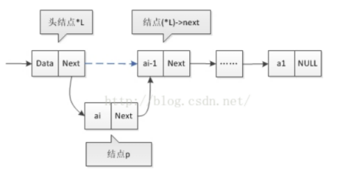

# 数据结构

<!-- @import "[TOC]" {cmd="toc" depthFrom=1 depthTo=6 orderedList=true} -->

<!-- code_chunk_output -->

1. [数据结构](#数据结构)
    1. [数据结构与算法分析相关概念](#数据结构与算法分析相关概念)
    2. [线性表](#线性表)
        1. [线性表的顺序存储结构](#线性表的顺序存储结构)
        2. [线性表的链式存储结构](#线性表的链式存储结构)
        3. [线性表的应用](#线性表的应用)

<!-- /code_chunk_output -->

## 数据结构与算法分析相关概念

1. 数据结构

    - 数据：信息的载体，在计算机科学中是指能输入到计算机中并能被计算机程序识别和处理的符号集合，它是计算机操作对象的总称，是计算机处理的信息的某种特定的符号表示形式。
        - 一类是整数、实数等数值型数据。
        - 另一类是图形、图像、声音、文字等非数值型数据。
    - 数据元素：是数据的基本单位，在计算机程序中，通常作为一个整体进行考虑和处理，是数据结构中讨论的基本单位。
    - 数据项：构成数据元素的不可分割的最小单位，一个数据元素可以由若干个的数据项组成。
    - 数据对象：是具有相同性质的数据元素的集合，是数据的一个子集。
    - 数据结构：是指相互之间存在一种或多种特定关系的数据元素的集合。四种基本结构如下：
        - 集合：同属于一个集合，除此没有任何关系。
        - 线性结构：数据元素之间存在着一对一的线性关系。
        - 树形结构：数据元素之间存在着一对多的层次关系。
        - 图状结构或网状结构：数据元素之间存在着多对多的任意关系。

    数据结构包括逻辑结合和物理结构两个层次：

    - 逻辑结构：指数据元素之间逻辑关系的整体。
    - 物理结构：指数据结构在计算机中的表示，又称存储结构。

    数据的存储结构在计算机中有两种不同的表示方法：顺序映像和非顺序映像，并由此得到两种存储结构：顺序存储结构和链式存储结构。

    - 抽象数据类型：Abstract Data Type 简称ADT则是指一个数学模型以及定义在该模型的一组操作。

    - 抽象：抽出问题的本质特征而忽略非本质的细节，是对具体事务的一个概括。

    - 数据抽象（Data Abstraction）：指用ADT描述程序处理的实体时，强调其本质的特征、所能完成的功能以及它和外部用户的接口。

    - 数据封装（Data Encapsulation）：将实体的外部特性和其内部实现细节分开，并且对外部用户隐藏其内部实现细节。

2. 算法和算法分析

    - 算法：对特定问题求解步骤的一种描述，是指令的有限序列，其中每一条指令表示一个或多个操作。算法的的特性：
        - 有穷性
        - 确定性
        - 可行性
        - 零个或多个输入
        - 一个或多个输出
    - 算法设计的要求
        - 正确性
        - 可读性
        - 健壮性：算法应具有容错性或例外处理能力。
        - 效率与存储量需求

    - 时间复杂度：指程序运行从开始到结束所需要的时间。

    算法的时间度量记作：$$T(n)=O(f(n))$$
    它表示随着问题规模$n$的增大，算法执行时间的增长率和$f(n)$的增长率相同，称作算法的 **渐进时间复杂度**

    - 空间复杂度：程序运行从开始到结束所需要的存储空间。记作$$S(n)=O(f(n))$$
    其中$n$为问题的规模，$f(n)$为所需存储空间关于问题规模$n$的函数表达式。

    一个上机执行的程序运行所需的存储空间包括两部分：
    - 固定部分：这部分存储空间用来存储程序代码、常量、简单变量、定长成分的结构变量。
    - 可变部分：这部分空间大小与算法在某次执行处理的特定数据的大小和规模有关。

## 线性表

def: 线性表（Linear List）是由$n(n \geq 0)$个具有相同类型的数据元素$a_1,a_2,\dots,a_n$组成的有限序列。其中元素的个数$n$定义为表的长度。

非空线性表的逻辑特征：

- 有且仅有一个开始结点$a_1$，该结点没有前趋，仅有一个后继$a_2$。
- 有且仅有一个终点结点$a_n$，该结点没有后继，仅有一个前趋$a_{n-1}$
- 其余内部内部结点$a_i \; (2 \leq i \leq n-1)\;$都有且仅有一个前趋$a_{i-1}$和一个后继$a_{i+1}$。

线性表中的数据元素不限定形式，但同一线性表中的数据元素必须具有相同特性，相邻元素之间存在着序偶。

### 线性表的顺序存储结构

线性表的两种存储表示方法：

- 顺序存储表示
- 链式存储表示

顺序表：线性表的顺序存储指的是把线性表的数据元素按逻辑顺序依次存放一组地址连续的存储单元里。$code:1.cpp$

假设顺序吧每个数据元素占有$m$个存储单元，且数据元素的存储位置定义为其所占的存储空间中第一个单元的存储地址，则表中相邻的数据元素$a_i$和$a_{i+1}$的存储位置$LOC(a_i)$和$LOC(a_{i+1})$也是相邻的，且满足如下关系：
$$LOC(a_{i+1}) = LOC(a_i) + m$$

如果知道第一个元素$a_i$的存储位置则：$$LOC(a_{i}) = LOC(a_1) + (i-1)*m$$

由于计算任意数据元素存储地址的时间都是相等的，因此顺序表是一种 **随机存取（Random Access）** 结构

顺序表的优点：

- 节省存储空间
- 随机存取

顺序表的缺点：

- 插入和删除需要移动大量元素
- 表容量

### 线性表的链式存储结构

链式存储结构：用一组地址任意的存储单元来依次存放线性表中的数据元素。

链式存储结构中的每个数据节点需要保存以下两部分信息：

- 存储数据元素自身信息的部分。称为数据域；
- 存储与前驱和后继结点的逻辑关系。称为指针域。

1. 单链表

    单链表：如果结点只包含一个指针域。则称为单链表$Single\;Linked\;List$。

    结构为：$\boxed{data|next}$

    $data$为数据域，用来存放数据元素自身的信息；$next$为指针域也成链域，用来存放后继结点的地址。

    表中的第一个结点$a_1$无前驱，故设置一个头指针$(Head\;Pointer)head$指向$a_1$,此外最后一个结点无后继，故$a_n$的指针域为空。
    $$head\;\to\;\boxed{a_1|\quad}\;\to\;\boxed{a_2|\quad}\;\to\;\boxed{a_3|\quad}\;\to\dots\;\to\;\boxed{a_n|\land}$$

    链式映像或非顺序映像：逻辑上相邻的两个数据元素其存储的物理位置不一定相邻。

    单链表是 **非随机存取** 的存储结构。

    单链表基本操作的实现：
        - 创建链表
            - 头插入法
            - 尾插入法
        - 查找操作
            - 按位序查找
            - 按值查找
        - 插入操作
        - 删除操作

    $code:2.cpp$
    

2. 静态链表

    静态链表：指用一维数组表示的单链表。

3. 循环链表

    循环链表：一种头尾详解的链表

4. 双向链表

    双向链表的结点结构：$$\boxed{piror|data|next}$$

### 线性表的应用

1. 一元多项式的表示及运算

    一个一元多项式可按照升幂表示为：$$A(x)=a_0+a_1x+a_2x^2+\dots+a_nx^n$$

    它由$n+1$个系数确定。在计算机中，可用一个线性表$(a_0,a_1,a_2,\dots,a_n)$来表示，每一项的指数$i$隐含在其系数$a_i$在序号里。

    实际情况中，可能很多零数据元素，采用只存储非零数据元素，但是需要存储非零数据元素系数和存储相应的指数。一个一元多项式的每一个非零项可由系数和指数唯一表示。如$S(x)=5+10x^{30}+90x^{100}$可由线性表$((5,0),(10,30),(90,100))$表示。

2. 一元多项式的线性表存储结构问题：

    - 采用顺序表存储，对于指数相差很多的两个一元多项式，相加会改变多项式的系数和指数。若相加的两项的指数不相等，则需将两项分别加在结果中，将会进行顺序表的插入操作；若某两项指数相等，则系数相加，若相加结果为零，将会进行顺序表的删除操作。因此采取顺序表虽然可以实现两个一元多项式相加，但**不可取**。

    - 采用单链表存储，则每一个非零项对应单链表中的一个结点，且为方便于指数的比较和判断，单链表须按照指数递增有序排列。

        一元多项式链表的结点结构：$\boxed{coef|exp|next}$

        - coef:系数域，存放非零项的系数。
        - exp:指数域，存放非零项的指数。
        - next:指针域，存放指向下一结点的指针。

        $code:3.cpp$

    一元多项式相加原则：指数相同的项系数相加。