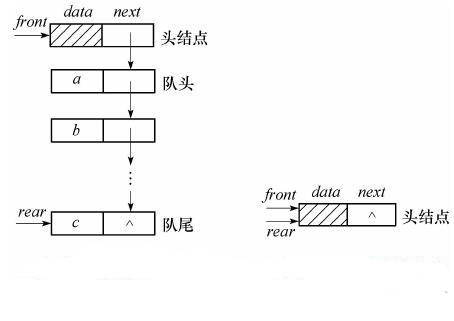
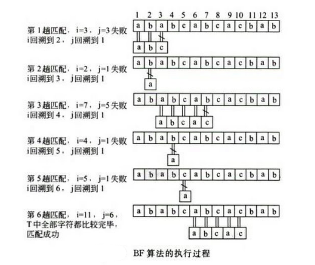

# 数据结构

<!-- @import "[TOC]" {cmd="toc" depthFrom=1 depthTo=6 orderedList=true} -->

<!-- code_chunk_output -->

1. [数据结构](#数据结构)
    1. [数据结构与算法分析相关概念](#数据结构与算法分析相关概念)
    2. [线性表](#线性表)
        1. [线性表的顺序存储结构](#线性表的顺序存储结构)
        2. [线性表的链式存储结构](#线性表的链式存储结构)
        3. [线性表的应用](#线性表的应用)
    3. [栈和队列](#栈和队列)
        1. [栈](#栈)
            1. [栈的顺序存储结构](#栈的顺序存储结构)
            2. [栈的链式存储结构](#栈的链式存储结构)
        2. [队列](#队列)
            1. [队列的顺序存储](#队列的顺序存储)
            2. [队列的链式存储](#队列的链式存储)
    4. [串](#串)
        1. [串的表示与实现](#串的表示与实现)
        2. [串的匹配模式](#串的匹配模式)
    5. [数组和广义表](#数组和广义表)
        1. [数组](#数组)
            1. [数组的存储结构](#数组的存储结构)
            2. [矩阵的压缩存储](#矩阵的压缩存储)
        2. [广义表](#广义表)

<!-- /code_chunk_output -->

## 数据结构与算法分析相关概念

1. 数据结构

    - 数据：信息的载体，在计算机科学中是指能输入到计算机中并能被计算机程序识别和处理的符号集合，它是计算机操作对象的总称，是计算机处理的信息的某种特定的符号表示形式。
        - 一类是整数、实数等数值型数据。
        - 另一类是图形、图像、声音、文字等非数值型数据。
    - 数据元素：是数据的基本单位，在计算机程序中，通常作为一个整体进行考虑和处理，是数据结构中讨论的基本单位。
    - 数据项：构成数据元素的不可分割的最小单位，一个数据元素可以由若干个的数据项组成。
    - 数据对象：是具有相同性质的数据元素的集合，是数据的一个子集。
    - 数据结构：是指相互之间存在一种或多种特定关系的数据元素的集合。四种基本结构如下：
        - 集合：同属于一个集合，除此没有任何关系。
        - 线性结构：数据元素之间存在着一对一的线性关系。
        - 树形结构：数据元素之间存在着一对多的层次关系。
        - 图状结构或网状结构：数据元素之间存在着多对多的任意关系。

    数据结构包括逻辑结合和物理结构两个层次：

    - 逻辑结构：指数据元素之间逻辑关系的整体。
    - 物理结构：指数据结构在计算机中的表示，又称存储结构。

    数据的存储结构在计算机中有两种不同的表示方法：顺序映像和非顺序映像，并由此得到两种存储结构：顺序存储结构和链式存储结构。

    - 抽象数据类型：Abstract Data Type 简称ADT则是指一个数学模型以及定义在该模型的一组操作。

    - 抽象：抽出问题的本质特征而忽略非本质的细节，是对具体事务的一个概括。

    - 数据抽象（Data Abstraction）：指用ADT描述程序处理的实体时，强调其本质的特征、所能完成的功能以及它和外部用户的接口。

    - 数据封装（Data Encapsulation）：将实体的外部特性和其内部实现细节分开，并且对外部用户隐藏其内部实现细节。

2. 算法和算法分析

    - 算法：对特定问题求解步骤的一种描述，是指令的有限序列，其中每一条指令表示一个或多个操作。算法的的特性：
        - 有穷性
        - 确定性
        - 可行性
        - 零个或多个输入
        - 一个或多个输出
    - 算法设计的要求
        - 正确性
        - 可读性
        - 健壮性：算法应具有容错性或例外处理能力。
        - 效率与存储量需求

    - 时间复杂度：指程序运行从开始到结束所需要的时间。

    算法的时间度量记作：$$T(n)=O(f(n))$$
    它表示随着问题规模$n$的增大，算法执行时间的增长率和$f(n)$的增长率相同，称作算法的 **渐进时间复杂度**

    - 空间复杂度：程序运行从开始到结束所需要的存储空间。记作$$S(n)=O(f(n))$$
    其中$n$为问题的规模，$f(n)$为所需存储空间关于问题规模$n$的函数表达式。

    一个上机执行的程序运行所需的存储空间包括两部分：
    - 固定部分：这部分存储空间用来存储程序代码、常量、简单变量、定长成分的结构变量。
    - 可变部分：这部分空间大小与算法在某次执行处理的特定数据的大小和规模有关。

## 线性表

def: 线性表（Linear List）是由$n(n \geq 0)$个具有相同类型的数据元素$a_1,a_2,\dots,a_n$组成的有限序列。其中元素的个数$n$定义为表的长度。

非空线性表的逻辑特征：

- 有且仅有一个开始结点$a_1$，该结点没有前趋，仅有一个后继$a_2$。
- 有且仅有一个终点结点$a_n$，该结点没有后继，仅有一个前趋$a_{n-1}$
- 其余内部内部结点$a_i \; (2 \leq i \leq n-1)\;$都有且仅有一个前趋$a_{i-1}$和一个后继$a_{i+1}$。

线性表中的数据元素不限定形式，但同一线性表中的数据元素必须具有相同特性，相邻元素之间存在着序偶。

### 线性表的顺序存储结构

线性表的两种存储表示方法：

- 顺序存储表示
- 链式存储表示

顺序表：线性表的顺序存储指的是把线性表的数据元素按逻辑顺序依次存放一组地址连续的存储单元里。

[code: 1.cpp](./code/1.cpp)

假设顺序吧每个数据元素占有$m$个存储单元，且数据元素的存储位置定义为其所占的存储空间中第一个单元的存储地址，则表中相邻的数据元素$a_i$和$a_{i+1}$的存储位置$LOC(a_i)$和$LOC(a_{i+1})$也是相邻的，且满足如下关系：
$$LOC(a_{i+1}) = LOC(a_i) + m$$

如果知道第一个元素$a_i$的存储位置则：$$LOC(a_{i}) = LOC(a_1) + (i-1)*m$$

由于计算任意数据元素存储地址的时间都是相等的，因此顺序表是一种 **随机存取（Random Access）** 结构

顺序表的优点：

- 节省存储空间
- 随机存取

顺序表的缺点：

- 插入和删除需要移动大量元素
- 表容量

### 线性表的链式存储结构

链式存储结构：用一组地址任意的存储单元来依次存放线性表中的数据元素。

链式存储结构中的每个数据节点需要保存以下两部分信息：

- 存储数据元素自身信息的部分。称为数据域；
- 存储与前驱和后继结点的逻辑关系。称为指针域。

1. 单链表

    单链表：如果结点只包含一个指针域。则称为单链表$Single\;Linked\;List$。

    结构为：$\boxed{data|next}$

    $data$为数据域，用来存放数据元素自身的信息；$next$为指针域也成链域，用来存放后继结点的地址。

    表中的第一个结点$a_1$无前驱，故设置一个头指针$(Head\;Pointer)head$指向$a_1$,此外最后一个结点无后继，故$a_n$的指针域为空。
    $$head\;\to\;\boxed{a_1|\quad}\;\to\;\boxed{a_2|\quad}\;\to\;\boxed{a_3|\quad}\;\to\dots\;\to\;\boxed{a_n|\land}$$

    链式映像或非顺序映像：逻辑上相邻的两个数据元素其存储的物理位置不一定相邻。

    单链表是 **非随机存取** 的存储结构。

    单链表基本操作的实现：
        - 创建链表
            - 头插入法
            - 尾插入法
        - 查找操作
            - 按位序查找
            - 按值查找
        - 插入操作
        - 删除操作

    [code: 2.cpp](./code/2.cpp)

    

2. 静态链表

    静态链表：指用一维数组表示的单链表。

3. 循环链表

    循环链表：一种头尾相连的链表

4. 双向链表

    双向链表的结点结构：$$\boxed{piror|data|next}$$

### 线性表的应用

1. 一元多项式的表示及运算

    一个一元多项式可按照升幂表示为：$$A(x)=a_0+a_1x+a_2x^2+\dots+a_nx^n$$

    它由$n+1$个系数确定。在计算机中，可用一个线性表$(a_0,a_1,a_2,\dots,a_n)$来表示，每一项的指数$i$隐含在其系数$a_i$在序号里。

    实际情况中，可能很多零数据元素，采用只存储非零数据元素，但是需要存储非零数据元素系数和存储相应的指数。一个一元多项式的每一个非零项可由系数和指数唯一表示。如$S(x)=5+10x^{30}+90x^{100}$可由线性表$((5,0),(10,30),(90,100))$表示。

2. 一元多项式的线性表存储结构问题：

    - 采用顺序表存储，对于指数相差很多的两个一元多项式，相加会改变多项式的系数和指数。若相加的两项的指数不相等，则需将两项分别加在结果中，将会进行顺序表的插入操作；若某两项指数相等，则系数相加，若相加结果为零，将会进行顺序表的删除操作。因此采取顺序表虽然可以实现两个一元多项式相加，但**不可取**。

    - 采用单链表存储，则每一个非零项对应单链表中的一个结点，且为方便于指数的比较和判断，单链表须按照指数递增有序排列。

        一元多项式链表的结点结构：$\boxed{coef|exp|next}$

        - coef:系数域，存放非零项的系数。
        - exp:指数域，存放非零项的指数。
        - next:指针域，存放指向下一结点的指针。

        [code: 3.cpp](./code/3.cpp)

    一元多项式相加原则：指数相同的项系数相加。

## 栈和队列

> 栈和队列属于特殊的线性表 ，它们在逻辑结构上和线性表相似。栈和队列在操作比一般线性表多一些限制，栈只能在表的一端进行操作，而队列只能在一端进行插入，一端进行删除。

### 栈

**栈**：$Stack$，是限定仅在表尾进行插入或删除操作的线性表。
栈顶：允许插入和删除的一端。
栈底：另一端。
空栈：当栈中没有任何元素。
进栈(入栈)：将一个元素从栈顶插入到栈的操作。
出栈(弹出)):从栈顶删除一个元素的操作。

特点：**先进先出**$FIFO$和**后进先出**$LIFO$


栈的抽象数据类型:

- 数据对象：$D=\{a_i | a_i \in  ElemSet,i=1,2,\cdots,n,n \ge 0\}$
- 数据关系：$R=\{<a_{i-1},a_i>,a_i>|a_{i-1},a_i \in D,i=1,2,\cdots,n\}$

约定$a_n$端为栈顶，$a_1$端为栈底。

- 基本操作：
    - $InitStack(\&S)$
    - $DestroyStack(\&S)$
    - $CleanStack(\&S)$
    - $StackEmpty(S)$
    - $StackLength(S)$
    - $GetTop(S,\&e)$
    - $Push(\&S,e)$
    - $PopStack(\&S,\&e)$
    - $StackTraverse(S,visit())$

#### 栈的顺序存储结构

顺序栈：采用顺序存储结构的栈。

顺序栈：利用一组地址连续的存储单元一次存放自栈底到栈顶的数据元素，同时附设$top$指针指示栈顶元素在顺序栈的位置。通常$top=0$表示空栈。

顺序栈的类定义和基本操作：[code:4.cpp](./code/4.cpp)

顺序栈的应用：

- 数制转换
- 括号匹配的检验
- 行编辑程序问题
- 迷宫求解

#### 栈的链式存储结构

链栈的结点结构和单链表的结点结构相同。链表只能在栈顶执行插入和删除操作，因此以单链表的头部作为栈顶最方便，而且也没必要为单链表附加头结点链表的头指针即为栈顶指针。

链栈的类定义和基本操作：[code:4.cpp](./code/4.cpp)

### 队列

队列是线性表的特例。它将元素排列成队，有入口和出口，数据元素只能从队尾入队，从对头离队。队列具有**先进先出 FIFO**或**后进后出LILO**

**队列**：$Queue$是另一种限定存取位置的线性表。只允许在表的一端进入，在另一端删除，其中允许插入的一端称为**队尾（Rear）**，允许删除的一端称为**队头（Front）**

- 入队：从队尾插入元素
- 出队：从队头删除元素


队列的抽象数据类型：

- 数据对象：$D=\{a_i | a_i \in ElemSet,i=1,2,\cdots,n,n \ge 0\}$
- 数据关系：$R=\{<a_{i-1},a_i> | a_{i_1},a_i \in D,i=2,\cdots,n\}$

确定 $a_1$端为队头，$a_n$端为队尾。

- 基本操作：
    - InitQueue(&Q)
    - DestroyQueue(&Q)
    - CleanQueue(&Q)
    - QueueEmpty(Q)
    - QueueLength(Q)
    - GetHead(Q,&e)
    - EnQueue(&Q,e)
    - DeQueue(&Q,&e)
    - QueueTraverse(Q,visit())

#### 队列的顺序存储

顺序队列：队列的顺序存储结构。

用一组地址连续的存储单元依次存放从队头到队尾的元素，由于队列的队头和队尾的位置是变化的，因而还需要两个指针front和rear作为队头指针和队尾指针来分别指示队头和队尾在队列中的位置。


当rear大于等于容量时，新元素无法入队，但事实上队列的低端还有空闲的存储单元，这种现象称为“假溢”。

为了解决这种现象引入了循环队列。

解决“假溢”现象的方法：将存储队列的数组看成是头尾相接的圆环，并成为循环存储空间，即允许队列直接从数组中下标最大的位置延续到下标最小的位置。

循环队列$(Circular Queue)$：队列的头尾相接的顺序存储结构

这种队列，队空和队满时头尾指针均相等，故无法通过$front==rear$来判断队列“空”还是“满”。

解决这个问题的办法：

- 设置一个布尔变量以区别队列的空和满
- 少用一个元素空间：约定入队前，测试尾指针在循环意义下加1后是否等于头指针，若相等则认为队满，但实际还有一个空位置
- 使用一个计数器记录队列中元素的总数，即队列长度。

以方法2讨论：

循环队列的长度$(rear-front+QueunSize) \% QueueSize$


循环队列的类定义和基本操作：[code:5.cpp](./code/5.cpp)

#### 队列的链式存储

队列的链式存储结构称为**链队列$(Linked\;Queue)$**

根据队列先进先出的特性，链队列是仅在表头删除元素和表尾插入元素的单链表。



链队列的类定义和基本操作：[code:6.cpp](./code/6.cpp)

## 串

串：$(String)$是由零个或多个字符组成的有限序列。非空串一般记作：$$s="a_1a_2a_3 \cdots a_n"(n \ge 1)$$

其中$s$为串名，双引号引起来的字符序列是串值。

$a_i(1 \le n \le n)$可以是字母、数字或其他字符串。

串包含的字符个数称为串的长度。

空串$(Null\;String)$：长度为0的串。

空格串：仅有一个或多个空格组成的串。

子串和主串：串中任意个连续字符组成的子序列称为该串的子串，包含子串的串称为主串。

子串的首字符在主串中的序号称为子串在主串中的位置。

空串是任一串的子串，串总是自身的子串。

程序中使用的串分为两种：串常量和串变量

串常量在程序中只能被引用但不能改变其值，即只读不能写。

例如语句`cout<<"overflow"`中的“overflow”该字符串只能读，不能改。如C++中,可定义：

```C++
    const char path[] = "dir/bin/app1"
```

这里的path是一个串常量，对它只能读不能写。

串变量是可以改变的

串的抽象数据类型：

字符的集合：$WordSet$

- 数据对象：$D=\{a_i|a_i\in WordSet,i=1,2,\cdots,n\}$
- 数据关系：$R=\{(a_i,a_{i+1})|a_i,a_{i+1}\in D,i=1,2,\cdots,n-1\}$
- 基本操作：
    - strassign(&s,st)
        - 初始条件：st为字符串常量
        - 操作结果：产生一个值等于st的串s
    - strempty(s)
        - 初始条件：s为一个串
        - 操作结果：若s为空串，则返回1，否则返回0
    - strcopy(&t,s)
        - 初始条件：s为一个串
        - 操作结果：把串s复制给t
    - strncpy(&sub,s,pos,len)
        - 初始条件：s为一个串，pos为起始位置，$1\le pos \le strlength(s)-1,len \gt 0$
        - 操作结果：用sub返回串s的第pos个字符开始长度为len的子串
    - strcmp(s,t)
        - 初始条件：s和t为两个串
        - 操作结果：若s>t，则返回值1；若s=t，则返回值0，否则返回值-1
    - strlength(s)
        - 初始条件：s是一个串
        - 操作结果：返回s的元素的个数
    - strconcat(&t,s1,s2)
        - 初始条件：s1，s2是两个串
        - 操作结果：用t返回s1和s2连接成的新串
    - substring(&sub,s,pos,len)
        - 初始条件：s是一个串，pos是串的起始位置，len是子串的长度
        - 操作结果：用sub返回串s的第pos个字符开始长度为len的子串
    - strindex(s,t,pos)
        - 初始条件：s，t为两个串；$1\le pos \le strlength(s)$
        - 操作结果：在s中取从第pos个字符起、长度和串t相等的子串和t比较，若相等，则返回pos，否则增值1至s中不存在和串t相等的子串为止，此时返回0
    - strinsert(&s,pos，t)
        - 初始条件：s，t是两个串，$1\le pos \le strlength(s)+1$
        - 操作结果：在s的第pos字符插入串t
    - strdelete(&s,pos,len)
        - 初始条件：s是一个串，$1\le pos \le strlength(s)-len+1$
        - 操作结果：从串s中删除第pos字符起长度为len的子串
    - Replace(&s,t,w)
        - 初始条件：s，t，w是三个串，t为非空串
        - 操作结果：用w替换串s中出现的所有与t相等的不重复的子串。

### 串的表示与实现

串是特殊的线性表，存储结构和线性表的存储结构类似。其特殊性在于组成串的结点是单个字符。

串的三种存储表示方式：定长顺序存储、堆分配存储和链式存储

1. 定长顺序存储表示
    定长顺序存储也称为静态存储分配的顺序表，用一组连续的存储单元来存放串中的字符序列。

    定长存储结构，指直接使用定长的字符数组来实现。

    ```C++
        #define MAXSTRLEN 256
        typedef char sstring[MAXSTRLEN+1];//0号单元存放串的长度
        sstring s;//s是个可容纳255个字符的顺序串
    ```

    一般可使用一个不会出现在串中的特殊字符在串值的尾部来表示串的结束。例如C/C++语言使用字符'\0'表示串值的终结，这就是为什么上面保存255个字符，留一个字节存放'\0'字符。

2. 堆分配存储表示
    一般情况采用定长顺序存储表示，但在实际应用中，串变量的长度变化较大，往往会造成存储空间溢出。为了解决这个问题，可采用堆分配存储表示。

    堆分配存储表示的特点：仍以一组地址连续的存储单元存放串字符序列，但它们的存储空间是程序执行过程中动态分配的。

    系统提高一个连续的称为“堆”的自由存储区，作为串的存储空间。

    当建立一个新串时，就在这个存储空间中为新串分配一个连续的存储空间。

    在C++语言，动态分配用new和delete来管理。

    利用new为每个新产生的串分配一块实际串长所须的空间。若分配成功，则返回空间的起始地址。当串被删除时，用delete来释放串所占用的空间。

    堆分配存储表示的定义如下:

    ```C++
        typedef struct
        {
            char *ch;
            int length;
        }Hstring;
    ```

3. 链式存储表示

    串用链表存储，串的这种链式存储结构简称**链串**$(Linked\;String)$。

    链式存储有利于插入和删除运算，但是存储空间利用率低。

    为了便于进行串的操作，当以链表存储串值时，除头指针还附设一个尾指针指示链串的最后一个结点，并给出当前串中结点的个数，即串的长度。

    串的链式存储结构如下
    ```C++
        #define chunksize 100
        typedef struct chunk
        {
            char ch[chunksize];
            chunk *next;
        } chunk;
        typedef struct
        {
            chunk *head, *tail;
            int curlen;
        } Lstring;
    ```

### 串的匹配模式

设$S$和$T$是两个给定的串，在串$S$中找等于$T$的子串的过程称为**模式匹配**$(Pattern\;Matching)$

$S$一般称为主串或目标串，$T$称为模式串。如果找到，称为**匹配成功**，否则称为**匹配失败**

两种模式匹配算法：$BF$和$KMP$

1. 模式匹配方法$BF$

    $BF$方法全称是$Brute-Force$，也称简单匹配方法。

    设$S$为主串，$T$为目标串，且形式为:$S="s_0s_1\cdots s_{n-1}"$和$T="t_0t_1\cdots t_{n-1}"$

    $BF$模式匹配方法的基本思路：

    1. 对于合法的位置$0\le i \le n-m$依次将主串中的子串$S[i\dots{i+m-1}]$和模式串$T[0\dots{m-1}]$进行比较，
    2. 若$S[i\dots{i+m-1}]=T[0\dots{m-1}]$，则从位置$i$开始的匹配成功，亦称模式串$T$在主串$S$中出现；
    若$S[i\dots{i+m-1}]\ne T[0\dots{m-1}]$，则从位置$i$开始的匹配失败。

    具体操作：
    从主串$S$的第一个字符开始，与模式串$T$中的第一个字符比较，若相等，则继续逐个比较后续字符；否则从主串$S$的第二个字符开始重新与模式串$T$的第一个字符进行比较。
    以此类推，若主串$S$的第$i$个字符开始，每个字符依次和模式串$T$中的对应字符相等，则匹配成功，返回$i$;否则，匹配失败，返回-1。

    具体算法如下：

    ```C++
        int index(sstring s,sstring t,int pos)
        {
            int i=pos,j=1;
            while(i<=s[0]&&j<=t[0])
            {
                if(s[i]==t[j])
                {
                    i++;
                    j++;
                }
                else
                {
                    i=i-j+2;
                    j=1;
                }
            }
            if(j>t[0])
                return i-t[0];
            else
                return 0;
        }
    ```

    模式串T="abcac"和主串s=“ababcabcaccabbc”的匹配过程
    

2. 模式匹配方法$KMP$

    $KMP$方法的全称$Knuth-Morris-Pratt$。

    $KMP$方法较$BF$模式匹配有很大改进，改进思想在于：
    每当一趟匹配过程中出现字符比较不相等时，不需要回溯$i$指针，而是利用已经得到的"部分匹配"的结果将模式向右移动尽可能多的距离后，再继续比较。
    

    $KMP$的匹配过程：
    设主串$s$，模式串$t$，并设$i$和$j$分别指向主串和模式串待比较的字符，$i$和$j$的初值均为1。若$s_i=t_j$，则$i$和$j$分别加1；否则$i$不变，$j$退回$next(j)$位置。再比较$s_i$和$t_j$，若相等，则$i$和$j$分别加1；否则$i$不变，$j$退回$next(j)$位置依次类推，直至下列两种可能：
    - $j$退回到某个$next(j)$值时字符比较相等，则指针各自加1.继续进程匹配；
    - 退回到$j=0$,将$i$和$j$分别加1，即从主串的下一个字符$s_{i+1}$与模式串中的$t_1$重新开始匹配。

    算法如下：
    ```C++
        void get_next(sstring t,int next[])
        {   //求出模式串t的next函数值并存入数组next中
            int i=1,j=0;
            next[1]=0;
            while(i<t[0])
            {
                if(j==0||t[i]==t[j])
                {
                    i++;
                    j++;
                    next[i]=j;
                }
                else
                    j=next[j];
            }
        }
        int KMP_index(sstring s,sstring t,int pos)
        {
            //t非空,1<=pos<=Strlength(s)
            int i=pos,j=1;
            while(i<=s[0]&&j<=t[0])
            {
                if(j==0||s[i]==t[j])
                {
                    i++;
                    j++;
                }
                else
                    j=next[j];
            }
            if(j>t[0])
                return i-t[0];
            else
                return 0;
        }
    ```

## 数组和广义表

> 数组和广义表可以看做是线性表的扩展，即数组和广义表中的数据元素本身也是一种数据结构。数组中每个数据元素具有相同的结构，广义表中的数据元素可以有不同的数据结构。

### 数组

数组$(Array)$是由相同类型的一组数据元素组成的一个有限序列。其数据元素也称为数组元素。数组中的每个元素都有一个序号，称为**下标$(index)$**。可以通过下标访问数据元素。

数组元素受$n(n\ge1)$个线性关系的约束，每个数据元素在$n$
个线性关系中的符号$i_1,i_2,\cdots,i_n$成为数据元素的下标，并称该数组为$n$维数组。

当$n=2$是，为二维数组，任何一个数据元素有两个下标，一个为行号，一个为列号。如$a_{ij}$表示第$i$行第$j$列的数据元素

一维数组可以看作是一个线性表，二维数组可以看作数据元素是一维数组的线性表。

数组中的每个数据元素都和一组唯一的下标值对应。因此数组是一种随机存取机构。

数据的抽象数据类型

- 数据对象：$j_i=0,\cdots,b_i-1,i=1,2,\cdots,n$
    $$D=\{a_{j_1j_2\cdots j_n}|n(n>0),b_i,j_i,a_{j_1j_2\cdots j_n}\in ElemSet\}$$
    $n$是数据的维数，$b_i$是数据的第$i$维的长度，$j_i$是数组元素第$i$维的下标。
- 数据关系：$R=\{R_1,R_2,\cdots,R_n\}$
    $$R_i=\{<a_{j1\cdots ji \cdots jn},a_{j1\cdots ji+1\cdots jn}>\} 
    \\ 0\le j_k\le b_k-1,1\le k\le n\;n\neq i,
    \\ 0\le j_i \le b_i-2,
    - InitArray(&A,n,bound1,...,boundn)
    \\a_{j1\cdots ji \cdots jn},a_{j1\cdots ji+1\cdots jn}\in D,i=2,\cdots,n$$
- 基本操作
    - InitArray(&A,n,bound1,...,boundn)
        - 初始条件：无
        - 操作结果：若维数$n$和各维长度$b_1,...,b_n$合法，则构造相应的数组$A$，并返回$OK$
    - DestroyArray(&A)
        - 初始条件：无
        - 操作结果：销毁数组$A$
    - GetValue(A,&e,index1,...,indexn)
        - 初始条件：$A$是$n$维数组，$e$为数据元素变量，$index1,\cdots,indexn$是$n$个下标值。
        - 操作结果：若下标$index1,\cdots,indexn$都不超界，则读取与下标对应的数据元素的值，并赋值给$e$
    - Assign(&A,e,index1,...,indexn)
        - 初始条件：$A$是$n$维数组，$e$为数据元素变量，$index1,\cdots,indexn$是$n$个下标值。
        - 操作结果：若下标$index1,\cdots,indexn$都不超界，则将$e$赋值给下标对应的数据元素

#### 数组的存储结构

由于计算机内存结构是一维的，因此用一维内存来表示多维数组，必须按某种次序将数据元素排成一个序列，然后将这个序列放在存储空间中。

由于对不对数组进行插入和删除操作，一般采用顺序存储的方法来表示数组。

用一组连续的存储单元存放数据元素存在一个次序约定的问题，是先存一行数据元素还是先存一列数据元素？

根据存储方式的不同，顺序存储方法分为一下两类：

- 行优先顺序存储
    以行序为主序的存储方式。将数据元素按行排列，第$i+1$个行向量紧接在第$i$个行向量后面。
- 列优先顺序存储
    以列序为主序的存储方式。将数据元素按列排列，第$j+1$个列向量紧接在第$j$个列向量后面。

行优先顺序存储：$\boxed{a_{11}|a_{12}|\cdots|a_{1n}|a_{21}|a_{22}|\cdots|a_{2n}|\cdots|a_{m1}|a_{m2}|\cdots|a_{mn}}$
列优先顺序存储：$\boxed{a_{11}|a_{21}|\cdots|a_{m1}|a_{12}|a_{22}|\cdots|a_{m2}|\cdots|a_{1n}|a_{2n}|\cdots|a_{mn}}$

二维数组元素地址，按行优先顺序存储的计算公式

任一数据元素$a_{ij}$的存储地址$LOC(a_{ij})$应为数组的基地址加上排在$a_{ij}$前面的数据元素所占用的单元数，因此$a_{ij}$的存储地址计算公式为：$$LOC(a_{ij})=LOC(a_{l_1l_2})+((i-l_1)*(h_2-l_2+1)+(j-l_2))*c\\=LOC(a_{l_1l_2})+i*(h_2-l_2+1)*c-l_1*(h_2-l_2+1)*c+j*c-l_2*c$$

令：$M_1=(h_2-l_2+1)*c,M_2=c,$则有$$LOC(a_{ij})=v_0+i*M_1+j*M_2$$
其中，$v_0=LOC(a_{l_1l_2})+-l_1*M_1-l_2*M_2,i\in[l_1,h_1],j\in[l_2,h_2],$且$i$和$j$均为整数；$LOC(a_l{ij})$是数据元素$a_{ij}$的存储地址，$LOC(a_{l_1l_2})$是二维数组中第一个元素的存储地址，即基地址。

二维数组推广到一般，按照行优先顺序存储，则下标为$i_1,i_2,\cdots,i_n$的存储地址为：$$LOC(a_{i_1,i_2,\cdots,i_n})
=LOC(a_{l_1,l_2,\cdots,l_n})+(j_1d_2d_3\cdots d_n+j_2d_3\cdots d_n+\cdots+j_{n-1}d_n+j_n)*c\\=V_0+i_1*M_1+i_2*M_2+\cdots+i_n*M_n$$

#### 矩阵的压缩存储

在矩阵中，若非零元素呈现某种规律分布或举证中出现大量零数据元素。为了节省空间，可以对这类矩阵进行压缩。

压缩存储的原则：

- 为多个值相同的非零数据元素分配一个存储空间
- 不为零数据元素分配存储空间

特殊矩阵$(Special\;Matrix)$：值相同的数据元素或者零数据元素在矩阵中的分布有一定的规律。

稀疏矩阵$(Sparse\;Maxtrix)$：矩阵中有许多零数据元素(一般根据稀疏因子的值判定领数据元素是否较多)

1. 特殊矩阵的压缩存储
    特殊矩阵是指非零数据元素或零数据元素的分布具有一定规律的矩阵。
    常见的特殊矩阵有，对称矩阵、对角矩阵等，它们都是方阵，行数和列数相同。
    1. 对称对称的压缩
        在一个$n$阶方阵$A$中，若数据元素满足下述性质:$$a_{ij}=a_{ji}(i\ge1,j\le n)$$
        则称为$A$为$n$阶对称矩阵。

        对称矩阵只需存储矩阵中的上三角$a_{ij}(i\le j)$或下三角$a_{ij}(i\ge j)$的数据元素。

        对称矩阵优先采用行优先顺序存储下三角中的数据元素。

        下三角的数据元素可用一个容量是$n*(n+1)/2$的一维数组存储。对于下三角中任意数据元素$a_{ij}(i\ge j)$,$a_{ij}$在一维数组中的下标$k$与$i、j$的关系为：$k=i*(i+1)/2+j$。
        $$\boxed{a_{00}|a_{10}|a_{11}|a_{20}|a_{21}|a_{22}|\cdots|a_{ij}|\cdots|a_{n-1,0}|a_{n-1,1}|\cdots|a_{n-1,n-1}}$$

        若采用上述的压缩存储方式，则矩阵中的任一数据元素$a_{ij}$与它在一维数组中的存储位置$k$之间存在如下的对应关系:
        $$k=\begin{cases}i(i-1)/2+j-1,\ge j
        \\j(j-1)/2+i-1,\lt j\end{cases}$$
        其中$k=0,1,2，\cdots,((n+1)n/2)-1,
        \\1+2+3+(i-1)=(i-1)i/2,
        \\(i-1)i/2+j=k+1\quad i\ge j\quad and\quad i,j\ge 1$
    2. 对角矩阵的压缩存储
        对角矩阵：所有的非零数据元素都集中在以主对角线为中心的带状区域中的举证，即除了主对角线上和主对角线相邻两侧的若干条对角线上的数据之外，其余所有数据元素均为零数据元素。

2. 稀疏矩阵的压缩存储

### 广义表