# 数据结构

<!-- @import "[TOC]" {cmd="toc" depthFrom=1 depthTo=6 orderedList=true} -->

<!-- code_chunk_output -->

1. [数据结构](#数据结构)
    1. [数据结构与算法分析相关概念](#数据结构与算法分析相关概念)
    2. [线性表](#线性表)
        1. [线性表的顺序存储结构](#线性表的顺序存储结构)
        2. [线性表的链式存储结构](#线性表的链式存储结构)
        3. [线性表的应用](#线性表的应用)
    3. [栈和队列](#栈和队列)
        1. [栈](#栈)
            1. [栈的顺序存储结构](#栈的顺序存储结构)
            2. [栈的链式存储结构](#栈的链式存储结构)
        2. [队列](#队列)
            1. [队列的顺序存储](#队列的顺序存储)
            2. [队列的链式存储](#队列的链式存储)
    4. [串](#串)
        1. [串的表示与实现](#串的表示与实现)
        2. [串的匹配模式](#串的匹配模式)
    5. [数组和广义表](#数组和广义表)
        1. [数组](#数组)
            1. [数组的存储结构](#数组的存储结构)
            2. [矩阵的压缩存储](#矩阵的压缩存储)
        2. [广义表](#广义表)
            1. [广义表的存储结构](#广义表的存储结构)
    6. [树和二叉树](#树和二叉树)
        1. [树](#树)
            1. [基本术语](#基本术语)
            2. [树的性质和存储](#树的性质和存储)
            3. [森林](#森林)
            4. [二叉树](#二叉树)
        2. [树，森林与二叉树的转换](#树森林与二叉树的转换)
        3. [堆](#堆)
        4. [哈夫曼树和哈夫曼编码](#哈夫曼树和哈夫曼编码)
    7. [图](#图)
        1. [图的基本概念](#图的基本概念)
        2. [图的存储结构](#图的存储结构)
        3. [图的遍历](#图的遍历)
        4. [最小生成树](#最小生成树)
        5. [有向无环图及其应用](#有向无环图及其应用)
        6. [最短路径](#最短路径)
    8. [查找](#查找)
        1. [查找的基本概念](#查找的基本概念)
        2. [静态查找表](#静态查找表)
        3. [哈希表](#哈希表)
    9. [内部排序](#内部排序)
        1. [排序的基本概念](#排序的基本概念)
        2. [插入排序](#插入排序)
        3. [交换排序](#交换排序)
        4. [选择排序](#选择排序)
        5. [归并排序](#归并排序)
        6. [基数排序](#基数排序)
        7. [各种内部排序方法的比较](#各种内部排序方法的比较)
    10. [算法设计与分析](#算法设计与分析)
        1. [分治法](#分治法)
        2. [回溯法](#回溯法)
        3. [贪心算法](#贪心算法)
        4. [动态规划](#动态规划)
        5. [分支限界法](#分支限界法)

<!-- /code_chunk_output -->

## 数据结构与算法分析相关概念

1. 数据结构

    - 数据：信息的载体，在计算机科学中是指能输入到计算机中并能被计算机程序识别和处理的符号集合，它是计算机操作对象的总称，是计算机处理的信息的某种特定的符号表示形式。
        - 一类是整数、实数等数值型数据。
        - 另一类是图形、图像、声音、文字等非数值型数据。
    - 数据元素：是数据的基本单位，在计算机程序中，通常作为一个整体进行考虑和处理，是数据结构中讨论的基本单位。
    - 数据项：构成数据元素的不可分割的最小单位，一个数据元素可以由若干个的数据项组成。
    - 数据对象：是具有相同性质的数据元素的集合，是数据的一个子集。
    - 数据结构：是指相互之间存在一种或多种特定关系的数据元素的集合。四种基本结构如下：
        - 集合：同属于一个集合，除此没有任何关系。
        - 线性结构：数据元素之间存在着一对一的线性关系。
        - 树形结构：数据元素之间存在着一对多的层次关系。
        - 图状结构或网状结构：数据元素之间存在着多对多的任意关系。

    数据结构包括逻辑结合和物理结构两个层次：

    - 逻辑结构：指数据元素之间逻辑关系的整体。
    - 物理结构：指数据结构在计算机中的表示，又称存储结构。

    数据的存储结构在计算机中有两种不同的表示方法：顺序映像和非顺序映像，并由此得到两种存储结构：顺序存储结构和链式存储结构。

    - 抽象数据类型：$Abstract\;Data\;Type$ 简称$ADT$则是指一个数学模型以及定义在该模型的一组操作。

    - 抽象：抽出问题的本质特征而忽略非本质的细节，是对具体事务的一个概括。

    - 数据抽象$Data\;Abstraction$：指用$ADT$描述程序处理的实体时，强调其本质的特征、所能完成的功能以及它和外部用户的接口。

    - 数据封装$Data\;Encapsulation$：将实体的外部特性和其内部实现细节分开，并且对外部用户隐藏其内部实现细节。

2. 算法和算法分析

    - 算法：对特定问题求解步骤的一种描述，是指令的有限序列，其中每一条指令表示一个或多个操作。算法的的特性：
        - 有穷性
        - 确定性
        - 可行性
        - 零个或多个输入
        - 一个或多个输出
    - 算法设计的要求
        - 正确性
        - 可读性
        - 健壮性：算法应具有容错性或例外处理能力。
        - 效率与存储量需求

    - 时间复杂度：指程序运行从开始到结束所需要的时间。

    算法的时间度量记作：
    $$T(n)=O(f(n))$$
    它表示随着问题规模$n$的增大，算法执行时间的增长率和$f(n)$的增长率相同，称作算法的 **渐进时间复杂度**

    - 空间复杂度：程序运行从开始到结束所需要的存储空间。记作
    $$S(n)=O(f(n))$$

    其中$n$为问题的规模，$f(n)$为所需存储空间关于问题规模$n$的函数表达式。

    一个上机执行的程序运行所需的存储空间包括两部分：
    - 固定部分：这部分存储空间用来存储程序代码、常量、简单变量、定长成分的结构变量。
    - 可变部分：这部分空间大小与算法在某次执行处理的特定数据的大小和规模有关。

## 线性表

**线性表**$Linear List$是由$n(n \geq 0)$个具有相同类型的数据元素$a_1,a_2,\dots,a_n$组成的有限序列。其中元素的个数$n$定义为表的长度。

非空线性表的逻辑特征：

- 有且仅有一个开始结点$a_1$，该结点没有前趋，仅有一个后继$a_2$。
- 有且仅有一个终点结点$a_n$，该结点没有后继，仅有一个前趋$a_{n-1}$
- 其余内部内部结点$a_i \; (2 \leq i \leq n-1)\;$都有且仅有一个前趋$a_{i-1}$和一个后继$a_{i+1}$。

线性表中的数据元素不限定形式，但同一线性表中的数据元素必须具有相同特性，相邻元素之间存在着序偶。

### 线性表的顺序存储结构

线性表的两种存储表示方法：

- 顺序存储表示
- 链式存储表示

顺序表：线性表的顺序存储指的是把线性表的数据元素按逻辑顺序依次存放一组地址连续的存储单元里。

```C++
const int LISTINCREMENT = 10;
typedef int ElemType;

class SqList_d
{
  private:
    ElemType *elem;
    int length;
    int maxSize;

  public:
    SqList_d(int n);
    ~SqList_d();
    void SqListInsert(int i, int e);
    int SqListDelete(int i);
    void printAllData();
};

SqList_d::SqList_d(int n)
{
    elem = (int *)malloc(n * sizeof(int));
    length = 0;
    maxSize = n;
}

SqList_d::~SqList_d()
{
    delete[] elem;
    length = 0;
    maxSize = 0;
}

void SqList_d::SqListInsert(int i, int e)
{
    if (length >= maxSize)
    {
        elem = (int *)realloc(elem, (maxSize + LISTINCREMENT) * sizeof(int));
    }
    if (i < 1 || i > length + 1)
    {
        cout << "插入位置异常";
        return;
    }

    for (int j = length; j >= i; j--)
        elem[j] = elem[j - 1];
    elem[i - 1] = e;
    length++;
}

int SqList_d::SqListDelete(int i)
{
    int e;

    if (length <= 0)
    {
        cout << "溢出";
        return -1;
    }

    if (i < 1 || i > length + 1)
    {
        /* code */
        cout << "删除位置异常";
        return -1;
    }

    e = elem[i - 1];

    for (int j = i; j < length; j++)
    {
        elem[j - 1] = elem[j];
    }
    length--;
    return e;
}

void SqList_d::printAllData()
{

    for (int i = 0; i < length; i++)
    {
        /* code */
        cout << "Item: " << i << " value: " << this->elem[i] << endl;
    }
}

main(int argc, char const *argv[])
{
    SqList_d la = SqList_d(10);
    la.SqListInsert(1, 1);
    la.printAllData();
    return 0;
}
```

假设顺序吧每个数据元素占有$m$个存储单元，且数据元素的存储位置定义为其所占的存储空间中第一个单元的存储地址，则表中相邻的数据元素$a_i$和$a_{i+1}$的存储位置$LOC(a_i)$和$LOC(a_{i+1})$也是相邻的，且满足如下关系：
$$LOC(a_{i+1}) = LOC(a_i) + m$$

如果知道第一个元素$a_i$的存储位置则：
$$LOC(a_{i}) = LOC(a_1) + (i-1)*m$$

由于计算任意数据元素存储地址的时间都是相等的，因此顺序表是一种 **随机存取**$(Random\;Access)$结构

顺序表的优点：

- 节省存储空间
- 随机存取

顺序表的缺点：

- 插入和删除需要移动大量元素
- 表容量

### 线性表的链式存储结构

链式存储结构：用一组地址任意的存储单元来依次存放线性表中的数据元素。

链式存储结构中的每个数据节点需要保存以下两部分信息：

- 存储数据元素自身信息的部分。称为数据域；
- 存储与前驱和后继结点的逻辑关系。称为指针域。

1. 单链表

    单链表：如果结点只包含一个指针域。则称为单链表$Single\;Linked\;List$。

    结构为：$\boxed{data|next}$

    $data$为数据域，用来存放数据元素自身的信息；$next$为指针域也成链域，用来存放后继结点的地址。

    表中的第一个结点$a_1$无前驱，故设置一个头指针$(Head\;Pointer)head$指向$a_1$,此外最后一个结点无后继，故$a_n$的指针域为空。
    $$head\;\to\;\boxed{a_1|\quad}\;\to\;\boxed{a_2|\quad}\;\to\;\boxed{a_3|\quad}\;\to\dots\;\to\;\boxed{a_n|\land}$$

    链式映像或非顺序映像：逻辑上相邻的两个数据元素其存储的物理位置不一定相邻。

    单链表是 **非随机存取** 的存储结构。

    单链表基本操作的实现：
    - 创建链表
        - 头插入法
        - 尾插入法
    - 查找操作
        - 按位序查找
        - 按值查找
    - 插入操作
    - 删除操作

    ```C++
    typedef int ElemType;
    struct Node{
        ElemType data;
        Node* next;
    };
    class LinkList
    {
        private:
            Node *Head;
        public:
            LinkList();
            ~LinkList();
            void CreateList1(int n);
            void CreateList2(int n);
            void ListInsert(int i,int e);
            int ListDelete(int i);
            int GetElem(int i);
            int LocateElem(int e);
            int ListLength();
    };
    void LinkList::CreateList1(int n)
    {
        //头插法创建线性表：不停的从头部插入
        Node *p,*s;
        p = Head;
        cout << "请依次输入" << n << "个数据元素值：" << endl;
        for(int i = 1; i <= n; i++)
        {
            s = new Node;
            cin >> s->data;
            s->next = p->next;
            p->next = s;
        }
    }
    ```

    

2. 静态链表

    静态链表：指用一维数组表示的单链表。

3. 循环链表

    循环链表：一种头尾相连的链表

4. 双向链表

    双向链表的结点结构：
    $$\boxed{piror|data|next}$$

### 线性表的应用

1. 一元多项式的表示及运算

    一个一元多项式可按照升幂表示为：
    $$A(x)=a_0+a_1x+a_2x^2+\dots+a_nx^n$$

    它由$n+1$个系数确定。在计算机中，可用一个线性表$(a_0,a_1,a_2,\dots,a_n)$来表示，每一项的指数$i$隐含在其系数$a_i$在序号里。

    实际情况中，可能很多零数据元素，采用只存储非零数据元素，但是需要存储非零数据元素系数和存储相应的指数。一个一元多项式的每一个非零项可由系数和指数唯一表示。如$S(x)=5+10x^{30}+90x^{100}$可由线性表$((5,0),(10,30),(90,100))$表示。

2. 一元多项式的线性表存储结构问题：

    - 采用顺序表存储，对于指数相差很多的两个一元多项式，相加会改变多项式的系数和指数。若相加的两项的指数不相等，则需将两项分别加在结果中，将会进行顺序表的插入操作；若某两项指数相等，则系数相加，若相加结果为零，将会进行顺序表的删除操作。因此采取顺序表虽然可以实现两个一元多项式相加，但**不可取**。

    - 采用单链表存储，则每一个非零项对应单链表中的一个结点，且为方便于指数的比较和判断，单链表须按照指数递增有序排列。

        一元多项式链表的结点结构：$\boxed{coef|exp|next}$

        - coef:系数域，存放非零项的系数。
        - exp:指数域，存放非零项的指数。
        - next:指针域，存放指向下一结点的指针。

        ```C++
        #define MAX 20

        typedef struct
        {
            float coef;
            int exp;
        } PolyArray[MAX];

        struct PolyNode
        {
            float coef;
            int exp;
            PolyNode *next;
        };

        class Poly
        {
          private:
            PolyNode *Head;

          public:
            Poly(){};
            ~Poly(){};
            void CreatePoly(PolyArray a, int n); //创建多项式
            void PolyDisplay();                  //多项式显示
            void PolySort();                     // 有序表排列
            void PolyAdd(Poly LB);               //多项式相加
        };

        void Poly::CreatePoly(PolyArray a, int n)
        {

            PolyNode *s, *r;
            int i;
            r = Head;

            for (i = 0; i < n; i++)
            {
                s = new PolyNode;
                s->coef = a[i].coef;
                s->exp = a[i].coef;
                s->next = NULL;
                r->next = s;
                r = s;
            }
        }

        void Poly::PolySort()
        {
            PolyNode *p, *q, *r;
            p = Head->next;

            if (p != NULL)
            {
                r = p->next;
                p->next = NULL;
                p = r;

                while (p != NULL)
                {
                    r = p->next;
                    q = Head;
                    while (q->next != NULL && q->next->exp < p->exp)
                    {
                        q = q->next;
                        p->next = q->next;
                        q->next = p;
                        p = r;
                    }
                }
            }
        }

        void Poly::PolyAdd(Poly LB)
        {
            float sum;
            PolyNode *pa, *pb, *qa, *qb;
            pa = Head;
            qa = pa->next;
            pb = LB.Head;
            qb = qb->next;

            while (qa != NULL && qb != NULL)
            {
                if (qa->exp < qb->exp)
                {
                    pa = qa;
                    qa = qa->next;
                }
                else if (qa->exp > qb->exp)
                {
                    pb->next = qb->next;
                    qb->next = qa;
                    pa->next = qb;
                    pa = qb;
                    qb = qb->next;
                }
                else
                {
                    sum = qa->coef + qb->coef;
                    if (sum == 0)
                    {
                        pa->next = qa->next;
                        delete qa;
                        qa = pa->next;
                        pb->next = qb->next;
                        delete qb;
                        qb = pb->next;
                    }

                    else
                    {
                        qa->coef = sum;
                        pa = qa;
                        qa = qa->next;
                        pb->next = qb->next;
                        delete qb;
                        qb = pb->next;
                    }
                }
            }

            if (qb != NULL)
            {
                pa->next = qb;
            }
        }
        main(int argc, char const *argv[])
        {
            PolyArray a = {{7.0, 0}, {3.0, 1}, {9.0, 8}, {5.0, 16}};
            cout << a;
            PolyArray b = {{8.0, 1}, {22, 7}, {-9.0, 8}};
            Poly LA = Poly(), LB = Poly();
            LA.CreatePoly(a, 4);
            LB.CreatePoly(b, 3);
            LA.PolySort();
            LB.PolySort();
            LA.PolyAdd(LB);
            return 0;
        }
        ```

    一元多项式相加原则：指数相同的项系数相加。

## 栈和队列

> 栈和队列属于特殊的线性表 ，它们在逻辑结构上和线性表相似。栈和队列在操作比一般线性表多一些限制，栈只能在表的一端进行操作，而队列只能在一端进行插入，一端进行删除。

### 栈

**栈**：$Stack$，是限定仅在表尾进行插入或删除操作的线性表。

- 栈顶：允许插入和删除的一端。
- 栈底：另一端。
- 空栈：当栈中没有任何元素。
- 进栈(入栈)：将一个元素从栈顶插入到栈的操作。
- 出栈(弹出)):从栈顶删除一个元素的操作。

特点：**先进先出**$FIFO$和**后进先出**$LIFO$


栈的抽象数据类型:

- 数据对象：$D=\{a_i | a_i \in  ElemSet,i=1,2,\cdots,n,n \ge 0\}$
- 数据关系：$R=\{<a_{i-1},a_i>,a_i>|a_{i-1},a_i \in D,i=1,2,\cdots,n\}$

约定$a_n$端为栈顶，$a_1$端为栈底。

- 基本操作：
    - $InitStack(\&S)$
    - $DestroyStack(\&S)$
    - $CleanStack(\&S)$
    - $StackEmpty(S)$
    - $StackLength(S)$
    - $GetTop(S,\&e)$
    - $Push(\&S,e)$
    - $PopStack(\&S,\&e)$
    - $StackTraverse(S,visit())$

#### 栈的顺序存储结构

顺序栈：采用顺序存储结构的栈。

顺序栈：利用一组地址连续的存储单元一次存放自栈底到栈顶的数据元素，同时附设$top$指针指示栈顶元素在顺序栈的位置。通常$top=0$表示空栈。

顺序栈的类定义和基本操作：

```C++
class SqStack
{
  private:
    int *base; //栈底指针
    int top;   //栈顶
    int stackSize;

  public:
    SqStack(int m);
    ~SqStack()
    {
        delete[] base;
        top = -1;
        stackSize = 0;
    };
    void Push(int e);
    int Pop();
    int GetTop();
    int StackEmpty();
    void StackTranverse(); //显示栈中元素
};

void SqStack::Push(int e)
{
    if (top == stackSize - 1)
    {
        cout << "栈满，无法入栈";
        return;
    }
    top++;
    base[top] = e;
}

int SqStack::Pop()
{
    int e;
    if (top = -1)
    {
        cout << "栈空，无法出栈";
        return -1;
    }
    e = base[top--];
    return e;
}

int SqStack::GetTop()
{
    return top;
}

void SqStack::StackTranverse()
{
    if (top == -1)
    {
        cout << "空栈";
    }

    for (int i = 0; i < top; i++)
    {
        cout << "index: " << i << " value: " << base[i] << endl;
    }
}
```

顺序栈的应用：

- 数制转换
- 括号匹配的检验
- 行编辑程序问题
- 迷宫求解

#### 栈的链式存储结构

链栈的结点结构和单链表的结点结构相同。链表只能在栈顶执行插入和删除操作，因此以单链表的头部作为栈顶最方便，而且也没必要为单链表附加头结点链表的头指针即为栈顶指针。

链栈的类定义和基本操作：

```C++
struct Node
{
    int data;
    Node *next;
};

class LinkStack
{
  private:
    Node *top;

  public:
    LinkStack() { top == NULL; };
    ~LinkStack();
    void Push(int e);
    int Pop();
    int GetTop()
    {
        if (top != NULL)
            return top->data;
    };
    bool Empty() { return top != NULL ? 1 : 0; };
};

LinkStack::~LinkStack()
{
    Node *p;
    while (top)
    {
        p = top->next;
        delete top;
        top = p;
    }
}

void LinkStack::Push(int e)
{
    Node *s = new Node;

    if (!s)
    {
        cout << "内存分配失败";
        return;
    }
    s->data = e;
    s->next = top;
    top = s;
}

int LinkStack::Pop()
{
    int x;
    if (top == NULL)
    {
        cout << "栈溢出";
        return -1;
    }
    x = top->data;
    Node *p = top;
    top = top->next;
    delete p;
    return x;
}
```

### 队列

队列是线性表的特例。它将元素排列成队，有入口和出口，数据元素只能从队尾入队，从对头离队。队列具有**先进先出 FIFO**或**后进后出LILO**

**队列**：$Queue$是另一种限定存取位置的线性表。只允许在表的一端进入，在另一端删除，其中允许插入的一端称为**队尾（Rear）**，允许删除的一端称为**队头（Front）**

- 入队：从队尾插入元素
- 出队：从队头删除元素

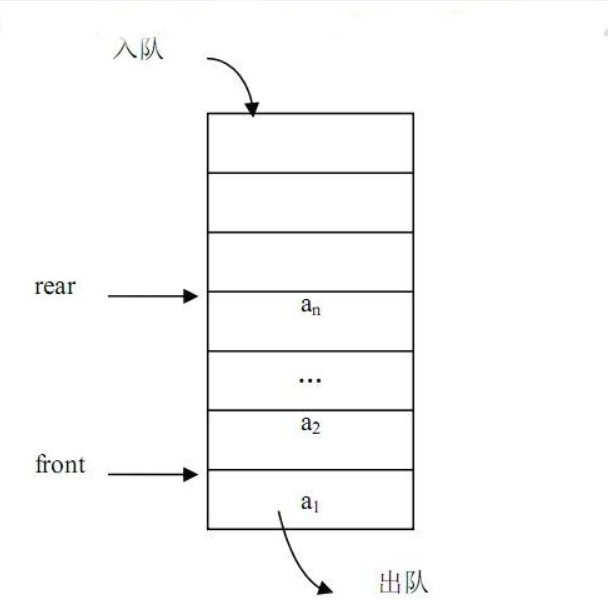

队列的抽象数据类型：

- 数据对象：$D=\{a_i | a_i \in ElemSet,i=1,2,\cdots,n,n \ge 0\}$
- 数据关系：$R=\{<a_{i-1},a_i> | a_{i_1},a_i \in D,i=2,\cdots,n\}$

确定 $a_1$端为队头，$a_n$端为队尾。

- 基本操作：
    - $InitQueue(\&Q)$
    - $DestroyQueue(\&Q)$
    - $CleanQueue(\&Q)$
    - $QueueEmpty(Q)$
    - $QueueLength(Q)$
    - $GetHead(Q,\&e)$
    - $EnQueue(\&Q,e)$
    - $DeQueue(\&Q,\&e)$
    - $QueueTraverse(Q,visit())$

#### 队列的顺序存储

顺序队列：队列的顺序存储结构。

用一组地址连续的存储单元依次存放从队头到队尾的元素，由于队列的队头和队尾的位置是变化的，因而还需要两个指针front和rear作为队头指针和队尾指针来分别指示队头和队尾在队列中的位置。


当rear大于等于容量时，新元素无法入队，但事实上队列的低端还有空闲的存储单元，这种现象称为“假溢”。

为了解决这种现象引入了循环队列。

解决“假溢”现象的方法：将存储队列的数组看成是头尾相接的圆环，并成为循环存储空间，即允许队列直接从数组中下标最大的位置延续到下标最小的位置。

循环队列$(Circular\;Queue)$：队列的头尾相接的顺序存储结构

这种队列，队空和队满时头尾指针均相等，故无法通过$front==rear$来判断队列“空”还是“满”。

解决这个问题的办法：

- 设置一个布尔变量以区别队列的空和满
- 少用一个元素空间：约定入队前，测试尾指针在循环意义下加1后是否等于头指针，若相等则认为队满，但实际还有一个空位置
- 使用一个计数器记录队列中元素的总数，即队列长度。

以方法2讨论：

循环队列的长度$(rear-front+QueunSize) \% QueueSize$

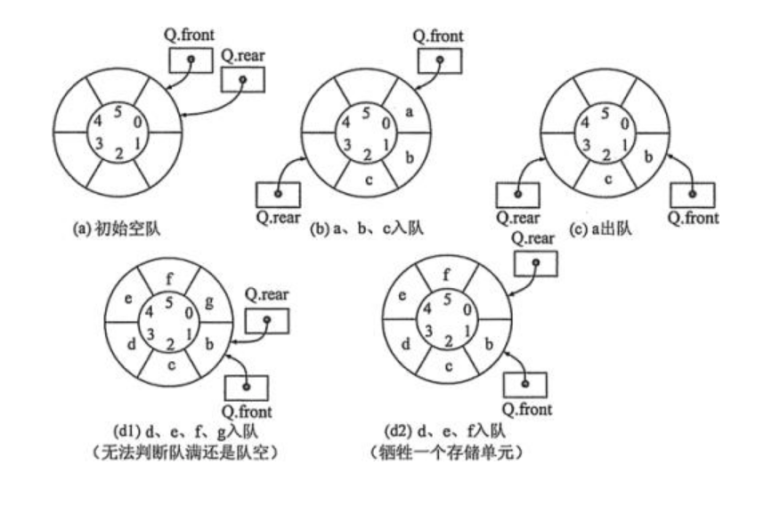

循环队列的类定义和基本操作：

```C++
class CQueue
{
  private:
    int *base; //存储空间基址
    int front;
    int rear;
    int queueSize;

  public:
    CQueue(int m);
    ~CQueue();
    void EnQueue(int e);
    int DeQueue();
    int GetHead();
    int GetLast();
    void QueueDisplay();
};

CQueue::CQueue(int m)
{
    queueSize = m;
    base = (int *)malloc(queueSize * sizeof(int));
    front = 0;
    rear = 0;
}

CQueue::~CQueue()
{
    delete[] base;
    front = 0;
    rear = 0;
    queueSize = 0;
}

void CQueue::EnQueue(int e)
{
    if ((rear + 1) % (queueSize) == front)
    {
        cout << "上溢，无法入队" << endl;
        return;
    }
    base[rear] = e;
    rear = (rear + 1) % queueSize;
}

int CQueue::DeQueue()
{
    int e;

    if (front == rear)
    {
        cout << "下溢，不能出队" << endl;
        return -1;
    }
    e = base[front];
    front = (front + 1) % queueSize;
    return e;
}

int CQueue::GetHead()
{
    int e;
    if (front == rear)
    {
        cout << "队空，无元素" << endl;
        return -1;
    }
    e = base[front];
    return e;
}

int CQueue::GetLast()
{
    int e;
    if (front == rear)
    {
        cout << "队空，无元素";
        return -1;
    }
    e = base[rear];
    return e;
}

void CQueue::QueueDisplay()
{
    if (front == rear)
    {
        cout << "队空，无元素" << endl;
        return;
    }
    for (int i = front % queueSize; i < rear; i++)
    {
        int index = i;
        if (i > queueSize) {
            index = i % queueSize;
        }
        cout << "index: " << index << " value: " << base[index] << endl;
    }

    // for (int i = 0; i < (rear) % queueSize; i++)
    // {
    //     cout << "index: " << i << " value: " << base[i] << endl;
    // }
}

int main(int argc, char const *argv[])
{
    CQueue cq = CQueue(6);
    cq.EnQueue(1);
    cq.EnQueue(2);
    cq.EnQueue(3);
    cq.EnQueue(4);
    cq.EnQueue(5);

    cout << "入队后：" << endl;
    cq.QueueDisplay();

    cout << "第一个元素出队后：" << endl;
    cq.DeQueue();
    cq.QueueDisplay();
    return 0;
}
```

#### 队列的链式存储

队列的链式存储结构称为**链队列$(Linked\;Queue)$**

根据队列先进先出的特性，链队列是仅在表头删除元素和表尾插入元素的单链表。


链队列的类定义和基本操作：

```C++
struct Node
{
    int data;
    Node *next;
};

class LinkQueue
{
  private:
    Node *front;
    Node *rear;

  public:
    LinkQueue();
    ~LinkQueue();
    void EnQueue(int e);
    int DeQueue();
    int GetHead();
    int GetLast();
    void QueueDisplay();
};

LinkQueue::LinkQueue()
{
    front = new Node;
    front->next = NULL;
    rear = front;
}

LinkQueue::~LinkQueue()
{
    Node *p;

    while (front != NULL)
    {
        p = front;
        front = front->next;
        delete p;
    }
}

void LinkQueue::EnQueue(int e)
{
    cout << e << "进入队列！！" << endl;
    Node *s = new Node;
    s->data = e;
    s->next = rear->next;
    rear->next = s;
    rear = s;

    if (front->next == NULL)
    {
        front->next = s;
    }
}

int LinkQueue::DeQueue()
{
    int e;
    Node *p;

    if (rear == front)
    {
        cout << "下溢";
        return -1;
    }
    p = front->next;
    e = p->data;
    front->next = p->next;
    if (p->next == NULL)
    {
        rear = front;
    }
    delete p;
    return e;
}

int LinkQueue::GetHead()
{
    int e;
    Node *p;
    if (front == rear)
    {
        cout << "下溢";
        return -1;
    }
    p = front->next;

    if (p == NULL)
    {
        cout << "当前队列为空" << endl;
    }
    e = p->data;
    return e;
}

int LinkQueue::GetLast()
{
    int e;
    if (front == rear)
    {
        cout << "下溢";
        return -1;
    }
    e = rear->data;
    return e;
}

void LinkQueue::QueueDisplay()
{
    if (front == rear)
    {
        cout << "队列为空" << endl;
        return;
    }
    Node *p = NULL;
    do
    {

        if (p == NULL)
        {
            p = front->next;
        }
        else
        {
            p = p->next;
        }
        cout << p->data << " ";
    } while ((p != rear));
}

int main(int argc, char const *argv[])
{
    LinkQueue lq = LinkQueue();
    lq.EnQueue(1);
    lq.EnQueue(2);
    lq.EnQueue(3);
    lq.EnQueue(4);
    lq.EnQueue(5);
    lq.EnQueue(7);
    lq.EnQueue(8);

    int e = lq.DeQueue();
    cout << e << endl;
    e = lq.DeQueue();
    cout << e << endl;
    e = lq.GetHead();
    cout << e << endl;
    e = lq.GetLast();
    cout << e << endl;
    lq.QueueDisplay();
    return 0;
}
```

## 串

串：$(String)$是由零个或多个字符组成的有限序列。非空串一般记作：$$s="a_1a_2a_3 \cdots a_n"(n \ge 1)$$

其中$s$为串名，双引号引起来的字符序列是串值。$a_i(1 \le n \le n)$可以是字母、数字或其他字符串。

- 串包含的字符个数称为串的长度。
- 空串$(Null\;String)$：长度为0的串。
- 空格串：仅有一个或多个空格组成的串。
- 子串和主串：串中任意个连续字符组成的子序列称为该串的子串，包含子串的串称为主串。
- 子串的首字符在主串中的序号称为子串在主串中的位置。
- 空串是任一串的子串，串总是自身的子串。

程序中使用的串分为两种：串常量和串变量

串常量在程序中只能被引用但不能改变其值，即只读不能写。

例如语句`cout<<"overflow"`中的`overflow`该字符串只能读，不能改。如C++中,可定义：

```C++
const char path[] = "dir/bin/app1"
```

这里的path是一个串常量，对它只能读不能写。

串变量是可以改变的

串的抽象数据类型：

字符的集合：$WordSet$

- 数据对象：$D=\{a_i|a_i\in WordSet,i=1,2,\cdots,n\}$
- 数据关系：$R=\{(a_i,a_{i+1})|a_i,a_{i+1}\in D,i=1,2,\cdots,n-1\}$
- 基本操作：
    - $strassign(\&s,st)$
        - 初始条件：st为字符串常量
        - 操作结果：产生一个值等于st的串s
    - $strempty(s)$
        - 初始条件：s为一个串
        - 操作结果：若s为空串，则返回1，否则返回0
    - $strcopy(\&t,s)$
        - 初始条件：s为一个串
        - 操作结果：把串s复制给t
    - $strncpy(\&sub,s,pos,len)$
        - 初始条件：s为一个串，pos为起始位置，$1\le pos \le strlength(s)-1,len \gt 0$
        - 操作结果：用sub返回串s的第pos个字符开始长度为len的子串
    - $strcmp(s,t)$
        - 初始条件：s和t为两个串
        - 操作结果：若s>t，则返回值1；若s=t，则返回值0，否则返回值-1
    - $strlength(s)$
        - 初始条件：s是一个串
        - 操作结果：返回s的元素的个数
    - $strconcat(\&t,s1,s2)$
        - 初始条件：s1，s2是两个串
        - 操作结果：用t返回s1和s2连接成的新串
    - $substring(\&sub,s,pos,len)$
        - 初始条件：s是一个串，pos是串的起始位置，len是子串的长度
        - 操作结果：用sub返回串s的第pos个字符开始长度为len的子串
    - $strindex(s,t,pos)$
        - 初始条件：s，t为两个串；$1\le pos \le strlength(s)$
        - 操作结果：在s中取从第pos个字符起、长度和串t相等的子串和t比较，若相等，则返回pos，否则增值1至s中不存在和串t相等的子串为止，此时返回0
    - $strinsert(\&s,pos，t)$
        - 初始条件：s，t是两个串，$1\le pos \le strlength(s)+1$
        - 操作结果：在s的第pos字符插入串t
    - $strdelete(\&s,pos,len)$
        - 初始条件：s是一个串，$1\le pos \le strlength(s)-len+1$
        - 操作结果：从串s中删除第pos字符起长度为len的子串
    - $Replace(\&s,t,w)$
        - 初始条件：s，t，w是三个串，t为非空串
        - 操作结果：用w替换串s中出现的所有与t相等的不重复的子串。

### 串的表示与实现

串是特殊的线性表，存储结构和线性表的存储结构类似。其特殊性在于组成串的结点是单个字符。

串的三种存储表示方式：**定长顺序存储、堆分配存储和链式存储**

1. 定长顺序存储表示

    定长顺序存储也称为静态存储分配的顺序表，用一组连续的存储单元来存放串中的字符序列。

    定长存储结构，指直接使用定长的字符数组来实现。

    ```C++
    #define MAXSTRLEN 256
    typedef char sstring[MAXSTRLEN+1];//0号单元存放串的长度
    sstring s;//s是个可容纳255个字符的顺序串
    ```

    一般可使用一个不会出现在串中的特殊字符在串值的尾部来表示串的结束。

    例如C/C++语言使用字符'\0'表示串值的终结，这就是为什么上面保存255个字符，留一个字节存放'\0'字符。

2. 堆分配存储表示

    一般情况采用定长顺序存储表示，但在实际应用中，串变量的长度变化较大，往往会造成存储空间溢出。为了解决这个问题，可采用堆分配存储表示。

    堆分配存储表示的特点：仍以一组地址连续的存储单元存放串字符序列，但它们的存储空间是程序执行过程中动态分配的。

    系统提供一个连续的称为“堆”的自由存储区，作为串的存储空间。

    当建立一个新串时，就在这个存储空间中为新串分配一个连续的存储空间。

    在C++语言，动态分配用new和delete来管理。

    利用new为每个新产生的串分配一块实际串长所须的空间。若分配成功，则返回空间的起始地址。当串被删除时，用delete来释放串所占用的空间。

    堆分配存储表示的定义如下:

    ```C++
    typedef struct
    {
        char *ch;
        int length;
    }Hstring;
    ```

3. 链式存储表示

    串用链表存储，串的这种链式存储结构简称**链串**$(Linked\;String)$。

    链式存储有利于插入和删除运算，但是存储空间利用率低。

    为了便于进行串的操作，当以链表存储串值时，除头指针还附设一个尾指针指示链串的最后一个结点，并给出当前串中结点的个数，即串的长度。

    串的链式存储结构如下
    ```C++
    #define chunksize 100
    typedef struct chunk
    {
        char ch[chunksize];
        chunk *next;
    } chunk;
    typedef struct
    {
        chunk *head, *tail;
        int curlen;
    } Lstring;
    ```

### 串的匹配模式

设$S$和$T$是两个给定的串，在串$S$中找等于$T$的子串的过程称为**模式匹配**$(Pattern\;Matching)$

$S$一般称为主串或目标串，$T$称为模式串。如果找到，称为**匹配成功**，否则称为**匹配失败**

两种模式匹配算法：$BF$和$KMP$

1. 模式匹配方法$BF$

    $BF$方法全称是$Brute-Force$，也称简单匹配方法。

    设$S$为主串，$T$为目标串，且形式为:$S="s_0s_1\cdots s_{n-1}"$和$T="t_0t_1\cdots t_{n-1}"$

    $BF$模式匹配方法的基本思路：

    1. 对于合法的位置$0\le i \le n-m$依次将主串中的子串$S[i\dots{i+m-1}]$和模式串$T[0\dots{m-1}]$进行比较，
    2. 若$S[i\dots{i+m-1}]=T[0\dots{m-1}]$，则从位置$i$开始的匹配成功，亦称模式串$T$在主串$S$中出现；
    若$S[i\dots{i+m-1}]\ne T[0\dots{m-1}]$，则从位置$i$开始的匹配失败。

    具体操作：
    从主串$S$的第一个字符开始，与模式串$T$中的第一个字符比较，若相等，则继续逐个比较后续字符；否则从主串$S$的第二个字符开始重新与模式串$T$的第一个字符进行比较。
    以此类推，若主串$S$的第$i$个字符开始，每个字符依次和模式串$T$中的对应字符相等，则匹配成功，返回$i$;否则，匹配失败，返回-1。

    具体算法如下：

    ```C++
    int index(sstring s,sstring t,int pos)
    {
        int i=pos,j=1;
        while(i<=s[0]&&j<=t[0])
        {
            if(s[i]==t[j])
            {
                i++;
                j++;
            }
            else
            {
                i=i-j+2;
                j=1;
            }
        }
        if(j>t[0])
            return i-t[0];
        else
            return 0;
    }
    ```

    模式串T="abcac"和主串s=“ababcabcaccabbc”的匹配过程
    

2. 模式匹配方法$KMP$

    $KMP$方法的全称$Knuth-Morris-Pratt$。

    $KMP$方法较$BF$模式匹配有很大改进，改进思想在于：
    每当一趟匹配过程中出现字符比较不相等时，不需要回溯$i$指针，而是利用已经得到的"部分匹配"的结果将模式向右移动尽可能多的距离后，再继续比较。
    

    $KMP$的匹配过程：
    设主串$s$，模式串$t$，并设$i$和$j$分别指向主串和模式串待比较的字符，$i$和$j$的初值均为1。若$s_i=t_j$，则$i$和$j$分别加1；否则$i$不变，$j$退回$next(j)$位置。再比较$s_i$和$t_j$，若相等，则$i$和$j$分别加1；否则$i$不变，$j$退回$next(j)$位置依次类推，直至下列两种可能：
    - $j$退回到某个$next(j)$值时字符比较相等，则指针各自加1，继续进程匹配；
    - 退回到$j=0$,将$i$和$j$分别加1，即从主串的下一个字符$s_{i+1}$与模式串中的$t_1$重新开始匹配。

    算法如下：
    ```C++
    void get_next(sstring t,int next[])
    {   //求出模式串t的next函数值并存入数组next中
        int i=1,j=0;
        next[1]=0;
        while(i<t[0])
        {
            if(j==0||t[i]==t[j])
            {
                i++;
                j++;
                next[i]=j;
            }
            else
                j=next[j];
        }
    }
    int KMP_index(sstring s,sstring t,int pos)
    {
        //t非空,1<=pos<=Strlength(s)
        int i=pos,j=1;
        while(i<=s[0]&&j<=t[0])
        {
            if(j==0||s[i]==t[j])
            {
                i++;
                j++;
            }
            else
                j=next[j];
        }
        if(j>t[0])
            return i-t[0];
        else
            return 0;
    }
    ```

## 数组和广义表

数组和广义表可以看做是线性表的扩展，即数组和广义表中的数据元素本身也是一种数据结构。数组中每个数据元素具有相同的结构，广义表中的数据元素可以有不同的数据结构。

### 数组

数组$(Array)$是由相同类型的一组数据元素组成的一个有限序列。其数据元素也称为数组元素。数组中的每个元素都有一个序号，称为**下标$(index)$**。可以通过下标访问数据元素。

数组元素受$n(n\ge1)$个线性关系的约束，每个数据元素在$n$
个线性关系中的符号$i_1,i_2,\cdots,i_n$成为数据元素的下标，并称该数组为$n$维数组。

当$n=2$是，为二维数组，任何一个数据元素有两个下标，一个为行号，一个为列号。如$a_{ij}$表示第$i$行第$j$列的数据元素

一维数组可以看作是一个线性表，二维数组可以看作数据元素是一维数组的线性表。

数组中的每个数据元素都和一组唯一的下标值对应。因此数组是一种随机存取机构。

数据的抽象数据类型

- 数据对象：$j_i=0,\cdots,b_i-1,i=1,2,\cdots,n$
    $$D=\{a_{j_1j_2\cdots j_n}|n(n>0),b_i,j_i,a_{j_1j_2\cdots j_n}\in ElemSet\}$$
    $n$是数据的维数，$b_i$是数据的第$i$维的长度，$j_i$是数组元素第$i$维的下标。
- 数据关系：$R=\{R_1,R_2,\cdots,R_n\}$

$$R_i=\{<a_{j1\cdots ji \cdots jn},a_{j1\cdots ji+1\cdots jn}>\}
​    \\ 0\le j_k\le b_k-1,1\le k\le n\;n\neq i,
​    \\ 0\le j_i \le b_i-2,
​    - InitArray(\&A,n,bound1,...,boundn)
​    \\a_{j1\cdots ji \cdots jn},a_{j1\cdots ji+1\cdots jn}\in D,i=2,\cdots,n$$

- 基本操作
    - $InitArray(\&A,n,bound1,...,boundn)$
        - 初始条件：无
        - 操作结果：若维数$n$和各维长度$b_1,...,b_n$合法，则构造相应的数组$A$，并返回$OK$
    - $DestroyArray(\&A)$
        - 初始条件：无
        - 操作结果：销毁数组$A$
    - $GetValue(A,\&e,index1,...,indexn)$
        - 初始条件：$A$是$n$维数组，$e$为数据元素变量，$index1,\cdots,indexn$是$n$个下标值。
        - 操作结果：若下标$index1,\cdots,indexn$都不超界，则读取与下标对应的数据元素的值，并赋值给$e$
    - $Assign(\&A,e,index1,...,indexn)$
        - 初始条件：$A$是$n$维数组，$e$为数据元素变量，$index1,\cdots,indexn$是$n$个下标值。
        - 操作结果：若下标$index1,\cdots,indexn$都不超界，则将$e$赋值给下标对应的数据元素

#### 数组的存储结构

由于计算机内存结构是一维的，因此用一维内存来表示多维数组，必须按某种次序将数据元素排成一个序列，然后将这个序列放在存储空间中。

由于对不对数组进行插入和删除操作，一般采用顺序存储的方法来表示数组。

用一组连续的存储单元存放数据元素存在一个次序约定的问题，是先存一行数据元素还是先存一列数据元素？

根据**存储方式**的不同，顺序存储方法分为一下两类：

- 行优先顺序存储

    以行序为主序的存储方式。将数据元素按行排列，第$i+1$个行向量紧接在第$i$个行向量后面。

- 列优先顺序存储

    以列序为主序的存储方式。将数据元素按列排列，第$j+1$个列向量紧接在第$j$个列向量后面。

行优先顺序存储：$\boxed{a_{11}|a_{12}|\cdots|a_{1n}|a_{21}|a_{22}|\cdots|a_{2n}|\cdots|a_{m1}|a_{m2}|\cdots|a_{mn}}$
列优先顺序存储：$\boxed{a_{11}|a_{21}|\cdots|a_{m1}|a_{12}|a_{22}|\cdots|a_{m2}|\cdots|a_{1n}|a_{2n}|\cdots|a_{mn}}$

二维数组元素地址，按行优先顺序存储的计算公式

任一数据元素$a_{ij}$的存储地址$LOC(a_{ij})$应为数组的基地址加上排在$a_{ij}$前面的数据元素所占用的单元数，因此$a_{ij}$的存储地址计算公式为：

$$LOC(a_{ij})=LOC(a_{l_1l_2})+((i-l_1)*(h_2-l_2+1)+(j-l_2))*c\\=LOC(a_{l_1l_2})+i*(h_2-l_2+1)*c-l_1*(h_2-l_2+1)*c+j*c-l_2*c$$

令：$M_1=(h_2-l_2+1)*c,M_2=c,$则有

$$LOC(a_{ij})=v_0+i*M_1+j*M_2$$

其中，$v_0=LOC(a_{l_1l_2})+-l_1*M_1-l_2*M_2,i\in[l_1,h_1],j\in[l_2,h_2],$且$i$和$j$均为整数；$LOC(a_l{ij})$是数据元素$a_{ij}$的存储地址，$LOC(a_{l_1l_2})$是二维数组中第一个元素的存储地址，即基地址。

二维数组推广到一般，按照行优先顺序存储，则下标为$i_1,i_2,\cdots,i_n$的存储地址为：
$$LOC(a_{i_1,i_2,\cdots,i_n})
=LOC(a_{l_1,l_2,\cdots,l_n})+(j_1d_2d_3\cdots d_n+j_2d_3\cdots d_n+\cdots+j_{n-1}d_n+j_n)*c\\=V_0+i_1*M_1+i_2*M_2+\cdots+i_n*M_n$$

#### 矩阵的压缩存储

在矩阵中，若非零元素呈现某种规律分布或举证中出现大量零数据元素。为了节省空间，可以对这类矩阵进行压缩。

压缩存储的原则：

- 为多个值相同的非零数据元素分配一个存储空间
- 不为零数据元素分配存储空间

特殊矩阵$(Special\;Matrix)$：值相同的数据元素或者零数据元素在矩阵中的分布有一定的规律。

稀疏矩阵$(Sparse\;Maxtrix)$：矩阵中有许多零数据元素(一般根据稀疏因子的值判定领数据元素是否较多)

1. 特殊矩阵的压缩存储
    特殊矩阵是指非零数据元素或零**数据元素的分布**具有一定**规律**的矩阵。

    常见的特殊矩阵有:对称矩阵、对角矩阵等，它们都是方阵，行数和列数相同。

    1. 对称对称的压缩
        在一个$n$阶方阵$A$中，若数据元素满足下述性质:

        $$a_{ij}=a_{ji}(i\ge1,j\le n)$$

        则称为$A$为$n$阶对称矩阵。

        对称矩阵只需存储矩阵中的上三角$a_{ij}(i\le j)$或下三角$a_{ij}(i\ge j)$的数据元素。

        对称矩阵优先采用行优先顺序存储下三角中的数据元素。

        下三角的数据元素可用一个容量是$n*(n+1)/2$的一维数组存储。对于下三角中任意数据元素$a_{ij}(i\ge j)$,$a_{ij}$在一维数组中的下标$k$与$i、j$的关系为：$k=i*(i+1)/2+j$。

        $$\boxed{a_{00}|a_{10}|a_{11}|a_{20}|a_{21}|a_{22}|\cdots|a_{ij}|\cdots|a_{n-1,0}|a_{n-1,1}|\cdots|a_{n-1,n-1}}$$

        若采用上述的压缩存储方式，则矩阵中的任一数据元素$a_{ij}$与它在一维数组中的存储位置$k$之间存在如下的对应关系:

        $$k=\begin{cases}i(i-1)/2+j-1,\ge j
        \\j(j-1)/2+i-1,\lt j\end{cases}$$

        其中$k=0,1,2，\cdots,((n+1)n/2)-1,
        \\1+2+3+(i-1)=(i-1)i/2,
        \\(i-1)i/2+j=k+1\quad i\ge j\quad and\quad i,j\ge 1$

    2. 对角矩阵的压缩存储

        对角矩阵：所有的非零数据元素都集中在以主对角线为中心的带状区域中的举证，即除了**主对角线上和主对角线相邻两侧**的若干条对角线上的数据之外，其余所有数据元素均为零数据元素。

2. 稀疏矩阵的压缩存储

    **稀疏矩阵$(Sparse\;Matrix)$**:矩阵$A$中有$s$个非零数据元素，若$s$远远小于矩阵数据元素的总数即$(s\ll m*n)$。

    稀疏因子：假设$m\ast n$阶矩阵中有$s$个非零元素，令$t=s/(m\ast n)$，称$t$为稀疏因子。

    通常认为$s\ll0.05$时，称为稀疏矩阵。

    1. 稀疏矩阵的三元组顺序表

        - 不存储零数据元素，只存储稀疏矩阵的非零数据元素。
        - 除了存储非零数据的元素的数据值，还需要同时存储它所在的行和列的位置$(i,j)$。
        - 一个三元组$(i,j,a_{ij})$唯一确定了矩阵$A$的一个非零数据元素。
        - 若把稀疏矩阵的三元组线性表按顺序存储结构存储，则称为**稀疏矩阵的三元组顺序表**

    2. 稀疏矩阵的类定义和基本操作

        ```C++
        const int MaxSize = 1000;

        typedef int ElemType;

        struct Triple
        {
            int i;
            int j;
            ElemType e;
        };

        class SMatrix
        {
          private:
            int mu; //行数
            int nu; //列数
            int tu; //非零数据的个数
            Triple *data;

          public:
            SMatrix();
            SMatrix(int m, int n, int k, Triple data[]);
            ~SMatrix();
            SMatrix MCreate(int d[][3], int m, int n, int k);
            void MDisplay(SMatrix a);
            void MatrixTrans_1(SMatrix A, SMatrix &B); //矩阵转置算法1
            void MatrixTrans(SMatrix A, SMatrix &B);   //快速转置算法
        };

        SMatrix::SMatrix()
        {
            mu = 0;
            nu = 0;
            tu = 0;

            for (int p = 0; p < tu; p++)
            {
                data[p].i = 0;
                data[p].j = 0;
                data[p].e = 0;
            }
        }

        SMatrix::SMatrix(int m, int n, int k, Triple data[])
        {
            this->mu = m;
            this->nu = n;
            this->tu = k;
            this->data = data;
        }

        SMatrix SMatrix::MCreate(int d[][3], int m, int n, int k)
        {
            SMatrix M = {m, n, k, NULL};
            if (k != 0)
                M.data = new Triple[k];

            for (int i = 0; i < k; i++)
            {
                M.data[i].i = d[i][0];
                M.data[i].j = d[i][1];
                M.data[i].e = d[i][2];
            }
            return M;
        }
        //矩阵遍历
        void SMatrix::MDisplay(SMatrix a)
        {
            Triple p;
            int i, j, k, c = 0;
            p = a.data[k];

            for (i = 0; i < a.mu; i++)
            {
                for (j = 1; j < a.nu; j++)
                {
                    if (k < a.tu && p.i == i && p.j == j)
                    {
                        cout << "\t" << p.e;
                        k++;
                        if (k < a.tu)
                            p = a.data[k];
                    }
                    else
                    {
                        cout << "\t" << c;
                    }
                }
                cout << endl;
            }
        }

        //基于三元组顺序表的转置算法
        void SMatrix::MatrixTrans_1(SMatrix A, SMatrix &B)
        {
            B.mu = A.nu;
            B.nu = A.tu;
            B.tu = A.tu;
            int q, p;
            int col;
            if (B.tu)
            {
                q = 0;
                for (col = 1; col < A.nu; col++)
                {
                    for (p = 0; p <= A.tu - 1; p++)
                    {
                        if (A.data[p].j == col)
                        {
                            B.data[q].i = A.data[p].j;
                            B.data[q].j = A.data[p].i;
                            B.data[q].e = A.data[p].e;
                            q++;
                        }
                    }
                }
            }
        }

        //快速转置算法
        void SMatrix::MatrixTrans(SMatrix A, SMatrix &B)
        {
            int col, k, p, q;
            int *num, *cpot;
            num = new int[B.nu];
            cpot = new int[B.nu];

            if (B.tu)
            {
                for (col = 0; col < A.tu; col++)
                {
                    num[col] = 0;
                }

                for (k = 0; k < A.tu; k++)
                {
                    num[A.data[k].j]++;
                }
                cpot[0] = 0;

                for (col = 1; col <= A.nu; col++)
                {
                    cpot[col] = cpot[col - 1] + num[col - 1];
                }

                for (p = 0; p < A.tu; p++)
                {
                    col = A.data[p].j;
                    q = cpot[col];
                    B.data[q].i = A.data[p].j;
                    B.data[q].j = A.data[p].i;
                    B.data[q].e = A.data[p].e;
                    cpot[col]++;
                }
            }
        }
        ```

        矩阵的运算一般有**矩阵转置、矩阵相加、矩阵相减、矩阵相乘**等。
        - 矩阵转置

            $def：$一个$m\ast n$的矩阵$A$，它的转置矩阵$B$是一个$n\ast m$的矩阵，且
            $a[i][j]==b[j][i],1\le i\le m,1\le j\le m$，即$A$的行是$B$的列，$A$的列是$B$的行。

            1. 基于三元组顺序表的转置算法

                - 基本思想：对矩阵$A$的三元组从头到尾多次扫描
                    1. 第一次扫描时，将$A$中列号为1的三元组行列交换并赋值到矩阵$B$的三元组中；
                    2. 第二次扫描时，将$A$中列号为2的三元组行列交换并赋值到矩阵$B$的三元组中；
                    3. 依次类推直到$A$中所有的三元组都赋值到矩阵$B$的三元组中。

                - 评价:基于三元组顺序表的矩阵算法更加复杂，虽然节省了存储空间，但可能增大算法的时间复杂度，故基于三元组顺序表的转置算法仅适用
                $tu \ll m\ast n$情况。

            2. 快速转置算法

                - 快速转置算法的核心思想：对矩阵$A$扫描一次，按矩阵$A$提供的列号一次确定装入矩阵$B$的一个三元组$d$的位置。
                    1. 一遍扫描先确定三元组的位置关系(具体是根据矩阵$A$中非零数据元素的分布确定每列第一个非零数据元素在矩阵$B$中的位置)
                    2. 二次扫描由位置关系装入三元组。
                - 位置关系是快速转置算法的关键
                    为求得矩阵$A$各列第一个非零数据元素的三元组的所在位置，引入两个辅助运算功能的一个数组$num[],cpot[]$
                    - $num[col]$:存放矩阵$A$中第$col$列的非零数据元素的个数。
                    - $cpot[col]$:存放矩阵$A$中第$col$列第一个非零数据元素的三元组在$B$的位置。
                    - 位置计算公式
                        $$\begin{cases}cpot[1]=1\\
                        cpot[col]=cpot[col-1]+num[col-1];2\le col\leq n\end{cases}$$
                - 步骤：
                    1. 求矩阵$A$中各列非零数据元素的个数$num[]$
                    2. 求矩阵$A$中各列第一个非零数据元素在转置矩阵$B$中的下标$cpot[col]$
                    3. 对矩阵$A$进行一次扫描，遇到第$col$列的第一个非零三元组时，按照$cpot[col]$的位置，将其放至矩阵$B$中，当再次遇到第$col$列的非零元三元组时，只需顺序放到第$col$列数据元素的后面。

                - 评价：相对于基于三元组顺序表的转置算法，多占用了两个数组的存储空间，同时算法本身比较复杂，但时间复杂度较低，为$O(nu+tu)$。

        - 矩阵相乘
            由于两个稀疏矩阵相乘不一定是稀疏矩阵，所以矩阵的乘积采用二维数组表示。设矩阵$A$为$m$行$p$列，矩阵$B$为$p$行$n$列，则计算矩阵乘积$C$($C$为$m$行$n$列)的一般传统方式，依据下述公式计算：
            $$C[i][j]=\sum^{p-1}_{k=1}A[i][k]\ast B[k][j]$$

            一般传统的矩阵相乘的算法代码如下

            ```C++
                for(i=0;i<m;i++)
                    for(j=0;j<n;j++)
                        c[i][j]=0;
                        for(k=0;k<p;k++)
                            c[i][j]+=a[i][k]*b[k][j];
            ```

            算法的时间复杂度为$O(m*n*p)$

            如果采用三元组顺序存储表示，则不能采用上述传统矩阵相乘算法。

            思路：先求得各个$c[i][j]$的部分积，最后分别累加，只需对$B$每一行扫描一次。

            采用上述思路，需要一些辅助数组：
            1. 一个累加器$ctemp[]$存储当前行中$c[i][j]$的部分积，待当前行中所有数据元素全部算完后，再将非零数据元素的结果存放到$C.data$中。
            2. 为了便于在$B$的三元组表中找到各行的第一个非零数据元素，与快速矩阵转置算法类似，引入$num[row]$和$cpot[row]$两个一维数组。其中$num[row]$指示$row$行的非零元个数，$cpot[row]$指示第$row$行第一个非零数据元素的位置。$cpot[row]$的计算公式如下：
            $$\begin{cases}cpot[0]]=1\\
               ​         cpot[row]=cpot[row-1]+num[row-1];\end{cases}$$

            采用三元组顺序表表示的稀疏矩阵的乘法步骤如下：
            1. 如果矩阵$A$的列数和矩阵$B$的行数不同，则不满足计算条件，算法退出。
            2. 如果矩阵$A$的列数与矩阵$B$的行数相同，则申请矩阵$C$的存储空间，令矩阵$C$的行数等于矩阵$A$的行数，矩阵$C$的列数等于矩阵$B$的列数。
            3. 如果矩阵$A$或矩阵$B$中的非零数据元素个数为0，则矩阵$C$为全零矩阵，计算结束，算法退出。
            4. 如果矩阵$A$和矩阵$B$的非零数据元素个数均不为0，求$B$的$num[row]$和$cpot[row]$。
            5. 按矩阵$A$的行号从小到大的顺序，执行一下操作。
                1. 对每行非零数据元素执行一下操作：
                    - 累加器$ctemp[nu]$清零；
                    - 数据元素$a[i][k]$与$b[k][j]$相乘，累加到$ctemp[j]$中。
                2. 如果$ctemp[j]$非零，则得到一个$c[i][j]$即在$C$中新添加一个三元组，$C$的非零数据元素个数增1。

### 广义表

**广义表**$(Generalized\;Lists)$是$n(n\ge 0)$个数据元素的有限序列，一般记作:

$$LS=(a_1,a_2,\cdots,a_n)$$

其中,$LS$是广义表的名称，$a_i(i\le i\le n)$是$LS$的直接数据元素，也称成员，它可以是单个数据元素，也可以是一个广义表，它们分别称为$LS$的单数据元素(原子)或子表。

当广义表$LS$非空时：

- 表头$(Head)$：第一个数据元素
- 表尾$(Tail)$：除去表头后其余数据元素组成的广义表
- 长度：直接数据元素的个数
- 深度：括号中最大嵌套层数

广义表$()$和广义表$(())$是不同的，前者为空表，长度为0，后者长度为1。

广义表的性质：

- 广义线性：不考虑其数据元素的内部结构，则它是一个线性表，它的直接数据元素之间是线性关系
- 数据元素复合性：数据元素分为单数据元素和子表，数据类型不统一。
- 数据元素递归性：广义表是递归的。即广义表可以是自身的子表。
- 数据元素共享性：广义表以及广义表的数据元素可以被其他广义表共享。

广义表的抽象数据类型：

- 数据对象：$D=\{e_i|i=1,2,\cdots,n;n\ge 0;e_i\in AtomSet\;or\;e_i\in GList\}$$AtomSet$为某个数据对象
- 数据关系：$R=\{<e_{i-1},e_i>|e_{i-1},e_i\in D,2\le i\le n\}$
- 基本操作：
    - $InitGList(\&L)$
    - $CreateGList(\&L,S)$
    - $CopyGList(\&T,L)$
    - $GListLength(L)$
    - $GListDepth(L)$
    - $GListEmpty(L)$
    - $GetHead(L)$
    - $GetTail(L)$
    - $InsertFirst_GL(\&L,e)$
    - $DeleteFirst_GL(\&L,e)$
    - $Traverse_GL(L,visit())$

#### 广义表的存储结构

由于数据元素**类型的不统一**，难以采用顺序存储结构，而采用链式存储结构存储广义表。

若广义表不空，则可分解为**表头和表尾**；反之，一对确定的表头和表尾可唯一确定一个广义表。

根据上述性质可采用**头尾表示法**$(Head\;Tail\;Express)$来存储广义表。

广义表的数据元素可以是单数据元素也可以是广义表，相应的在头尾表示法中链表的结点结构也有两种：

- 表结点，用于存储广义表
- 数据元素结点，用于存储但数据元素

为了区别这两类结点，在结点设置一个标识域，标志为1，则为表结点；标志为0，则该结点为数据元素结点。

$$\boxed{tag=1|hp|tp}\quad\quad\boxed{tag=0|data}$$

- tag:区分表结点和数据元素结点的标志
- hp:指向表头结点的指针
- tp:指向表尾结点的指针
- data:存储数据元素自身的信息

```C++
struct GLNode
{
    int tag;
    char data;
    struct atom
    {
        GLNode *hp, *tp;
    } ptr;
};

class GList
{
  private:
    GLNode *ls; //指向表头的指针
    char result[50];
    int count;                      //计数
    GLNode *CreateGList(string st); //由广义表的书面格式s创建广义表
    GLNode *CopyGList(GLNode *ts, GLNode *ls);
    int Depth(GLNode *ls);
    void Print(GLNode *ls);

  public:
    GList();
    GList(string s);
    ~GList();
    int DepthGList();
    void GListCopy();
    void Server(string &str, string &hstr);
    void GListDisplay();
};

GList::GList()
{
    ls = NULL;
    count = 0;
}

GList::~GList()
{
    delete[] ls;
}
```

## 树和二叉树

树是一种非线性结构。树是一种**层次结构**。

### 树

树$(Tree)$:是$n(n\ge0)$个结点的有限集。

树的递归定义如下：

当$n=0$时，$T$称为空树；当$n>0$时，$T$是非空树。在一棵非空树中：

1. 有且仅有一个特定的结点，它只有后继结点，没有前驱结点，这个结点称为根$(Root)$
2. 当$n\gt1$时，除了根以外的其余结点分为$m(m\gt0)$个互不相交的有限集合$T_1,T_2，\cdots,T_m$其中每一个集合本身又是一棵树，并且称为根的**子树**$(SubTree)$。T的定义记作：

    $$T=\begin{cases}\varPhi,n=0\\
    \{root,T_1,T_2,\cdots,T_m\},n\gt0\end{cases}$$
    其中，$root$表示$T$的根，$T_1,T_2,\cdots,T_m$表示$T$的$m$棵子树。

#### 基本术语

- 结点$(Node)$:树中的每个元素对应一个结点
- 结点的度$(Degree)$:是结点所拥有的子树的个数
- 树的度$(Degree)$:树中所有结点的度的最大值
- 叶子结点$(Deaf)$:即度为0的结点，又称为终端结点，叶子结点简称叶子
- 分支结点$(Branch)$:即度不为0的结点，又称非终端结点，分支结点简称为分支
- 孩子结点$(Child)$:若结点$X$有子树，则子树的根结点即为结点$X$的孩子结点，孩子结点简称孩子
- 双亲结点$(Parent)$:若结点$X$有孩子，则$X$即为孩子的双亲结点，双亲结点简称双亲
- 兄弟结点$(Sibling)$:同一双亲的孩子结点间互称为兄弟结点，兄弟结点简称兄弟
- 堂兄弟结点$(Cousin)$:结点在树中的层次相同，但双亲不同的结点称为堂兄弟结点，堂兄弟结点简称堂兄弟
- 结点的层次:根结点的层次为1，根结点的孩子的层次为2，根结点的孩子的孩子的层次为3.依次类推
- 祖先结点$(Ancestor)$:从根结点到结点$X$所经过分支上的所有结点，都称为$X$的祖先结点，祖先结点简称为祖先
- 子孙结点$(Descendant)$:结点$X$的孩子，以及这些孩子的孩子都是$X$的子孙结点，子孙结点简称子孙
- 树的深度$(Depth)$:树中距离根最远的结点所处的层次即为树的深度。空树的深度为0，有一个根结点的树的深度为1.
- 树的高度$(Height)$:叶子结点的高度为1，非叶子结点的高度等于它的孩子界定啊的高度的最大值加1,这样定义树的高度等于根结点的高度。高度的深度的计算的方向不同，但数值相等
- 路径$(Path)$:从树的双亲结点移动到其孩子结点和其他子孙结点所经过的路线；路径上经过的边的个数成为路径长度。
- 有序树$(Ordered\;Tree)$:树中个结点的各棵子树从左到右都是有次序的树
- 无序树$(Unordered\;Tree)$:树中各个结点的各棵子树不存在确定的次序关系
- 森林$(Forest)$:$m(m\ge0)$棵互不相交的树的集合称之为森林

#### 树的性质和存储

1. 树的性质
    - 树中的结点个数等于树中所有结点的度数之和再加1
        假设树中的结点个数为
    - 度为$m$的树中第$i$层上至多有$m^{i-1}$个结点$(i\ge1)$

2. 树的存储结构

    1. 树的顺序存储结构

        双亲表示法：$(Parent\;Express)$，一维数组来存储树的每个结点的信息，数组中的一个数据元素表示树中的一个结点，数据元素为结构体类型，其中包括结点本身的信息以及其双亲结点在数组中的位置信息。

        ```C++
        const int MaxSize = 100;
        struct PNode
        {
            ElemType data;
            int parent
        };
        struct PNode Tree[MaxSize];;
        ```

    2. 树的链式存储结构
        - 孩子表示法
            - 多重链表表示法：每个结点包括一个信息域和多个指针域，每个指针域指向该结点的一个孩子。
                - 每个结点的指针域的个数等于树的度数
                - 每个结点的指针域的个数等于该结点的度数
            - 孩子链表示法：存储单元的主体是一个与结点个数大小一样的一维数组，数组的每个元素由两个域组成，一个域用来存放结点的自身信息，另一个域用来存放指针，该指针指向由该结点孩子组成的单链表的表头。
        - 双亲孩子表示法：将双亲表示法和孩子表示法相结合的存储方法。将各结点的孩子组成单链表，同时用一维数组顺序存储树的各结点，一维数组中的数组元素除了本身的信息和该结点的孩子结点链表的头指针之外，还有一个域指向双亲结点。
        - 孩子兄弟表示法：又称二叉链表表示法或二叉树表示法。以二叉链表作为树的存储结构，链表中结点的两个链域分别指向该结点的第一个孩子结点和下一个兄弟结点，分别命名为$firstchild$和$nextsibling$域。

            ```C++
            struct TNode
            {
                ElemType data;
                TNode *firstchild,*nextsibling;
            };
            ```

    3. 树的遍历
        遍历：$(Traverse)$是树的基本操作。

        树的遍历：指从根结点出发，按照某种次序访问树中所有结点，使得每个结点被访问一次且仅被访问一次。

        - 先根遍历(先序遍历)
        - 后根遍历(后序遍历)
        - 层次遍历(一层一层的访问)

#### 森林

1. 森林的存储结构
    1. 森林的顺序存储结构
    2. 森林的链式存储结构
        - 双亲孩子表示法
        - 孩子兄弟表示法
2. 森林的遍历
    - 先序遍历森林
        若森林非空
        1. 访问森林第一棵树的根节点
        2. 先序遍历第一棵树中根结点的子树森林
        3. 先序遍历除去第一棵树之后剩余的树构成的森林
    - 中序遍历森林
        若森林非空
        1. 中序遍历第一个棵树的根结点和子树森林
        2. 访问第一个棵树的根结点
        3. 中序遍历除去第一棵树之后剩余的树构成的森林

#### 二叉树

1. 定义

    二叉树：$(Binary\;Tree)$:一种树形结构，每个结点至多有两棵子树，分别称为左子树和右子树。

    二叉树的递归定义如下：
    $$T=\begin{cases}\phi,n=0\\\{root,T_L,T_r\},n\gt0\end{cases}$$

2. 性质

    - 在二叉树的第$i(i\ge1)$层上至多有$2^{i-1}$个结点。
    - 深度为$k(k\ge1)$的二叉树至多有$2^{k}-1$个结点
    - 对任何一棵非空二叉树，如果其叶子结点数为$n_0$,度为2的结点数为$n_2$则$n_0=n_2+1$.
        - 满二叉树：$(Full\;Binary\;Tree)
            $深度为$k$且有$2^{k}-1$个结点的二叉树。除最底层结点度为0，其余都为2。
        - 完全二叉树：$(Complete\;Binary\;Tree)$
            如果一棵深度为$k$且具有$n$个结点的二叉树，它的每一个结点都与深度为$k$的满二叉树中顺序编号为$1\sim n$的结点一一对应。
    - 具有$n(n\gt0)$个结点的完全二叉树的深度为$\left\lfloor log_2n\right\rfloor+1$
    - 如果将一棵$n$个结点的完全二叉树按照自顶向下，同一层自左向右的顺序连续给结点编号$1,2,3,\cdots,n$。
        按照此结点编号将树中各结点顺序地存放于一个一维数组，并简称编号为$i$的结点为结点$1\le i\le n)$
        1. 若$i=1$，则结点$i$为根，无双亲结点；若$i\gt1$,则结点的双亲结点为结点$\left\lfloor\frac{i}{2}\right\rfloor$
        2. 若$2i\le n$，则结点$i$的左孩子为结点$2i$，否则$i$无左孩子
        3. 若$2i+1\le n$，则结点$i$的右孩子为结点$2i+1$，否则结点$i$无右孩子

3. 二叉树的存储结构

    - 二叉树的顺序存储结构

        1. 完全二叉树的顺序存储表示
        2. 一般二叉树的顺序表示：对不存在的结点仍然编号。

    - 二叉树的链式存储结构

        顺序存储方式用于完全二叉树的存储非常有效，但用于一般二叉树，存储空间浪费。

        根据二叉树的定义，每个结点可以有两个分支：
        二叉树的结点至少三个域，分别存放数据信息$data$、左孩子结点指针$lchild$和右孩子结点指针$rchild$，这种结构称为二叉链表$(Binary)\;Linked\;List$。
        为了便于查找，可以增加一个指向双亲结点的指针域。这样的结构称为三叉链表$(Trifurcate\;Linked\;List)$。

        ```C++
        typedef int ElemType;
        struct BiTNode
        {
            ElemType data;
            BiTNode *lchild, *rchild;
        };
        class BinaryTree
        {
          private:
            BiTNode *bt;
            int RCreate(BiTNode *p, int k, int end);
            int PreTraverse(BiTNode *p);
            int InTraverse(BiTNode *p);
            int PostTraverse(BiTNode *p);

          public:
            BinaryTree();
            ~BinaryTree();
            void CreateBiTree(int end);
            void PreOrderTraverse();
            void InOrderTraverse();
            void PostOrderTraverse();
            BiTNode *GetRoot();
            void BiTreeDisplay(BiTNode *bt, int level = 1);
        };

        BinaryTree::BinaryTree()
        {
            bt = NULL;
        }

        BinaryTree::~BinaryTree()
        {
            delete[] bt;
        }
        ```

4. 二叉树的遍历

    1. 二叉树遍历的概念
        - 先序遍历
        - 中序遍历
        - 后序遍历
        - 层次遍历
    2. 二叉树遍历的递归算法和非递归算法
        1. 递归算法

            ```C++
            int BinaryTree::PreTraverse(BiTNode *p)
            {

                if (p != NULL)
                {
                    cout << p->data << ' ';
                    PreTraverse(p->lchild);
                    PreTraverse(p->rchild);
                }
                return 0;
            }
            int BinaryTree::InTraverse(BiTNode *p)
            {

                if (p != NULL)
                {
                    InTraverse(p->lchild);
                    cout << p->data << ' ';
                    InTraverse(p->rchild);
                }
                return 0;
            }
            int BinaryTree::PostTraverse(BiTNode *p)
            {

                if (p != NULL)
                {
                    PostTraverse(p->lchild);
                    PostTraverse(p->rchild);
                    cout << p->data << ' ';
                }
                return 0;
            }
             ```

        2. 非递归算法

            ```C++
            void BinaryTree::PreOrderTraverse()
            {
                cout << "先序非递归遍历二叉树：";
                BiTNode *p = bt;
                SqStack s(20);
                while (p || !s.StackEmpty())
                {
                    if (p)
                    {
                        cout << p->data << ' ';
                        s.Push(p->data);
                        p = p->lchild;
                    }
                    else
                    {
                        s.Pop();
                        p = p->rchild;
                    }
                }
                cout << endl;
            };
            ```

    3. 二叉树遍历的应用
        - 利用后序递归遍历计算结点个数
        - 利用后序递归遍历计算树的高度
        - 利用后序递归遍历销毁二叉树
        - 利用先序递归遍历复制二叉树
        - 利用先序递归遍历判断两棵二叉树是否相等
        - 利用先序递归遍历构造二叉树
        - 利用先序遍历输出显示二叉树

5. 线索二叉树

    一个具有$n$个结点的二叉树若采用二叉链表存储结构，在$2n$个指针域中只有$n-1$个指针域用来存储孩子结点的地址，另外的$n+1$个指针域为空，利用这些空指针域存放指向该结点的某种遍历序列中的前驱和后继结点的位置信息。

    其中：
    $$ltag=\begin{cases}0,*lchild\;is\;lchild\\
    1,*lchild\;is\;preNode\end{cases}$$

    $$rtag=\begin{cases}0,*rchild\;is\;rchild\\
    1,*rchild\;is\;postNode\end{cases}$$

    线索$(Thread)$：指向结点前驱和后继的指针
    线索二叉树$(Thread\;Binary\;Tree)$：加上线索的二叉树
    线索链表$(Thread\;Linked\;List)$：加上线索的二叉链表
    线索化：对二叉树以某种次序进行遍历使其成为线索二叉树的过程

    结点结构示意图：
    $$\boxed{lchild|ltag|data|rtag|rchild}$$

    线索二叉树的定义和基本操作：
    ```C++
    typedef struct BiThrNode
    {
        ElemType data;
        BiThrNode *lchild, *rchild;
        int LTag, RTag;
    } BiThrNode, *BiThrTree;

    class ThreadBiTree
    {
      private:
        BiThrNode *bt;
        BiThrNode *pre;
        void RCreate(BiThrNode *p, int flag, int end);

      public:
        BiThrNode *Thrt;
        ThreadBiTree();
        ~ThreadBiTree();
        void CreateBiTree(int end);
        BiThrNode *GetRoot();
        int InOrderThreading(BiThrTree &Thrt, BiThrTree T);
        void InThreading(BiThrTree p);
        int InOrderTraverse_Thr(BiThrTree T);
        void BiTreeDisplay(BiThrNode *bt, int level = 1);
    };
    ThreadBiTree::ThreadBiTree()
    {
        bt = NULL;
        Thrt = new BiThrNode();
    }

    ThreadBiTree::~ThreadBiTree()
    {
    }
    void ThreadBiTree::InThreading(BiThrTree p)
    {

        if (p)
        {
            InThreading(p->lchild);

            if (!p->lchild)
            {
                p->LTag = 1;
                p->lchild = pre;
            }

            if (!pre->rchild)
            {
                pre->RTag = 1;
                pre->rchild = p;
            }
            pre = p;
            InThreading(p->rchild);
        }
    }
    ```

### 树，森林与二叉树的转换

1. 树与二叉树的转换

    由于树和二叉树都可以采用二叉链表作为存储结构，则以二叉链表作为中间形态导出树和二叉树之间的对应关系。

    将一棵树转换成二叉树的方法如下：
    1. 加线：在树中所有相邻兄弟之间加一条连线
    2. 抹线：对树中的每个结点，只保留它与第一个孩子结点之间的连线，删除它与其他孩子结点之间的连线
    3. 旋转：以树的根结点为轴心，将整棵树顺时针旋转45°，使之成为一棵层次分明的二叉树

2. 森林与二叉树的转换

    1. 将森林中的每棵树转换成对应的二叉树
    2. 第一棵二叉树不动，从第二棵二叉树开始，依次把后一棵二叉树的根结点作为前一棵二叉树根结点的右孩子。

### 堆

堆：设有$n$个元素的序列$\{k_1,k_2,\cdots,k_n\}$,当且仅当满足下述关系之一时：

$$\begin{cases}k_i\le k_{2i}\\
k_i\le k_{2i+1}\end{cases}
\;or\;
\begin{cases}k_i\ge k_{2i}\\
k_i\ge k_{2i+1}\end{cases}$$

若以一维数组存储堆，则堆对应为一棵完全二叉树，且所有非叶子结点的值均不大于或不小于其子女的值，根结点的值是最小或最大的。

堆具有下列其中某一条性质的完全二叉树：

1. 每个结点的值都小于或等于其左右孩子结点的值，称为小根堆或小顶堆。
2. 每个结点的值都大于或等于其左右孩子结点的值，称为大根堆或大顶堆。

### 哈夫曼树和哈夫曼编码

1. 概念

    哈夫曼树：又称最优二叉树，指带权路径长度最小的二叉树。

    涉及的术语：

    - 结点的权：对结点赋予的一个有着某种意义的数值
    - 结点的带权路径长度：从树根结点到该结点之间的路径长度与该结点权值的乘积
    - 叶子结点：树中度为0的结点
    - 树的带权路径长度：树中所有叶子结点的带权路径长度之和

    树的带权路径长度$WPL$可记为：
    $$WPL=\sum^n_{k=1}W_k\bullet L_k$$

    其中$W_k$为第$k$个叶子结点的权值，$L_k$为第$k$个叶子结点的路径长度。

2. 哈夫曼树的构造

    哈夫曼树的构造算法如下：
    1. 根据给定的$n$个权值$\{w_1,w_2,\cdots,w_n\}$构造$n$棵二叉树的集合$F=(T_1,T_2,\cdots,T_n)$，其中每棵二叉树$T_i$中只有一个权值为$W_i$的根结点，其左右子树均为空。
    2. 在$F$中选取两个根结点的权值最小的树，分别作为左右子树构造一棵新的二叉树，且将新的二叉树的根结点的权值为置其左右子树上根结点的权值之和。
    3. 在$F$中删除作为左右子树的两棵二叉树，同时将新得到的二叉树加入$F$中。
    4. 重复2和3，直到$F$只含有一棵树为止，这棵树就是哈夫曼树。

3. 哈夫曼编码

    在数据通信中，需要将传送的文字转换成由二进制字符0、1组成的字符串也称编码。

    每个字符所转换的二进制字符长度相等称为**等长编码**。

    如果让出现频率高的字符采用尽可能短的编码，出现频率低的字符采用稍长的编码，构造一种**不等长编码**，则电文的代码总长度会更短。

    设计电文总长最短的编码方式：构造以字符使用频率作为权值的哈夫曼树。

    具体操作如下：设需要编码的字符集合为$\{d_1,d_2,\cdots,d_n\}$，它们在电文中出现的次数或频率集合为$\{w_1,w_2,\cdots,w_n\}$，以$d_1,d_2,\cdots,d_n$作为叶子结点，$w_1,w_2,\cdots,w_n$作为它们的权值，构造一棵哈夫曼树，规定哈夫曼树的左分支代表0，右分支代表1，则从根结点到每个叶子结点所经过的路径分支组成的0和1的序列便为该结点对应字符的编码，称之为**哈夫曼编码**。

    **在不等长编码的选择上，必须使任何一个字符的编码都不是其他字符编码的前缀，以保证译码的唯一性。**

    若采用哈夫曼编码，则能确保译码的唯一性。

    哈夫曼编码的算法：
    1. 构造哈夫曼树。
    2. 在哈夫曼树上求叶子结点的编码。

## 图

### 图的基本概念

- 图$(Graph)$：是由有穷非空的顶点集合和顶点之间的边的集合组成的，可表示为：

    $$G=(V,E)$$

    其中，$G$表示图，图中的数组元素通常叫做**顶点**$(Vertex),V$称为顶点的非空有穷集合，$E$是图$G$中顶点之间边的集合。

- 无向边：若顶点$v$和$w$间的边没有方向，用$(v,w)$表示

- 无向图$(Undigraph)$：只有无向边的图

- 有向边(弧)：若顶点$v$和$w$间的边有方向,用$<v,w>$表示且称$v$为弧尾$(Tail)$或初始点$(Initial\;Node)$,称$w$为弧头$(Head)$或终端点$(Teriminal\;Node)$

- 有向图$(Digraph)$：只有有向边的图

- 自环$(Self\;Loop)$:顶点有直接与自身相连的边

- 多重图$(Multigraph)$：任意连个顶点之间有多条边直接相连

- 完全图$(Complete\;Graph)$：在由$n$个边组成的**无向图**中，若有$\frac{n(n-1)}{2}$条边，则称之**无向完全图**。在由$n$个边组成的**有向图**中，若有$\frac{n(n-1)}{2}$条边，则称之为**有向完全图**

- 权$(Weight$：在某些图上，边或弧上具有与它相关的数据信息称之为权

- 网或网络$(NetWword)$：带权的图

    分别称带权的有向图和带权的无向图为**有向网和无向网**

- 邻接顶点$(Adjacent\;Vertex)$：相邻的两个结点互为邻接顶点

- 子图$(Subgraph)$：设图$G=(V,E)$和$G^1=(V^1,E^1)$，若$V^1\subseteq V$且$E^1\subseteq E$，则称图$G^1$为图$G$的子图。

- 度$(Degree)$：与顶点$v$关联的边的数目，记作$deg(v)$。

    - 有向图中，顶点的度等于出度加入度
    - 入度$(Indegree)$：以顶点$v$为弧头的弧的数目，记作$indeg(v)$
    - 出度$(Outdegree)$：以顶点$v$为弧尾的弧的数目，记作$outdeg(v)$
    - $deg(v)=indeg(v)+outdeg(v)$
    - 无论有向图和无向图，若图$G$有n个顶点和e条边，则有：$e=\frac{1}{2}\{\sum^n_{i=1}deg(v_i)\}$

- 路径$(Path)$：从一个顶点到另一个顶点经过的顶点序列

- 路径长度$(Path\;Length)$：一条路径上经过的边或弧的数目

- 简单路径和回路$(Simple\;Path\;\&\;Cycle)$：路径上的各顶点补充度称为简单路径，若第一个顶点和最后一项顶点重复，称这样的路径为回路或环。

- 连通图和连通分量$(Connected\;Graph\;\&\;Connected\;Commponent)$：在无向图中，两顶点之间存在路径，则两顶点是连通的。如果图中任意一对顶点都是连通的，则此图为连通图。非连通图的极大连通子图叫做连通分量

- 强连通图与强连通分量$(Strongly\;Connected\;Digraph\;\&\;Strongly\;Connected\;Commponent)$：在有向图中，若在每一对顶点$v_i$和$v_j$之间都存在一条从$v_i$到$v_j$的路径，也存在一条从$v_j$到$v_i$的路径，则此图叫做强连通图，而非强连通图的极大强连通子图叫做强连通分量。

- 生成树$(Spanning\;Tree)$：具有$n$个顶点的连通图$G$的生成树是包含$G$中全部顶点的一个极小连通子图，在生成树中添加任意一条原图中的边必会产生回路或环，减少一条边则必然会成为非连通图。一棵具有$n$个顶点的生成树有且仅有$n-1$条边

- 生成森林$(Spanning\;Forest)$：非连通图的每个连通分量都可以得到一棵生成树，这些连通分量的生成树构成了森林，即生成森林

- 稀疏图$(Sparse\;Graph)$和稠密图$(Dense\;Graph)$：边很少的图称为稀疏图，反之称为稠密图。稀疏和稠密是模糊的概念，稀疏图和稠密图常常是相对而言。

### 图的存储结构

1. 图的顺序存储结构——邻接矩阵

    邻接矩阵$(Adjacency\;Matrix)$存储结构是指用两个数组表示图。

    一个一维数组存储图中顶点的信息，一个二维数组存储图中顶点之间的关系。

    设图$G=(V,E)$包含$n$个顶点，则$G$的邻接矩阵是一个二维数组$G.Edge[n][n]$

    - 若$G$是一个无权图，则$G$的邻接矩阵定义为：

    $$G.Edge[i][j]=\begin{cases}1,
    if\;(v_i,v_j)\in E\;or\;<v_i,v_j>\in E\\
    0,other\end{cases}$$

    - 若$G$是一个网，则$G$的邻接矩阵定义为：

    $$G.Edge[i][j]=\begin{cases}w_{i,j},
    if\;(v_i,v_j)\in E\;or\;<v_i,v_j>\in E\\
    \infty,other\end{cases}$$

    图的邻接矩阵存储结构具有的特点：
    - 无向图的邻接矩阵是对称的，采用压缩矩阵进行存储。
    - 有向图的邻接矩阵不一定对称，因此采用邻接矩阵存储据具有$n$个顶点的有向图，需要$n^2$个存储单元。
    - 无向图邻接矩阵的第$i$行(或第$i$列)中非零元素的个数，就是顶点$i$的度。
    - 有向图邻接矩阵的第$i$行中非零元素的个数，就是顶点$i$的出度，第$i$列中非零元素的个数就是顶点$i$的入度。
    - 邻接矩阵容易确定图中两顶点的是否有边，但检测边需要很大的时间代价。

    邻接矩阵的存储结构的类定义和基本操作：

    ```C++
    #define MAX_VERTEX_NUM 20
    const int infinity = INT32_MAX;
    struct ArcCell
    {
        int adj; //对无权图1,0表示是否相邻，对带权图表示权值类型
        char *info;
    };

    struct MGraph
    {
        string vexs[MAX_VERTEX_NUM];                  //顶点表
        ArcCell arcs[MAX_VERTEX_NUM][MAX_VERTEX_NUM]; //邻接矩阵表，即  边表
        int vexnum;                                   //顶点数
        int arcnum;                                   //边数
        int kind;                                     //邻接矩阵存储的  图的种类
    };
    class Graph
    {
      private:
        MGraph mgraph;
        bool visited[MAX_VERTEX_NUM];

      public:
        Graph(/* args */);
        ~Graph();
        void CreateGraph();
        int LocateVex(string u); //返回顶点u在图中的位置
        bool CreateDG();         //构造有向图
        bool CreateUDG();        //构造无向图
        bool CreateDN();         //构造有向网
        bool CreateUDN();        //构造无向网
        void Display();          //输出邻接矩阵
        void DFSTraverse(int v); //深度优先遍历
        void BFDTraverse(int v); //广度优先遍历
    };
    ```

2. 图的链式存储结构

    1. 邻接表$(Adjacency\;List)$是图的一种链式存储结构
        - 基本思想：
            邻接表只存储有关联的信息，对图中存在的相邻顶点之间边的信息进行存储，而对于不相邻的顶点则不保留信息。设图$G$具有$n$个顶点，则用顶点数组表和边表来表示图$G$
        - 顶点数组表
            用于存储顶点$v_i$的名或其他有关信息，也称为数据域$(Data)$。该数组的大小为图中的顶点个数$n$。顶点数组表中的数据元素也称为表头结点。
            每个表头结点由两个域组成：
            - $data$：结点的数据域，用来保存结点的数据值
            - $firstarc$：结点的指针域，也称为链域，指向自该结点出发的第一条边的边结点
        - 边表(弧表)
            图中每一个顶点建立一个单链表，第$i$个单链表的结点表示依附于顶点$v_i$的边。该单链表中的结点称为边结点，
            每个边结点由三个域组成：
            - $adjvex$:指示该边所指向的顶点在图中的位置，也称为邻接点域
            - $nextarc$:边结点的指针域，指向下一条边结点
            - $info$:存储和边相关的信息，如权值

        $$
        \begin{matrix} \underbrace{ \boxed{data|firstarc}}\\
        the\;node\;of\;the\;head\;of\;table\end{matrix}
        \begin{matrix} \underbrace{ \boxed{adjvex|nextarc|info}}\\
        the\;node\;of\;arc\end{matrix}
        $$

        ```C++
        //邻接表
        struct ArcNode
        {
            int adjvex;
            ArcNode *next;
        };

        struct VertexNode
        {
            int vertex;
            ArcNode *firstedge;
        };

        #define MAX_VERTEX_NUM 20

        struct ArcNode
        {
            int adjvex;
            struct ArcNode *nextarc;
            int *info;
        };

        struct VNode
        {
            string data;
            ArcNode *firstarc;
        };

        struct AdjLGraph
        {
            VNode vertices[MAX_VERTEX_NUM];
            int vexnum;
            int arcnum;
            int kind;
        };
        class ALGraph
        {
          private:
            AdjLGraph algraph;
            bool visited[MAX_VERTEX_NUM];

          public:
            ALGraph(/* args */);
            ~ALGraph();
            void CreateGraph();
            int LocateVex(string u);
            void ALGraphDisplay();
            void FindInDegree(int indegree[]);
            bool TopologicalSort();
        };
        ```

    2. 十字链表
        十字链表$(Orthogonal\;List)$是有向图的一种链式存储方式。
        十字链表将邻接表和逆邻接表结合起来得到的

        $$
        \begin{matrix} \underbrace{ \boxed{tailvex|headvex|hlink|tlink|info}}\\
        the\;node\;of\;arc\end{matrix}
        \begin{matrix} \underbrace{ \boxed{data|firstin|firstout}}\\
        the\;node\;of\;vertex\end{matrix}
        $$

        弧结点中共五个域：
        - tailevex：弧尾结点，即弧尾在顶点表的下标
        - headvex：弧头结点，即弧头在顶点表的下标
        - hlink：指向弧头相同的下一条弧
        - tlink：指向弧尾相同的下一条弧
        - info：存储该弧的相关信息

        顶点结点即链表的头结点：
        - data：存储和该顶点相关的信息
        - firstin：指向该顶点的第一个弧结点
        - firstout：指向该顶点为弧尾的第一个弧结点

        ```C++
        //十字链表

        #define MAX_INFO 10

        struct ArcBox
        {
            int tailvex, headvex;
            ArcBox *hlink, *tlink;
            char *info;
        };

        struct VexNode
        {
            string data;
            ArcBox *firstin, *firstout;
        };

        struct OLGraph
        {
            VexNode xlist[MAX_VERTEX_NUM];
            int vexnum, arcnum;
        };

        class OrListGraph //有向图的十字链表表示
        {
          private:
            OLGraph olgraph;
            bool visited[MAX_VERTEX_NUM];

          public:
            OrListGraph(/* args */) {}
            ~OrListGraph() {}
            void CreateGraph();
            int LocateVex(string u);
            void Display();
        };
        ```

        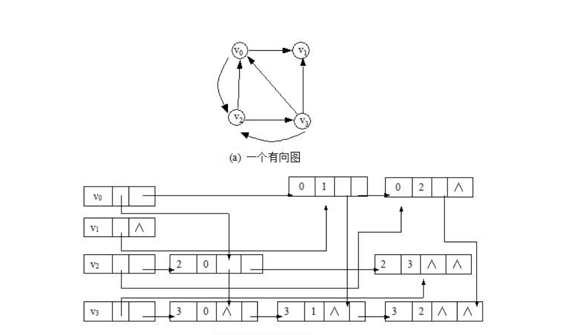

    3. 邻接多重表
        邻接多重表$(Adjacency\;Multilist)$是无向图的一种链式存储方式。

        $$
        \begin{matrix} \underbrace{ \boxed{mark|ivex|ilink|jvex|jlink|info}}\\
        the\;node\;of\;arc\end{matrix}
        \begin{matrix} \underbrace{ \boxed{data|firstedge}}\\
        the\;node\;of\;vertex\end{matrix}
        $$

        - mark：标志域，可以标记改边是否被搜索过
        - ivex、jvex：与该边依附的两个顶点在顶点表的下标
        - ilink、jlink：指针域，指向下一条依附于顶点ivex和jvex的边
        - info：存储和边相关的信息
        - data：存储和该点相关的信息
        - firstedge：指示第一条依附于该顶点的边

        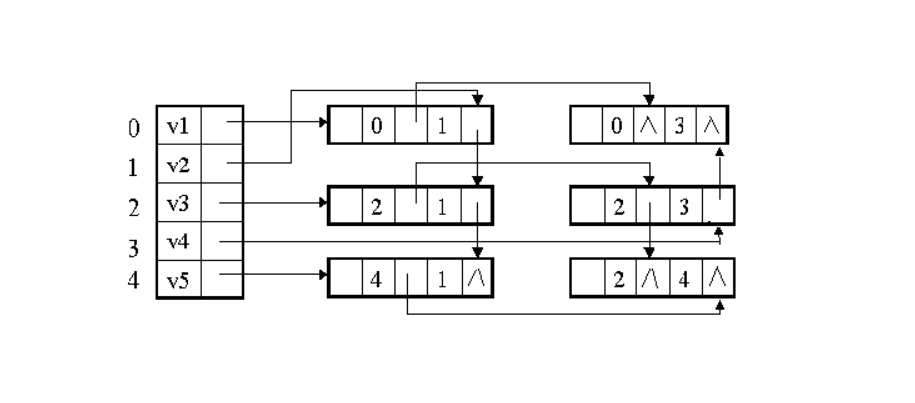

### 图的遍历

1. 深度优先搜索$Depth\_First\;Search\quad DFS$
    类似树的先根遍历。
    从图中的某个点v出发，作为当前顶点，访问此顶点，并设置该顶点的访问标志，接着从v的为被访问的邻接点中找出一个作为下一步探查的当前顶点。倘若当前顶点的所有邻接顶点都被访问过，则退回异步，将前一步访问的顶点重新取出，作为当前探查顶点，重复上述过程，直至图中最初指定起点的所有邻接顶点都被访问到。

    深度优先搜索的过程中所有访问过的顶点和经过的边，构成一个连通的无环图，也就是深度优先搜索树，简称DFS树

    深度优先搜索的递归实现

    ```C++
    void Graph::DFSTraverse(int v)
    {
        cout << mgraph.vertex[v];
        visited[v]=1;
        for(j=0;j<mgraph.vexnum;i++)
        {
            if(mgraph.arcs[v][j]==1 && visited[j]==0)
                DFSTraverse(j);
        }
    }
    ```

2. 广度优先搜索$Breadth\_First\;Search\quad BFS$

    类似树的层次遍历

    无向连通图广度优先搜索的实现
    ```C++
    void Graph::BFSTraverse(int v)
    {
        front = rear = -1;
        cout << mgraph.vertex[v];
        visited[v]=1;
        Q[++rear]=v;
        while(front!=rear)
        {
            v=Q[++front];
             if(mgraph.arcs[v][j]==1 && visited[j]==0)
                DFSTraverse(j);
            cout << mgraph.vertex[j];
            visited[j]=1;
            Q[++rear]=j;
        }
    }
    ```

3. 连通分量和重连通分量

    - 连通分量$(Connected\;Component)$：当无向图为非连通图时，利用$DFS$或$BFS$,无法遍历图中的所有顶点，而只能遍历到该顶点所在的最大连通子图的所有顶点，这些顶点构成一个连通分量。
    - 关节点$(Articulation\;Point)$:在无向连通图中，当且仅当删去一个点及其依附于它的边，图被分为两个连通分量。
    - 重连通图：没有关节点的连通图

### 最小生成树

设$G=(V,E)$是一个无向连通网

- 代价$(Cost)$：$G$的生成树上任一条边的权值称为该边的代价
- 最小生成树：一棵生成树的代价就是树上各边代价之和，代价最小的生成树就是最小代价生成树，简称最小生成树。

根据生成树的定义，若连通带权图由$n$个顶点组成，其生成树必含$n$个顶点，$n-1$条边，因此构造最小代价生成树的准则有3条：

1. 只能使用该网络中的边来构造最小生成树
2. 能且只能使用$n-1$条边来连接网络中的n个顶点
3. 选用的$n-1$条边不能产生回路

构造最小生成树的方法多数利用了最小生成树的一种性质，简称MST

- $MST$:假设$N(V,{E})$是一个连通网，$U$是顶点集$V$的一个非空子集。若$(u,v)$是一条具有最小权值的边，其中$u\in U，v\in{V-U}$，则必存在一棵包含边$(u,v)$的最小生成树。

构造最小生成树的典型算法：

- $Kruskal$算法
- $Prim$算法

都利用了$MST$性质，采用逐步求解的策略，亦称**贪心策略**

1. $Kruskal$算法

    基本思想：设一个有$n$个顶点的连通网络$N=\{V,E\}$。
    - 首先构造一个由$n$个顶点组成，不含任何边的图$T=\{V,\varnothing\}$，其中每个顶点自成一个连通分量
    - 不断从$E$中去除代价最小的一条边（若有多条，任选其一）,若该边的两个顶点来自T的不同的连通分量，则将此边加入到T中，否则舍去此边选择下一条代价最小的边。
    - 依次类推，直到T中所有的顶点在同一个连通分量为止。

    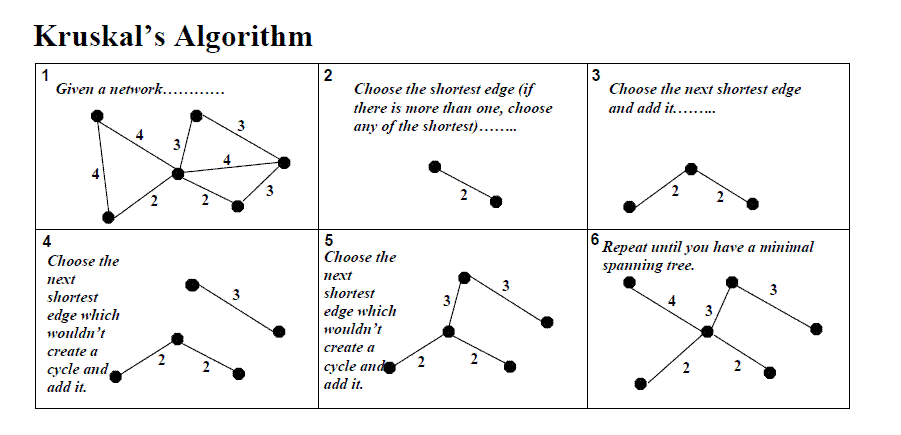

2. $Prim$算法

    基本思想：
    - 给定任意带权连通网络$V=\{V,E\},T=\{U,TE\}$是$G$的最小生成树。
    - 算法始终将顶点集合$V$分成没有元素重叠的两部分，$V=U\cup(V-U)，T$的初始状态为$U=\{u_0\}(u_0\in V),TE=\varnothing$,然后重复执行一下操作：
    - 在所有$u\in U,v\in V-U$的边中找出一条代价最小的边$(u_0,v_o)$并入集合$TE$,同时$v_0$并入$U$，直至$U=V$为止。

    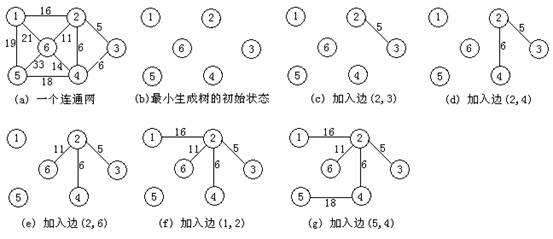

### 有向无环图及其应用

- 有向无环图$(Directed\;Acycline\;Graph)$：一个无环的有向图，简称$DAG$图
    - 有向无环图是描述含有公共子式的表达式的有效工具。例如：

        $$((a+b)*(b*(c-d)+b*(c-d)))*((c-d)*e)$$

        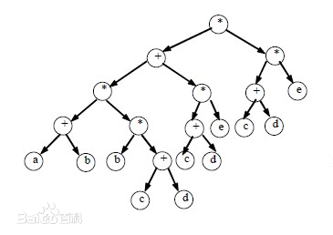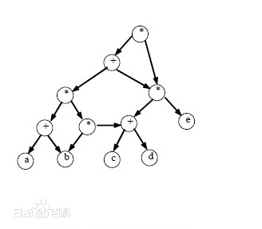

    - 有向无环图也是描述一项工程或系统的有效工具

        关心的问题：
        1. 工程是否能够顺利进行
        2. 估算整个工程完成所必须的最短时间
        对应于有向图，则进行拓扑排序和求关键路径的操作。

- $AOV$网与拓扑排序

    - 活动$(Activity)$：所有工程或某种流程可以分成若干个小的工程或阶段，这些小的工程或阶段就是活动
    - $AOV$网$(Activity\;On\;Vertex\;Netword)$：用顶点表示活动，有向边表示活动的优先关系
    - 若顶点$i$到顶点$j$之间存在一条有向路径，则称顶点$i$是顶点$j$的前驱或顶点$j$是顶点$i$的后继
    - 拓扑排序$(Topological\;Sort)$：就是由某个集合的一个偏序得到该集合上的一个全序的操作
        - 若集合$X$的关系$R$满足自反、反对称和传递性，则称$R$是集合$X$上的偏序$(Partial\;Order)$
        - 若$R$是集合$X$上的偏序，如果对每个$x,y\in X$必有$xRy$或$yRx$，则称$R$是$X$上的全序关系

- $AOE$网与关键路径

    - $AOE$网$(Activity\;On\;Edge\;Network)$：边表示活动的网。$AOE$网是一个带权的有向无环图。顶点表示事件，弧表示活动，权表示活动持续的时间，$AOE$网可以用来表示工程的进度计划
    - 在正常情况下(无环)下：网中只有一个入度为0的点,称之为源点$(Source)$；一个出度为0的点，称之为汇点$(Link)$

    $AOE$用于工程估算：
    1. 完成整个工程所需的时间(假设网中无环)？
    2. 那些活动是影响工程进度的关键？

    - 关键路径$(Critical\;Path)$：完成整个工程所需的时间取决于从源点到汇点的最长路径的长度，即在这条路径上所有活动的持续时间之和，这条最长的路径即关键路径
    - 关键活动$(Critical\;Activity)$：不按时完成就会影响整个工程的活动。关键路径上的活动就是关键活动

### 最短路径

- 最短路径：由于从一个顶点到另一个顶点可能存在多条路径，每条路径上所经过的边数可能不同，即路径长度不同，则称路径长度最短即边数最少的路径为最短路径

- 带权图路径长度：若图是带权图，则把一个顶点到图中其余任一个顶点的一条路径所经过边上的权值之和定义为带权图路径长度

- 最短路径问题包括：
    - 求图中一个顶点到其余顶点的最短路径
    - 求图中每对顶点之间的最短路径

- 单源最短路径
    利用$Dijkstra$算法解决单源最短路径问题：给定带权有向图$G$和源点$v$,求$v$到$G$中其余个点的最短路径，其时间复杂度为$O(n^3)$

    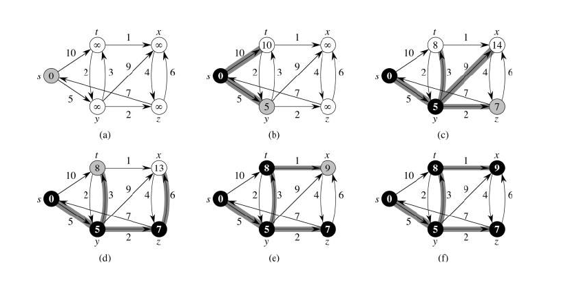

- 每对顶点间的最短路径
    求各个顶点之间最短路径的$Floyd$算法，其时间复杂度也是$O(n^3)$：

    通过$Floyd$计算图$G=(V,E)$中各个顶点的最短路径时，需要引入两个矩阵，- 矩阵$S$中的元素$a[i][j]$表示顶点$i$(第$i$个顶点)到顶点$j$(第$j$个顶点)的距离。
    - 矩阵$P$中的元素$b[i][j]$，表示顶点$i$到顶点$j$经过了$b[i][j]$记录的值所表示的顶点。

    假设图G中顶点个数为$N$，则需要对矩阵$D$和矩阵$P$进行$N$次更新。初始时，矩阵$D$中顶点$a[i][j]$的距离为顶点$i$到顶点$j$的权值;
    如果$i$和$j$不相邻，则$a[i][j]=\infty$，矩阵$P$的值为顶点$b[i][j]$的$j$的值。接下来开始，对矩阵$D$进行$N$次更新。
    第1次更新时，如果”$a[i][j]$的距离”$>$“$a[i][0]+a[0][j]$”($a[i][0]+a[0][j]$表示”$i$与$j$之间经过第1个顶点的距离”)，则更新$a[i][j]$为”$a[i][0]+a[0][j]$”,更新$b[i][j]=b[i][0]$。
    同理，第$k$次更新时，如果”$a[i][j]$的距离”$>$“$a[i][k-1]+a[k-1][j]$”，则更新$a[i][j]$为”$a[i][k-1]+a[k-1][j]$”,$b[i][j]=b[i][k-1]$。更新$N$次之后，操作完成！

    [最短路径问题---Floyd算法详解](https://blog.csdn.net/qq_35644234/article/details/60875818)

## 查找

### 查找的基本概念

- **静态查找表**$(Static\;Search\;Table)$：仅对查找表进行查找操作，不进行插入和删除操作的查找表
- **动态查找表**$(Dynamic\;Search\;Table)$：可以查找表进行查找、插入和删除操作的表。

- 面向查找操作的数据结构称为**查找结构**$(Search\;Structure)$

    - **线性表**：适用于静态查找，主要采用顺序查找技术、折半查找技术
    - **树表**：适用于动态查找，主要采用二叉排序树的查找技术；
    - **散列表**：静态和动态查找均适用，主要采用**散列技术**。

    以“关键字与给定值的比较次数”作为衡量算法效率的方法，该比较次数的期望值，称为查找成功的**平均查找长度**$(Average\;Search\;Length,ASL)$

    对于含有n个记录的表，查找成功的平均查找长度为：
    $$ASL=\sum_{i=1}^{n}P_iC_i$$
    $P_i$是查找第$i$个记录的概率，且$\sum_{i=1}^{n}P_i=1;C_i$表示找到给定关键字与给定值相等的第$i$个记录，已和给定值进行过比较的关键字个数。

### 静态查找表

1. 顺序查找$(Sequential\;Search)$
    - 又称线性查找。
    - 基本思想
        首先将顺序表中的第一个存储单元(即下标为0的单元)设置为“监视哨”，即把待查值放入该单元，查找时从顺序表的最后一个单元开始，依次向前搜索进行查找
    - 算法分析
        - 查找成功的情况下：
            若每个记录的查找概率相等，即$P_i=1/n$，则$ASL$为：
            $$ASL=\sum_{i=1}^{n}P_iC_i=\frac{1}{n}\sum_{i=1}^{n}(n-i+1)=\frac{n+1}{2}$$
        - 查找失败和查找成功的可能性相同，且每个记录的查找概率相等，则$P_i=1/{2n}$
            在查找失败的情况下，不管查找的关键字为何值，其比较次数都为$n+1$。在该条件下的平均查找长度为：
            $$ASL=\frac{1}{n}\sum_{i=1}^{n}(n-i+1)+\frac{1}{2}(n+1)=\frac{3}{4}(n+1)$$
    - 优点：算法简单，对表的结构没有任何要求
    - 缺点：当$n$很大，查找效率很低

2. 有序表的查找
    - 当查找表中的数据元素无序，选择顺序查找简单又实用。但但查找表中的数据元素在顺序存储时是有序的情况下，可以采用**折半查找**$(Binary\;Search)$，又称**二分查找**
    - 基本思想
        给定有序表ST,在表ST中取位于中间的记录作为比较对象，若中间记录和关键字与给定值相等，则查找成功；若中间记录的关键字大于给定值，则在中间记录的左半区继续查找；若中间记录的关键字小于给定值，则在中间记录的右半区继续查找。不断重复上述过程，直到查找成功或所查找的区域无记录即查找失败
    - 折半查找算法的非递归实现

        ```C++
        int Search_Bin(int key)
        {
            int low=0;high=st.length-1;
            int mid;
            while(low<=hight)
            {
                mid = (low+high)/2;
                if(st.elem[mid]==key)
                {
                    cout << "查找成功，处于第"<<mid+1<<"位置"<<endl;
                    return mid+1;
                }
                if(st.elem[mid]>key)
                {
                    high = mid - 1;
                }
                if(st.elem[mid]<key)
                {
                    low = mid + 1;
                }
            }
            cout << "未找到！"<<endl;
            return 0;
        }
        ```
    - 算法分析
        对于折半查找，查找成功时进行的关键字比较次数至多为$\left\lfloor{\log_2(n+1)}\right\rfloor+1$。
        查找成功的平均查找长度为
        $$ASL=\sum_{i=1}^{n}P_iC_i=\frac{1}{n}\sum_{j=1}^{h}{(j*2^{j-1})}=\frac{n+1}{n}\log_2{(n+1)}-1$$
        当$n$比较大时，$ASL\approx\log_2(n+1)-1$
        查找失败时的平均查找长度的量级为：$O(log_2n)$

3. 分块查找

    - 分块查找又称索引顺序查找

    - 前提：查找表，满足分块有序，分块有序即整个查找表无序，但把查找表看做几个子表时，每个子表的关键字是有序的。

    - 基本思想
        在查找时，首先用待查值key在索引表中进行区间查找(即查找key所在的子表，由于索引表按最大关键字项有序，因此可采用折半查找或者顺序查找)，然后在对应的子表进行顺序查找

    - 算法分析

        设对索引表查找的平均查找长度为$L_1$,对待查子表中查找元素的平均查找长度为$L_2$，则分块查找的平均查找长度可以通过两种算法的平均查找长度之和表示：
        $$ASL=L_1+L_2$$

        采用分块查找：长度为n的表分为b块，每个块m个记录，则$b=\left\lceil n/m \right\rceil$。
        - 采用顺序查找确定块的位置
            块的查找概率为$1/b$，块中每个记录的查找概率为$1/m$，该条件下分块查找的平均查找长度为：
            $$ASL=L_1+L_2=\frac{1}{b}\sum_{i=1}^{b}i+\frac{1}{m}\sum_{j=1}^{m}j=\frac{b+1}{2}+\frac{m+1}{2}=\frac{1}{2}(\frac{n}{m}+m)+1$$
            当$m=\sqrt{n}$时，平均查找厂区取最小值为$\sqrt{n}+1$。
        - 采用折半查找确定块
            $$ASL\approx \log_2{(\frac{n}{m}+1)}+\frac{m}{2}$$

4. 二叉排序树

    - 二叉排序树$(Binary\;Sort\;Tree)$又称二叉查找树

    - 性质
        1. 若左子树不空，则左子树上的所有结点的值均小于根结点的值
        2. 若右子树不空，则右子树上的所有结点的值均大于根结点的值
        3. 它的左右子树也分别是二叉排序树

    - 查找方法
        首先将给定值key与根结点的关键字进行比较，若相等，则查找成功；若根结点的关键字大于key，则在根结点的左子树上进行查找，否则在根结点的右子树上进行查找
    - 查找代码

        ```C++
        struct Node
        {
            int key;
        };
        struct BTSNode
        {
            Node data;
            BTSNode *lchild,*rchild;
        };
        void SearchBST(BTSNode *T,int key)
        {
            if((!T)||(key==T->data.key))
            {
                if(!T)
                    cout << "找不到"<<key<<“的结点”<<endl;
                else
                    cout << "找到"<<key<<“的结点”<<endl;
                else if(key<T->data.key)
                    SearchBST(T->lchild,key);
                else
                    SearchBST(T->rchild,key);
            }
        }
        int SearchBST(BTSNode *T,int key,BTSNode *f,BTSNode* &p)
        {
            if(!T)//查找不成功
            {
                p=f;
                return 0;
            }
            else if(key==T->data.key)//查找成功
            {
                p=T;
                return = 1;
            }
            else if(key<T->data.key)
                return SearchBST(T->lchild,key,T,p);
            else
                return SearchBST(T->rchild,key,T,p);
        }
        ```

    - 二叉排序树的插入

        - 插入方法
            首先在树中查找是否已有关键字为key的结点，若查找成功，则说明待插入结点已经存在，不能插入重复结点。只有当查找失败，才能在树中插入关键字为key的新节点。

        - 插入代码
            ```C++
            int InsertBST(int e)
            {
                int key =e;
                BTSNode *p = new BTSNode;
                BTSNode *T = BT;
                if(!SearchBST(T,key,NULL,p))
                {
                    BTSNode *s = new BTSNode;
                    s->data.key = e;
                    s->lchild=s->rchild=NULL:
                    if(!p)
                    {
                        BT=s;
                    }
                    else if(key<p->data.key)
                        p->lchild=s;
                    else
                        p->rchild=s;
                    return 1;
                }
                else
                    return 0;
            }
            ```

    - 二叉排序树的删除

        - 删除代码
            ```C++
            int DeleteBST(BSTNode* &T，int key)
            {
                if(!T)
                    return 0;
                else
                {
                    if(key==T->data.key)
                        return Delete(T);
                    else if(key<T->data.key)
                        return DeleteBST(T->lchild,key);
                    else
                        return DeleteBST(T->rchild,key);
                }
            }
            ```

5. B_树

    上述介绍的查找方法都是适用于内部查找的方法，称为**内部查找法**。适用于数据集不大，可以放入内存中，适用于对较小的文件进行查找，而不适用于对较大的存放在外存储器中文件。

    - B_树：特点是插入、删除时易于保持平衡，外部查找效率高，适用于组织磁盘文件的动态索引结构。

        B_树是一种平衡的多路查找树，作为索引组织文件，用以提高访问速度。

    - 一棵m阶的B_树，可以为空树，或者是一棵满足下列性质的m叉树：

        1. 树中的每个结点至多有m棵子树
        2. 若根结点不是叶子结点，则至少有两棵子树
        3. 除根结点之外所有非叶子结点至少有$\left \lceil \frac{m}{2} \right \rceil$棵子树
        4. 有s个子树的非叶子结点具有s-1个关键字，所有非叶子结点包含下列信息：
            $(n,A_0,K_1,A_1,K_2,\cdots,K_n,A_n)$，其中$n$为关键字个数，$K_i(i=1,2,\cdots,n)$为关键字，$K_i<K_{i+1}(i=1,2,\cdots,n-1),A_i(i=1,2,\cdots,n)$为指向子树根结点的指针，且指针$A_{i-1}$所指子树中所有结点的关键字均小于$K_i$，$A_n$所指子树中所有结点的关键字均大于
            $K_n(\left \lceil \frac{m}{2} \right \rceil-1\le n \le m-1)$
        5. B_树总是树高平衡的，所有的叶子结点都在同一层，且不包含任何关键字信息。通常叶子结点也被称为失败结点。

### 哈希表

在查找时，如果给定值$key$在表中存在，则需根据$key$并通过对应关系$H$，即可的到$key$在表中的存储位置$H(key)$。因此不需要比较，仅通过$H(key)$的计算，就能获得要查找的记录。称这样的对应关系$H$为**哈希函数**$(Hash)$或**散列函数**或**杂凑函数**，根据这个思想建立的表称为**哈希表**$(Hash\;Table)$或**散列表**或**杂凑表**，根据哈希函数所得到的存储位置称为**哈希地址**$(Hash\;Address)$或**散列地址**，而这种映像过程被称为**哈希造表**或**散列**。

根据函数的性质可知，对于某个函数$y=f(x)$，不同的$x$通过$f$获得的$y$可能是相同的。

- **冲突**$(Collision)$：不同的关键字有可能的到相同的哈希地址的现象
- **同义词**$(Synonym)$：相同函数值的关键字称为函数上的同义词。

采用散列技术需要考虑的两个问题：

- 哈希函数的设计
- 冲突的处理

1. 哈希函数

    设计哈希函数应该遵循的原则

    - 计算简单，否则会降低查找效率
    - 每个关键字所对应的哈希地址分布均匀。

    常见的几种哈希函数的构造方法：
    1. 直接定址法
        - 定义
            直接定义一个线性函数，取关键字对于该函数的函数值作为哈希地址，即：
            $$H(key)=a*key+b$$
            其中a和b是常数。
        - 特点
            这类函数是一一对应函数，因此不会产生冲突，但要求地址集合和关键字集合的大小相同，并且当关键字跨度非常大时并不适用。该方法在实际生活中并不常用
    2. 数学分析法
        - 定义
            在关键字集合中，若每个关键字均由$m$位组成，而每位上都有$r$中不同的取值，通过分析$r$中不同符号在每一位上的分布情况，选择其中某几位分布较为均匀的符号组成哈希地址。
        - Example
            例如：一组关键字$\{6537685,6533251,6536543,6542019,6539834,6541234,6545437\}$进行关键字分析
            |第一位|第二位|第三位|第四位|第五位|第六位|第七位|
            |---|---|---|---|---|---|---|---|
            |6|5|3|7|6|8|5|
            |6|5|3|3|2|5|1|
            |6|5|3|6|5|4|3|
            |6|5|4|2|0|1|9|
            |6|5|3|9|8|3|4|
            |6|5|4|1|2|3|4|
            |6|5|4|5|4|3|7|

            其中所有关键字的第一、二位均为6/5，而第三位也只有3和4，因此 这三位不用作哈希地址，剩余4为的取值分布比较均匀，可以作为哈希地址，因此可选取者四位中任意两位组合成哈希地址，也可以对这四位进行适当的处理来获得哈希地址。

    3. 平方取中法
        - 定义
            取关键字平方后的中间几位作为哈希地址。
        - Example
            例如：关键字集合${3456,2564,3466,3454}$
            |关键字|关键字平方|所选取哈希地址|
            |---|---|---|
            |3456|11943936|43|
            |2564|6574096|40|
            |3466|12013156|13|
            |3454|11930116|30|

            平方后可取地中第4、5位作为哈希地址

    4. 折叠法
        - 定义
            将关键字按位数分割成几部分(其中最后一部分的长度会较小)，然后将这些部分按一定的方式进行求和，按哈希表表长取后几位作为哈希地址
        - 形式
            - 位移法：将各部分按最后一维对齐相加
            - 间接折叠法：从一端向另一端沿分割界来回折叠，然后对齐相加
        - Example
            例子：一个关键字为83950661436，哈希表长为3
            首先将关键字表长分割成若干部分：$\underline{839}\quad\underline{502}\quad\underline{614}\quad\underline{36}$

            位移法：$839+502+614+36=1991$
            间接折叠法：$839+205+614+63=1721$

            由于哈希表长度为3，分别取后三位991和721作为关键地对应的哈希地址。
    5. 除留余数法
        - 定义
            选择一个常数p，取关键字除以$p$所得的余数作为哈希地址，即
            $$H(key)=key \bmod p$$
            该方法对$p$的选取非常重要，若哈希表长度为$m$，则要求$p$小于等于$m$且接近$m$，并且一般选质数作为$p$，或者是一个不包含小于20质因子的合数。

2. 处理冲突的方法

    1. 开放定址法
        - 定义
            开放地址，即一旦根据关键字所得到的哈希地址发生冲突，则按照某种规则寻找下一个空闲单元的哈希地址，只要哈希地址足够大，空的哈希地址总是能找到的。
            其函数定义为：
            $$H_i=(H(key)+d_i) \bmod m(1 \le i \le m)$$
            其中，$H$为哈希函数，$m$为哈希表长，$d_i$的所取的增量序列。每种再散列的方法区别在于$d_i$的取值不同。

        - 常用的方法
            - 线性探测再散列
                取增量序列$d_i$为$1,2,\cdots,m-1$的方法。
                其过程描述为：当哈希地址$i$发生冲突时，查看哈希地址$i+1$是否为空，若为空则将数据放入，否则查看$i+2$是否为空，依次类推
            - 二次探测在散列
                取增量序列$d_i$为$1^2,-1^2,2^2,-2^2,\cdots,q^2,-q^2(q\le \frac{m-1}{2})$
                其过程描述为：当哈希地址$i$发生冲突时，查看哈希地址$i+1$是否为空，若为空则将数据放入，否则查看$i-1$是否为空，若为空则将数据放入，否则查看$i+2^2$是否为空，依次类推
            - 伪随机探测在散列
                取增量序列$d_i$为一个伪随机数
                其过程描述为：当哈希地址$i$发生冲突时，产生一个伪随机数$d_1$，查找哈希地址$i+d_1$是否为空，若为空则将数据放入，否则重新产生一个伪随机数$d_2$查看$i+d_2$是否为空，依次类推。

    2. 再哈希法
        - 定义
            再哈希法用数学表达式可以描述为:
            $$H_i=RH_i(key)\quad i=1,2,\cdots,k$$
            其中，$RH_i$均为不同的哈希函数。
            在哈希法的本质是使用$k$个哈希函数，若第一个函数发生冲突，则利用第二个函数再生生成一个地址，直到产生的地址不冲突为止。
    3. 链地址法
        - 定义
            将每个哈希地址都作为一个指针，指向一个链表。
            若哈希表长为$m$，则建立$m$个空链表，将哈希函数对关键字进行转换为$i$后，映射到统一哈希地址$i$的同义词均加入到地址$i$指向的链表中
    4. 建立一个公共溢出区
        - 定义
            设哈希函数产生的哈希地址集为$[0,m-1]$，则分配两个表。一个表作为基本表，其每个存储单元仅存放一个数据元素；另一个表为溢出表，只要关键字对应的哈希地址在基本表上发生了冲突，则将发生冲突的元素一律放入该表中。

        查找时，对应给定关键字$key$，通过哈希函数计算出哈希地址为$i$，则先与基本表中的地址为$i$的数据元素进行比较，若相等则查找成功；否则再在溢出表中进行查找。

3. 哈希查找算法及分析

    查找元素：

    ```C++
    #define p 13//MOD 13
    struct HashTable
    {
        int *elem;//数据元素基址
        int count;//当前数据元素个数
        int size;//哈希表长度
    }ht;
    int SearchHash(int key,int &s)
    {
        s = CalHash(key);
        while((ht.elem[s]!=-1)&&(ht.elem[s]!=key))//发生冲突
            Collision(s);
        if(ht.elem[s]==key)
            return 1;
        else
            return 0;
    }
    ```

    计算哈希地址：

    ```C++
    int CalHash(int key)//由哈希函数求哈希地址
    {
        return key % p;
    }
    ```

    发生冲突，计算下一地址：

    ```C++
    void Collision(int &s)
    {
        s=s++;
    }
    ```

    插入元素：

    ```C++
    int InsertHash(int e)
    {
        int s;
        if(ht.count == ht.size)
        {
            cout << "表满，不能插入！" << endl;
            return 1;
        }
        else
        {
            s = CalHash(e);
            int r = SearchHash(e,s);
            if(r)//表中已有和e的关键字相同的元素，不能插入操作
            {
                cout << "元素已经存在，不能插入！" << endl;
                return 0;
            }
            else
            {
                ht.elem[s]=e;
                ht.count++;
                return 1;
            }
        }
    }
    ```

    查找过程中，关键字的比较次数取决于产生冲突的次数，冲突产生越少，查找效率就越高。

    影响冲突产生的因素有：
    1. 哈希函数是否均匀
    2. 冲突的处理方法
    3. 哈希表的**装填因子**
        将哈希表中元素的个数和哈希长度的比值最为哈希表的装填因子，即
        $$\alpha=\frac{count}{size}$$
        $\alpha$是哈希表装满程度的指标，即装填因子。
        $\alpha$与填入表中的元素的个数成正比，填入表中元素越多$\alpha$越大，冲突产生的可能性越大。

## 内部排序

### 排序的基本概念

- 排序$(Sort)$

    设有记录序列$\{R_1,R_2,\cdots,R_n\}$，其相应的关键字序列为$\{K_1,K_2,\cdots,K_n\}$，
    若存在某种确定的关系$K_x \le K_y \le \cdots \le K_z$，其中$1 \le x,y,z \le n$且$x,y,z$各不相同，则将记录序列$\{R_1,R_2,\cdots,R_n\}$排成按关键字有序的序列$\{R_x,R_y,\cdots,R_z\}$的操作。

- 正序$(Exact\;Order)$：若待排序序列中的记录已按关键字排序，此序列为正序
- 逆序$(Inverse\;Order)$和反序$(Anti\;Order)$：若待排序序列中的记录的排序顺序与排序后的排列顺序正好相反
- 一趟$(Pass)$：指在排序过程中，将待排序的记录序列扫描一遍
- 单关键字排序$(Single-key\;Sort)$：根据一个关键字进行的排序
- 多关键字排序$(Mutiple-key\;Sort)$：根据多个关键字进行的排序，多关键字排序主要针对关键字有重复的情况下。

- 按照排序过程中数据元素是否完全在内存，分为：

    1. 内部排序：在排序的整个过程，待排序的所有记录全部放置在内存中的排序方法，也称内排序
    2. 外部排序：指待排序的记录个数太多，不能同时放置在内存，需要将一部分记录放置在内存中，另一部分放置在外存中，整个排序过程需要在内外存之间多次交换数据才能得到排序结果的方法，也称外排序

- 按照是否建立在关键字比较的基础上，分为：

    1. 基于比较的排序方法：通过关键字之间的比较、记录的移动者两种操作来实现的方法
        如：插入排序、交换排序、选择排序和归并排序
    2. 不基于比较的排序方法：根据待排序数据的特点所采取的其他方法，通常没有大量的关键字之间的比较和记录的移动这两种操作的排序
        如：基数排序

### 插入排序

- 插入排序的工作原理：每次将一个待排序的数据按其关键字的大小**插入**到一个已经完成排序的**有序序列**中，直到所有记录排序结束。

- 根据排序的执行过程分为

    - 直接插入排序
    - 折半插入排序
    - 表插入排序
    - Shell排序

1. 直接插入排序
    - 算法思路

        通过构建有序序列，对于未排序数据，在已排序序列中从后往前扫描，从而找到相应的位置并插入。
        在从后往前扫描过程中，需要反复把已排序逐步往后挪位，为待插入的新元素提供插入空间

    - 步骤

        1. 设置$i=2$
        2. 将待插入记录$r[i]$放入编号为0的结点(即下标为0的结点)，即$r[0]=r[i]$;并令$j=i-1$，从第$i$个记录开始向前查找插入位置
        3. 若$r[0].key \ge r[j].key$,执行5；否则执行4
        4. 将第$j$个记录后移，即$r[j+1]=r[j]$；并令$j=j-1$;执行3
        5. 完成插入记录：$r[j+1]=r[0],i=i+1$。若$i \gt n$，则排序结束，否则执行2

    - 流程图

        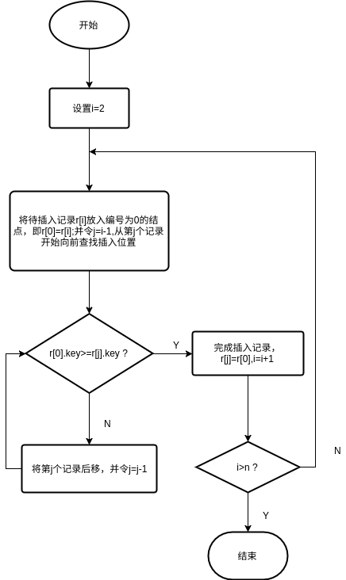

    - 语言描述：

        ```C++
        void SInsertSort(SqList &L)
        {
            for(int i=2;i<=L.length;i++)
            {
                if(L.r[i]<=L.r[i-1])
                {
                    L.r[0]=L.r[i];
                    L.r[i]=L.r[i-1];
                    for(int j=i-2;L.r[0]<=L.r[j];j--)
                        L.r[j+1]=L.r[j];
                    L.r[j+1]=L.r[0];
                }
            }
        }
        ```

    - 算法分析

        - 时间复杂度：两层嵌套循环结构，其外层循环n-1次，而内层循环执行次数取决于待排序列记录初始的排列情况。
            - 最好情况：待排序序列为正序，算法时间复杂度为$O(n)$
            - 最坏情况：待排序序列为逆序，算法时间复杂度为$O(n^2)$
            - 平均情况：算法的平均时间复杂度为$O(n)$

        - 空间复杂度：由于只需一个作为暂存待插入记录的存储单元，空间复杂度为$O(1)$

        - 稳定性：该算法是稳定的排序算法

2. 折半插入排序

    > 当待排序记录数量很小时，直接插入排序方法是一种效率较高的排序算法。当记录数量较大，不宜用直接插入排序。

    - 算法思想

        既然在有序表中确定插入位置，可以不断二分有序表来确定插入位置，即在一次比较中，通过比较待插入记录和有序表中中间记录的关键字，将有序表一分为二，而下一次比较则在其中一个有序子表中进行，将子表再次一分为二。这样继续下去，直到要比较的子表中只有一个记录时，做最后一次比较以确定插入位置。

    - 步骤

        1. 设置$i=2$
        2. 顺序表中前$i-1$个记录有序，将第$i$个记录插入。令$low=1，high=i-1，r[0]=r[i]$
        3. 若$low>high$,得到插入位置；执行6；否则执行4
        4. 则取有序子表的中点$m=\left\lfloor\frac{low+high}{2}\right\rfloor$
        5. 若$r[0].key \lt r[m].key$,则插入位置在低半区，令$high=m-1$；否则插入位置在高半区，令$low=m+1$;执行3
        6. $high+1$即为待插入位置，从$i-1$到$high+1$的记录，逐个后移，$r[high+1]=r[0],i=i+1$。若$i>n$，则排序结束，否则执行2

    - 流程图

        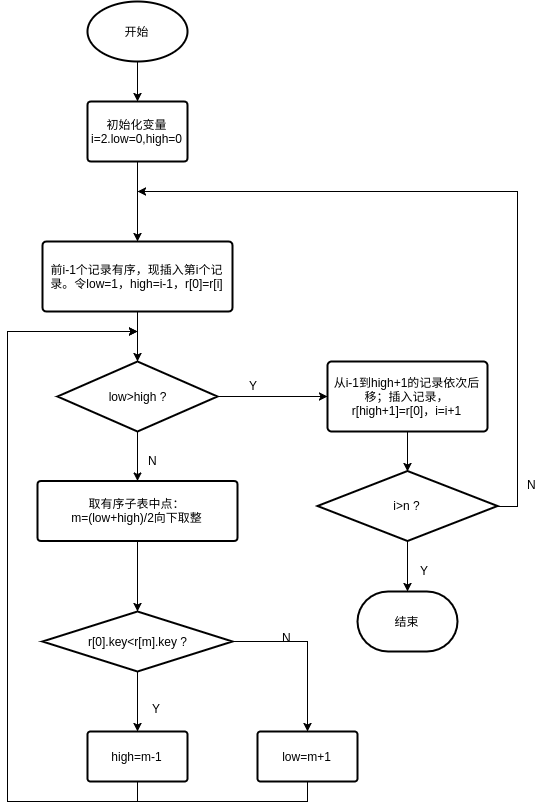

    - 语言描述

        ```C++
        void BInsertSort(SqList &L)
        {
            int high,low,m;
            for(int i=2;i<=L.length;i++)
            {
                L.r[0]=L.r[i];
                low = 1;
                high = i-1;
                while(low<=high)
                {
                    m = (low+high)/2;
                    if(L.r[0]<=L.r[m])
                        high=m-1;
                    else
                        low=m+1;
                }
                for(int j=i-1;j>high+1;j--)
                    L.r[j+1]=r[j];
                L.r[high+1]=L.r[0];
            }
        }
        ```

    - 算法分析

        - 时间复杂度：关键字比较次数最多为$\left\lceil \log_2{n+1} \right\rceil$因此时间复杂度为$O(n^2)$

        - 空间复杂度：$O(1)$

        - 稳定性：折半插入排序是稳定的排序方法

3. 表插入排序

    > 前面介绍的两种插入排序算法都要大量移动记录，表插入排序则是一种不移动记录而是通过改变存储结构来进行排序的算法

    - 算法思想

        表插入排序是通过链接指针、按关键字的大小实现从小到大的链接过程，为此需增设一个指针项。

        具体的操作方法与直接插入排序类似，不同的是表插入排序是直接修改链接指针来完成记录的排序。

        所需结点定义：

        ```C++
        #define SIZE 150
        struct SLNode
        {
            int rc;//记录项
            int next;//指针项
        };
        struct SLinkList
        {
            SLNode node[size];//0号单元为表头结点
            int curlen;//链表实际长度
        }；
        ```

        具体思想：

        首先设置空循环链表，即头结点指针置0，并在头结点数据中存放比所有记录的关键字都大的整数，然后把结点逐个向链表中插入即可。

    - 步骤

        1. 进行初始化操作。令$L->r[0].key=MAXSIZE;L->r[0].next=1;j=L->r[0].next;L->r[1].next=0;i=2;$
        2. 若$i=L->length$，调整结束；否则根据$j$对静态链表进行遍历：
            1. 当$L->r[i].key \le L->r[j+1].key$时停止遍历，令$L->r[i].next=L->[j].next;L->r[j].next=i;j=L->r[0].next;i++;$执行2
            2. 当$L->r[i].key>r[j+1].key$时，$j++$，执行2.1

    - 流程图

        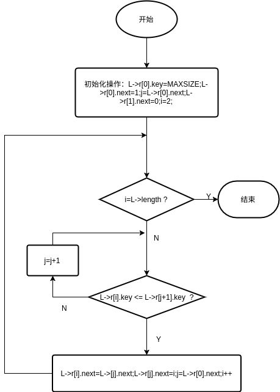

    - 语言描述

        ```C++
        void SLInsertSort(SlinkList &L)
        {
            int min,max;
            L.node[0].next = 1;
            L.node[1].next = 0;//初始化形成指头头结点的循环链表
            max = min = 1;
            for(int i=2;i<=L.curlen;i++)
            {
                if(L.node[i].rc<=L.node[min].rc)
                {
                    L.node[0].next = i;
                    L.node[i].next = i-1;
                    min = i;
                }
                if(L.node[i].rc>=L.node[max].rc)
                {
                    L.node[i].next = 0;
                    L.node[max].next = i;
                    max = i;
                }
                if(L.node[i].rc<L.node[max].rc && L.node[i].rc > L.node[min].rc)
                {
                    int index1=min,index2;//index2标记index1的前一个下标
                    while(L.node[i].rc>=L.node[index1].rc)
                    {
                        index2=index1;
                        index1=L.node[index1].next;
                    }
                    L.node[i].next=index1;
                    L.node[index2].next=i;
                }
            }
            cout << "表插入排序结果如下：" << endl;
            int index = L.node[0].next;
            while(index!=0)
            {
                cout << L.node[index].rc << "\t";
                index = L.node[index].next;
            }
            cout << endl;
        }
        ```
    - 算法分析

        - 时间复杂度：$O(n^2)$
        - 空间复杂度：$O(1)$
        - 稳定性：表插入排序是稳定的排序方法

4. 希尔排序

    > 希尔排序$(Shell\;Sort)$又称缩小增量排序，是1969年D.L.Shell提出的，它是对直接插入排序的一种改进

    - 算法思想

        - 先将待排序记录分成若干个子序列，在子序列内分别进行直接插入排序；
        - 直到整个序列基本有序时，在对全体记录进行一次直接插入排序。

        - 与直接插入排序的区别

            希尔排序不是每次一个元素挨着一个元素比较，而是初期选用大跨步(增量较大)间隔比较，使记录跳跃式的接近它的排序位置；然后增量逐步缩小，最后增量为1.

    - 步骤

        1. 选择一个步长序列$t_1,t_2,\cdots,t_k$，其中$t_k=1$且当$i \lt j$时，$t_i \gt t_j$
        2. 按步长序列个数$k$，对序列执行$k$次3
        3. 每次排序，根据对应的步长$t_i$，将待排序列分成若干个子序列，分别对各子序列进行直接插入排序。当步长为1时，整个序列作为一个表来处理，表长度即为整个序列的长度

    - 流程图

        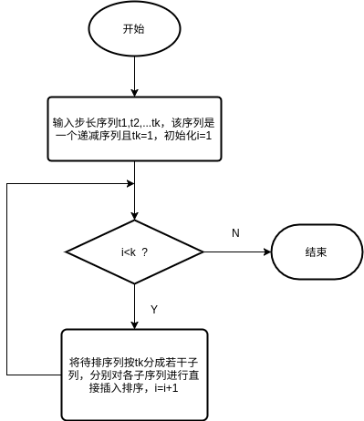
        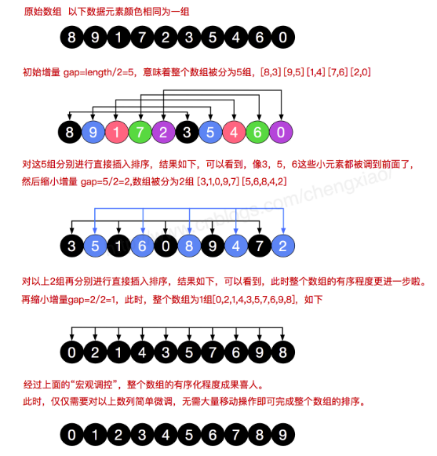

    - 语言描述

        - 子程序(一趟希尔排序)
            ```C++
            void ShellInsert(SqList &L,int dk)
            {
                for(int i=dk+1;i<=L.length;i++)
                {
                    L.r[0]=L.r[i];
                    for(int j=i-dk;j>0 && L.r[0]<=L.r[j];j-=dk)
                        L.r[j+dk]=L.r[j];
                    L.r[j+dk]=L.r[0];
                }
            }
            ```
        - 主程序(按照增量序列$dl[0]--dl[t-1]$对顺序表$L$调用子程序)
            ```C++
            void ShellSort(SqList &L,int dlta[],int t)
            {
                for(int k=0;k<t;k++)
                    ShellInsert(L,dlta[k]);
            }
            ```
    - 算法分析

        - 时间复杂度：时间性能在$O(n^2)--O(n\log_2n)$，当$n$在某个特定范围，希尔排序算法的时间复杂度约为$O(n^{1.3})$
        - 空间复杂度：$O(1)$
        - 稳定性：不稳定，以$\{49,50,65,97,76,13,27,\underline{49}\}$为例，该序列经过步长序列$\{5,2,1\}$的希尔排序得到有序序列为$\{13,27,\underline{49},49,50,65,76,97\}$

### 交换排序

> 交换排序是一类借助比较和交换进行排序的犯法。其中交换是指对序列中两个记录的关键字进行比较，如果排序不对则对换两个记录在序列中的位置。交换排序的特点是：将关键字较大的记录向序列的一端移动，而关键字较小的记录向序列的另一端移动。

1. 冒泡排序

    > 冒泡排序$(Bubble\;Sort)$也称为起泡排序，是交换排序中常用的排序方法

    - 算法思想

        通过对排序元素中相邻元素间的关键字的比较和交换，是关键字最大的元素如气泡一样逐渐“上浮”。

    - 步骤

        1. 从存储$n$个待排序元素的表尾开始，并令$j=n$
        2. 若$j \lt 2$，则排序结束
        3. 从第一个元素开始进行两两比较，令$i=1$
        4. 若$i \ge j$，则冒泡排序结束，$j=j-1$；待排序表记录数为-1，转2
        5. 比较$r[i].key$与$r[i+1].key$，若$r[i].key \le r[i+1].key$，则不交换，转7
        6. 当$r[i].key \gt r[i+1].key$时，将$r[i].key$和$r[i+1].key$交换
        7. $i=i+1$，转4继续比较

    - 流程图

        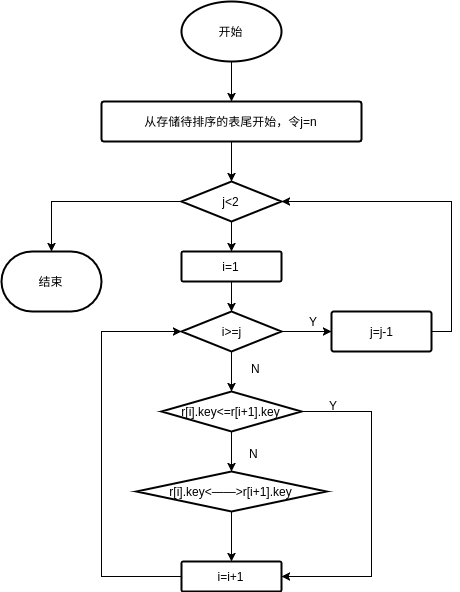

    - 语言描述

        ```C++
        void BubbleSort(SqList &L)
        {
            for (int i = 1; i < L.length; i++)
            {
                for (int j = 0; j < L.length - i; j++)
                {
                    if (L.r[j] > L.r[j + 1])
                    {
                        int t = L.r[j];
                        L.r[j] = L.r[j + 1];
                        L.r[j + 1] = t;
                    }
                }
            }
        }
        ```

    - 算法分析

        - 时间复杂度
            总需要进行$n-1$次冒泡，对$j$个记录的表进行一趟冒泡排序需要$j-1$次关键字比较，平均的总比较次数为:
            $$\sum_{j=2}^{n}(j-1)=\frac{n(n-1)}{2}$$
            平均时间复杂度为：$O(n^2)$
            最好情况：$O(n)$
            最好情况：$O(n^2)$

        - 稳定性：冒泡排序是一种稳定的排序方法。比较是相邻单元进行的，如果关键字值相同则不进行交换。

2. 快速排序

    > 快速排序也称分区交换排序

    - 算法思想

        通过对关键字的比较和交换，以待排序列中的某个数据为支点(或称枢轴量)，将待排序列分成两个部分，其中左半部分小于等于支点，右半部分大于等于支点。然后对左右两部分分别进行快速排序的递归处理，直到整个序列按关键字有序为止。

        其中将待排序列按关键字以支点分成两个部分的过程称为**一次划分**
        $$\begin{matrix}\underbrace{[r_1\quad\cdots\quad r_{i-1}]} \\ \le r_i\end{matrix}
        \quad r_i \quad
        \begin{matrix}\underbrace{[r_{i+1}\quad\cdots\quad r_n]} \\ \ge r_i\end{matrix}\quad$$

        冒泡排序中，元素的比较和移动是在相邻位置进行的，元素比较次数和移动次数较多。
        而在快速排序中，元素的比较和移动是从两端向中间进行的，关键字较大的记录一次就能从前面移动到后面，关键字较小的记录一次移动到前面，记录移动的距离较远，从而减少了总的比较次数和移动次数。
        可将快速排序看做对冒泡排序的一种改进。

    - 步骤

        1. 如果待排序子序列中元素的个数等于1，则排序结束；否则以$r[low]$为支点，按如下方法进行一次划分：
            1. 设置两个搜索指针：$low$是向后搜索指针，初始指向序列第一个结点；$high$是向前搜索指针，初始指向最后一个结点；取第一个记录为支点，$low$位暂时取值为支点$pivotkey=r[low].key$。
            2. 若$low=high$,枢轴空位确定为$low$，一次划分结束。
            3. 若$low \lt high$且$r[high].key \ge pivotkry$，则从$high$所指定的位置向前搜索：$high=high-1$，重新执行1.3；
                否则若有$low \lt high$并且有$r[high].key \lt pivotkey$，则设置$high$为新的支点位置。
                并交换$r[high].key$和$r[low].key$，然后令$low=low+1$,执行1.4；若$low \ge high$，则执行1.2
            4. 若$low \lt high$且$r[low].key \le pivotkry$。则从$low$所指的位置开始向后搜索：$low=low+1$，重新执行1.4；
                否则若由$low \lt high$并且有$r[low].key \gt pivotkey$，则设置$low$为新的支点位置，
                并交换$r[high].key$和$r[low].key$，然后令$high=high-1$，执行1.3；若$low \ge high$，则执行1.2
        2. 对支点左半子序列重复1
        3. 对支点右半子序列重复1

    - 流程图

        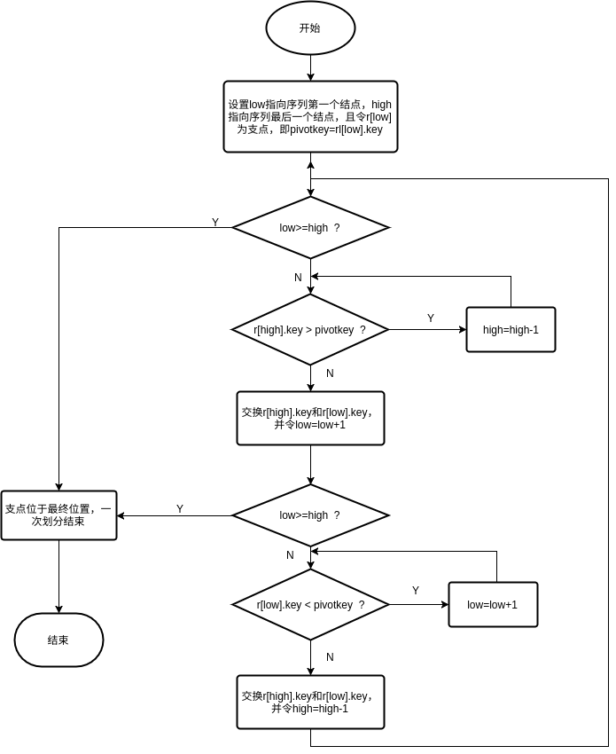

    - 语言描述

        ```C++
        int QSort::Partition(SqList &L, int low, int high)/对序列的一次划分
        {
            int pivotkey;
            L.r[0] = L.r[low];   //用子表的第一个记录作枢轴记录
            pivotkey = L.r[low]; //关键字

            while (low < high) //从表的两边交替向中间扫描
            {

                while (low < high && L.r[high] >= pivotkey)
                {
                    --high;
                }
                L.r[low] = L.r[high]; //将比枢轴小的记录移至低端

                while (low < high && L.r[low] <= pivotkey)
                {
                    ++low;
                }
                L.r[high] = L.r[low]; //将比枢轴大的记录移至高端
            }
            L.r[low] = L.r[0]; //枢轴记录到位
            return low;        //返回枢轴位置
        }
        void QSort::QuickSort1(SqList &L, int low, int high) //按分区对子程序进行调用
        {
            int mid;
            if (low < high)
            {
                mid = Partition(L, low, high);
                QuickSort1(L, low, mid - 1);
                QuickSort1(L, mid + 1, high);
            }
        }
        ```

    - 算法分析

        - 时间复杂度
            - 最好情况：每次支点都将待排序划分成两个长度相等的子列时，$O(n\log_2n)$
            - 最坏情况：每次划分都只得到一个子列时，快速排序的过程类似冒泡排序，$O(n^2)$
            - 为了避免最坏情况，对快速排序进行一定的改进，改进方法是选取支点时选最左、最右和中间三个元素取值处于中间的元素作为支点。
        - 空间复杂度：$O(\log_2n)$
        - 稳定性：以$\{55,49,65,97,76,52,50,\underline{49}\}$为例，经过快速排序得到有序序列为$\{\underline{49},49,50,52,55,65,76,97\}$，因此快速排序是**不稳定**的排序方法

### 选择排序

> **选择排序**$(Selection\;Sort)$是一类借助"选择"进行排序的方法

- 算法思想

    每一趟从待排序列中选取一个关键字最小的记录，也即第一趟从$n$个记录中选取关键字最小的记录，第二趟从剩下的$n-1$个记录中选取关键字最小的记录，直到全部元素排序完毕。

    适用于从大量元素中选择一部分排序元素的应用，如从50000个元素中选择前10个关键字最小的元素等。

1. 简单选择排序

    - 算法思想

        第一趟从$n$个记录中选出关键字最小的记录和第一个记录交换；第二趟从第二个记录开始的$n-1$个记录中选出关键字最小的记录与第二个记录交换；如此第$i$趟则从第$i$个记录开始的$n-i+1$个记录中选出关键字最小的记录与第$i$个记录交换，直到整个序列按关键字有序。

    - 步骤
        > 注：书上的设置i=1，因为书上默认列表的第一个元素即$r[0]$用来暂存待移动的下标
        1. 创建一个辅助变量$j$用于存放每次遍历关键字最小记录的下标，设指变量$i=1$
        2. 遍历第$i$个记录到第$L.length$个记录。选这一个关键字最小的记录，将其下标保存指$j$中
        3. 若第$i$个记录的关键字小于$j$中保存的记录的关键字，则交换这两个记录
        4. $i=i+1$，若$i \lt L.length$，则执行2；否则排序结束

    - 流程图

        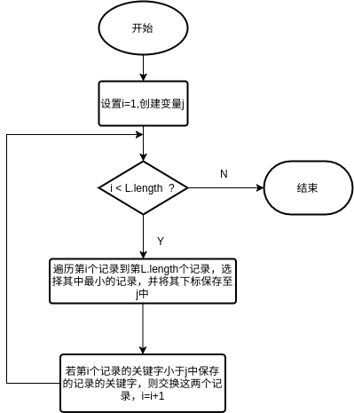

    - 语言描述

        ```C++
        void QSort::SSelectionSort(SqList &L)
        {
            int t, j;
            for (int x = 0; x <= L.length - 1; x++)
            {
                j = x;
                for (int y = x; y <= L.length - 1; y++)
                {
                    if (L.r[y] < L.r[j])
                    {
                        j = y;
                    }
                }
                if (x != j)
                {
                    t = L.r[x];
                    L.r[x] = L.r[j];
                    L.r[j] = t;
                }
            }
        }
        ```

    - 算法分析
        - 时间复杂度：总比较次数为：$\frac{n(n-1)}{2}$，$O(n^2)$
        - 空间复杂度：$O(1)$
        - 稳定性：简单选择排序是稳定的排序方法

2. 树形选择排序

    > **树形选择排序**$(Tree\;Selection\;Sort))$又称**锦标赛排序**$(Tournament\;Sort)$，它是一种按照锦标赛的思想设计的选择排序方法

    - 算法思想

        将$n$个参赛选择完全视为完全二叉树的叶子结点，则该完全二叉树有$2n$或$2n-1$个结点。首先，叶子结点进行两两比较，胜出(关键字较小者胜出)的结点在在兄弟结点之间再两两比较，直至产生第一名；接下来将作为第一名的结点视为最差的，并从该结点开始，沿该结点到根路径上，依次进行各分支结点孩子之间的比较，胜出的就是第二名(因为和它比赛的均是刚刚输给第一名的结点)。这样继续下去，直到所有选手的名次排定。

    - 步骤

        1. 从底层的叶子结点开始，逐层进行兄弟间的比较，关键字较小者上升为双亲结点，直到树根为止。
        2. 将树的根结点输出，并将底层叶子结点中的一个值与输出结点值相同的结点设为$MAX$.
        3. 如果输出的结点总数小于初始树的叶子结点个数，则重复步骤1；否则结束排序。

    - 流程图

        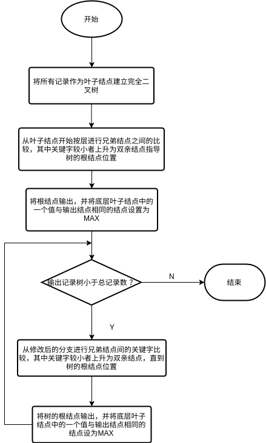

    - 示意图

        

    - 算法分析

        - 时间复杂度：树的深度为$\left\lceil\log_2n\right\rceil+1$，进行了$\log_2n$次比较，$O(n\log_2n)$
        - 空间复杂度：$O(n)$
        - 稳定性：树形选择排序是稳定的排序方法

3. 堆排序

    > 堆排序$(Heap\;Sort)$利用堆的特性进行排序的方法。

    堆：设有$n$个元素的序列$\{k_1,k_2,\cdots,k_n\}$,当且仅当满足下述关系之一时：
    $$\begin{cases}k_i\le k_{2i}\\
    k_i\le k_{2i+1}\end{cases}
    \;or\;
    \begin{cases}k_i\ge k_{2i}\\
    k_i\ge k_{2i+1}\end{cases}$$
    其中，$i=1,2,\cdots,\left\lfloor\frac{n}{2}\right\rfloor$，分别称为小顶堆和大顶堆。

    根据堆的性质，它也是完全二叉树，且具有下列性质之一：
    1. 每个结点的值都小于或等于其左右孩子的值，称之为**小顶堆**
    2. 每个结点的值都大于或等于其左右孩子的值，称之为**大顶堆**

    - 算法思想

        首先用待排序列的记录序列构造出一个堆，此时选出了堆中所有记录的最小者为堆顶，随后将它从堆中移走(通常是将堆顶记录和堆中最后一个记录交换)，并将剩余记录在调整成堆，这样又找出了次小的记录，依次类推，直到堆中只有一个记录位置。

    - 步骤

        1. i=1，基于顺序表$L[1,2,\cdots,L.length-i+1]$中的元素先建一个小顶堆
        2. 将堆顶元素和$L[L.length-i+1]$交换
        3. $i=i+1$，若$i \lt L.length$，则再对$L[1,2,\cdots,L.length-i+1]$进行调整，形成新的小顶堆，执行2；
            若$i \ge L.length$，则排序结束

    - 流程图

        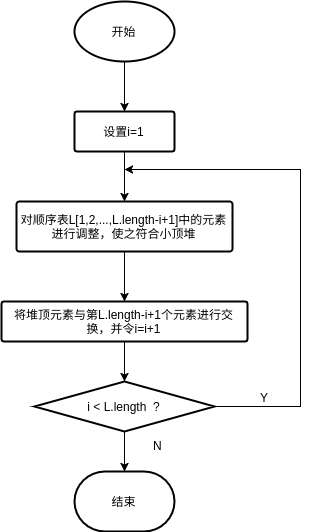
        > 图片的内容没有过关联，只是在网上找的图片示例，便于理解堆排序的过程。

        堆的创建：

        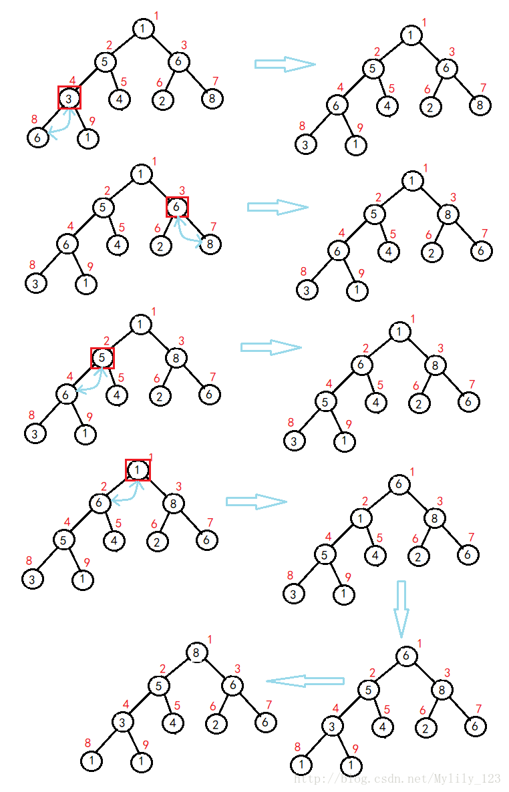

        堆的筛选和调整：
        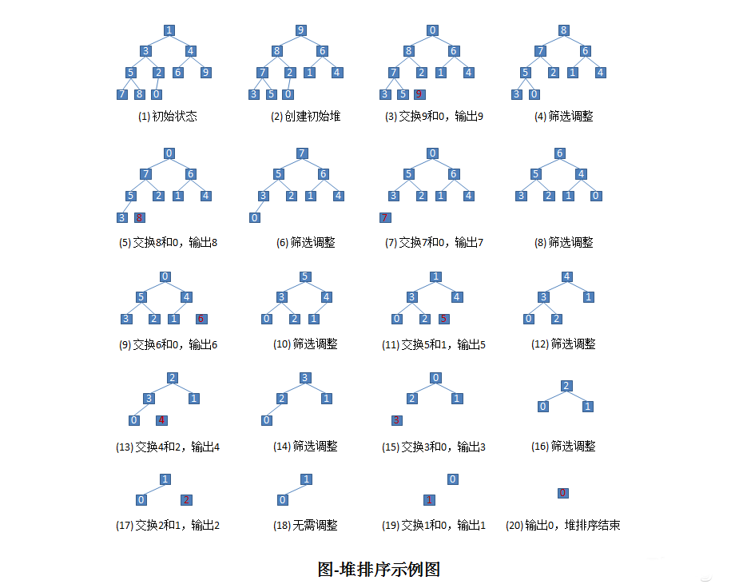

    - 语言描述

        ```C++
        //堆的建立
        void HeapAdjust(SqList &L, int s, int m) //对顺序表做查找，从值最小的孩子结点向下筛选，找到最小值
        {
            int rc = L.r[s];
            for (int j = 2 * s; j <= m; j *= 2)
            {
                if (j < m && L.r[j] >= L.r[j + 1])
                    j++;
                if (rc < L.r[j])
                    break;
                L.r[s] = L.r[j];
                s = j;
            }
            L.r[s] = rc;
        }
        //完整的堆排序
        void HeapSort(SqList &L) //对顺序表L进行堆排序
        {
            int value;
            int i;
            for (i = L.length / 2; i > 0; i--) //把L.r[1...L.length]调整为小顶堆
                HeapAdjust(L, i, L.length);
            for (i = L.length; i > 1; i--)
            {
                value = L.r[1];
                L.r[1] = L.r[i];
                L.r[i] = value;
                HeapAdjust(L, 1, i - 1);
            }
        }
        ```

    - 算法分析
        - 时间复杂度：建堆需要$O(n)$，每次取完顶堆进行调整需要的时间为$O(\log_2n)$，且过程经过$n-1$次，总的时间复杂度：$O(n\log_2n)$
        - 空间复杂度：$O(1)$
        - 稳定性：不稳定的排序方法

### 归并排序

**归并排序**$(Merge\;Sort))$是借助归并进行排序的方法。

归并的含义：将两个或两个以上的有序序列归并成一个有序序列的过程。

归并排序按所合并的表的个数分为：二路归并排序和多路归并排序

- 二路归并排序

    - 算法思想

        将待排序的$n$个元素看成是$n$个有序的子序列，每个子序列的长度为1，然后两两归并，得到$\left\lfloor\frac{n}{2}\right\rfloor$个长度为2或1(最后一个有序序列长度可能为1)的有序子序列；再两两归并，得到$\left\lfloor\frac{n}{4}\right\rfloor$个长度为4或小于4(最后一个有序序列长度可能小于4)的有序子序列;再两两归并，$\cdots\cdots$直至得到一个长度为$n$的有序序列

    - 步骤

        1. 将待排序序列划分为两个长度相当的子序列
        2. 若子序列长度大于1，则对子序列执行一次归并排序
        3. 执行下列步骤对子序列两两合并成有序序列
            1. 创建一个辅助数组$temp[]$。假设两个子列的长度分别为$u,v$，两个子列的下标为$0~u,u+1~v+u+1$。设置两个子表的起始下标和辅助数组的起始下标：$$i=0;j=u+1;k=0$
            2. 若$i \gt u$h或$j \gt v+u+1$，说明其中一个子表已经合并完毕，直接执行3.4
            3. 选取$r[i]$和$r[j]$中关键字较小的存入辅助数组$temp[]$:若$r[i].key \lt r[j].key$，则$temp[k]=r[i];i++;k++;$否则$temp[k]=r[j];j++;k++$，返回执行3.2
            4. 尚未处理完的子表元素与此存入$temp[]$，结束合并，并将结果返回。

    - 流程图

        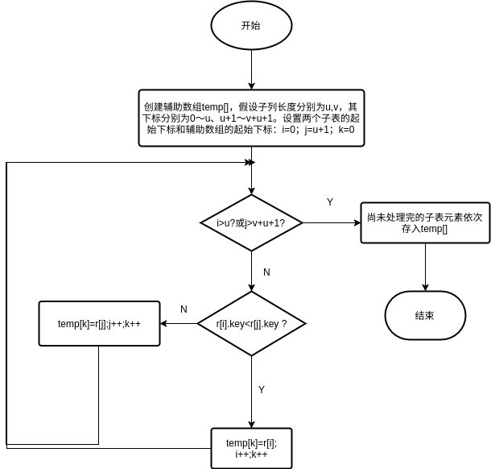

    - 语言描述

        ```C++
        //一趟归并排序
        void Merge(int *SR, int *TR, int i, int m, int n)
        {
            int j, k;
            for (j = m + 1, k = i; i <= m && j <= n; k++) //将SR中的记录由大到小并入TR
            {
                if (SR[i] <= SR[j])
                {
                    TR[k] = SR[i++];
                }
                else
                {
                    TR[k] = SR[j++];
                }
            }

            if (i <= m) //将剩余的SR[i...m]赋值到TR
            {
                for (int a = i; a <= m; a++)
                {
                    TR[k++] = SR[a];
                }
            }
            else if (j <= n) //将剩余的SR[j...n]赋值到TR
            {
                for (int b = j; b <= n; b++)
                {
                    TR[k++] = SR[b];
                }
            }
        }
        //归并排序递归算法
        void MergeSort(int *SR, int *TR1, int s, int t)
        {
            int TR2[100];
            int m;
            if (s == t)
            {
                TR1[s] = SR[s];
            }
            else
            {
                m = (s + t) / 2;
                MergeSort(SR, TR2, s, m);
                MergeSort(SR, TR2, m+1, t);
                Merge(TR2,TR1,s,m,t);
            }
        }
        ```

    - 算法分析

        - 时间复杂度：$O(n\log_2n)$
        - 空间复杂度：$O(n)$
        - 稳定性：归并排序是稳定的排序算法

### 基数排序

**基数排序**$(Radix\;Sort)$不利用关键字之间的比较和移动操作来进行排序，而是通过多关键字排序的思想，根据关键字每个位上的有效数字的取值，借助分配和收集两种操作对单关键字进行排序。

1. 多关键字的排序

    > **多关键字排序**是应用在多关键字的序列上的排序方法，最常见的多关键字序列的排序方法是**最低优先法**

    - 最低优先法的算法思想

        首先按照最低位$k^d$进行排序，再对高一位关键字$k^{d-1}$进行排序，一次类推直到所有关键字都排序完毕。

    - Example

        代表性的例子就是扑克牌的排序。可以将扑克牌的52张牌按花色和值分成两个关键字，其关系如下：
        - 花色：梅花$\lt$方块$\lt$红桃$\lt$黑桃
        - 值：$2\lt3\lt4\lt5\lt6\lt7\lt8\lt9\lt10\lt J\lt Q\lt K\lt A$
        且花色的关键字等级高于值关键字。
        花色相同时，才根据值确定大小。

2. 链式基数排序

    > 对于单关键字的序列，也可以通过将关键字拆分成若干项，每一项都看作是一个新的关键字，则可以利用上述多关键字排序的方法对单关键字的序列进行排序。如对于一个2位的整数，可以将其按照位数拆分为2项。这样拆分后，每个关键字的范围都相同$(0\to9)$，这样关键字可以出现的符号个数称为"基",例如，二进制数的基是2，十进制数的基是10。基于这样的设定，可以通过多关键字排序的方法方便地进行单关键字序列排序。

    链式基数排序：采用单链表作为分配的"容器".

    - 步骤

        1. 建立待排序序列的静态链表$SL$和分配记录用的若干个单链表
        2. 从最低位关键字开始，按关键字将$SL$中记录分配到各个单链表中
        3. 按照关键字的值从小到大从各个单链表中收集记录到静态链表$SL$中，重复Step2直至排序完成。

    - 流程图

        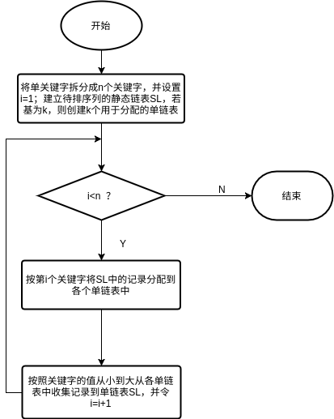

    - Example

        例如：给定8个2位的十进制数序列：49,39,65,97,76,13,27,69，采用链式基数排序的过程如下。
        $$\boxed{49}\to\boxed{39}\to\boxed{65}\to\boxed{97}\to\boxed{76}\to\boxed{13}\to\boxed{27}\to\boxed{69}$$

        方法：设置若干桶，因十进制分别有数字：$0,1,2,\cdots,9$，因此其基为10。设置十个桶，分别用$B_0,B_1,\cdots,B_9$进行标识。排序分两步：位数字相同的数放入同一个桶。
        1. 分配：将右起第$j$位数字相同的数放入同一桶。比如数字为1者(若位数不同则左边补0),将其看成01，放入桶$B_1$。其余类推
        2. 收集：按$B_0,B_1,\cdots,B_9$的顺序进行收集。
        重复1,2从最右位直到最左位共2次。

        和题目无关，只是为了展示过程
        

    - 语言描述

        ```C++
        #include <iostream>
        using namespace std;
        #define RADIX 10
        typedef int ArrType[RADIX];
        ArrType f, e;
        struct SLCell
        {
            int *keys; //关键字
            int next;
        };
        struct SLList
        {
            SLCell *SList;
            int keynum; //记录当前关键字个数
            int recnum; //记录当前静态链表的长度
        };
        //分配
        void Distrbute(SLCell *r, int i, ArrType &f, ArrType &e)
        {
            int j;
            for (j = 0; j < RADIX; j++)
                f[j] = 0;
            for (int a = r[0].next; a; a = r[a].next)
            {
                j = r[a].keys[i];
                if (!f[j])
                    f[j] = a;
                else
                    r[e[j]].next = a;
                e[j] = a;
            }
        }
        //收集
        void Collect(SLCell *r, int i, ArrType &f, ArrType &e)
        {
            int j;
            for (j = 0; !f[j]; j++)
                ;             //找到第一个非空子集
            r[0].next = f[j]; //r[0].next 指向第一个非空子表中第一个结点
            int t = e[j];
            while (j < RADIX)
            {
                for (j++; j < RADIX - 1 && !f[j]; j++)
                    ; //找下一个非空子集
                if (f[j])
                {
                    r[t].next = f[j];
                    t = e[j]; //链接两个非空子表
                }
            }
            r[t].next = 0; //t指向最后一个非空子表的左后一个结点
        }
        //主程序
        void RadixSort(SLList &SL)
        {
            for (int i = SL.keynum; i >= 1; i--) //按最高位优先依次对各关键字进行分配收集
            {
                Distrbute(SL.SList, i, f, e); //第i趟分散
                Collect(SL.SList, i, f, e);   //第i趟收集
            }
        }
        ```

    - 算法分析
        - 时间复杂度：设待排序列有$n$个记录，$d$个关键字，每个关键字的取值范围(基)为$r$,进行一趟分配的时间复杂度为$O(n)$，一趟收集的时间复杂度为$O(r)$，总共要进行$d$趟分配和收集，因此链式基数排序的时间复杂度为$O(d(n+r))$
        - 空间复杂度：链式基数排序需要$2r$个指向队列的辅助空间，且需要$n$个用于静态链表的指针，因此空间复杂度$O(n+rd)$
        - 稳定性：链式基数排序是稳定的排序方法

### 各种内部排序方法的比较

1. 快速排序、堆排序、归并排序的平均时间复杂度最好。
2. 直接插入排序思路明了、算法简单，是一种常用的排序算法。
3. 基数排序的时间复杂度为$O(d(rd+n))$，因此党待排序列的记录数量$n$很大且关键字长度很小时，其时间性能好。
4. 从空间复杂度上看，大多数排序算法的辅助空间为$O(1)$。但快速排序和归并排序例外，分别为$O(n\log_2n)$和$O(n)$。而基数排序的空间复杂度和关键字的数量和基有关。
5. 从稳定性上讲，属于稳定性算法的有直接插入排序、简单选择排序、归并排序和基数排序，属于不稳定排序算法的有希尔排序、快速排序和堆排序。
6. 从算法本身的复杂度上看，直接插入排序、简单选择排序比较容易理解，属于简单算法，其时间性能理论上较差；而另一类像希尔排序、快速排序、堆排序和归并排序这样较为复杂的算法，属于改进算法，时间性能理论上较好。
7. 从待排记录个数$n$来看，当$n$越小，采用简单排序算法更为合适，当$n$很大时，采用改进算法更为合适。

|排序算法|最好情况|最坏情况|平均情况|空间复杂度|
|---|---|---|---|---|
|直接插入排序|$O(n)$|$O(n^2)$|$O(n^2)$|$O(1)$|
|希尔排序|$O(n^{1.3})$|$O(n^2)$|$O(n\log_2n)$|$O(1)$|
|快速排序|$O(n\log_2n)$|$O(n^2)$|$O(n\log_2n)$|$O(\log_2n)$|
|简单选择排序|$O(n^2)$|$O(n^2)$|$O(n^2)$|$O(1)$|
|堆排序|$O(n\log_2n)$|$O(n\log_2n)$|$O(n\log_2n)$|$O(1)$|
|归并排序|$O(n\log_2n)$|$O(n\log_2n)$|$O(n\log_2n)$|$O(n)$|
|基数排序|$O(d(rd+n))$|$O(d(rd+n))$|$O(d(rd+n))$|$O(rd+n)$|

## 算法设计与分析

### 分治法

> 对于一个规模为n的问题，若问题比较容易解决(比如规模n较小)，则直接解决，否则将该问题分割为k个规模较小的子问题，这些子问题互相独立且与原问题的形式相同，递归的解决这些子问题，然后将各个子问题的解合并到原问题的解，这就是分治法。

- 基本思想

    “分治”就是“分而治之”，即将一个难以解决的大问题分割成若干个规模较小的子问题，以便各个击破，分而治之。

    分治法是很多算法的基础，如快速排序、归并排序等排序算法，以及傅里叶变换。

### 回溯法

> **回溯法**$(Back\;Tracking\;Method)$可以系统地搜索问题的所有解，是一个具有系统性和跳跃性的算法。

如搜索问题和优化问题，它们的解分布在一个**解空间**里，求解这些问题的算法就是一种遍历搜索解空间的系统方法，所以解空间又称为**搜索空间**。

回溯法将搜索空间看成树形结构，一个问题的解对应树中的一个叶子结点。

- 基本思想

    - 回溯法在问题的解空间中，按照深度优先策略，从根结点出发搜索解空间树。

    - 算法搜索至解空间的任一结点，先判断该结点是否包含问题的解。
        - 如果不包含，则跳过对该结点为根的子树的搜索，逐层向其祖先结点回溯；
        - 否则，进入该子树，继续进行深度优先策略搜索。

    - 回溯法求问题的所有解时，要回溯到根结点，且根结点所有子树都被搜索完才算结束。

### 贪心算法

> **贪心算法**$(Greedy\;Method)$是一种通用的算法设计方法，在许多**最优化问题**求解中得到了广泛应用，例如求图的最小生成树的Prim算法和Kruskal算法，单源最短路径的Dijkstra算法，数据压缩的Huffman算法

贪心算法和动态规划算法一样，常用于求解最优化问题，即量的最大化或最小化。

- 基本思想

    贪心算法的求解是一个多步决策的过程，每步决策不考虑子问题的计算结果，而是经过少量的计算，根据当前情况做出取舍，这样一步步地构筑解，每一步均建立在局部最优解的基础上，同时又扩大了局部解的规模。

    贪心选择：每一个选择都是当前状态下局部的最好选择

- 贪心算法的性质

    贪心算法求解问题，一般具有两个性质：贪心选择性质和最优子结构性质

    - 贪心选择性质

        贪心选择性质是指所求问题的整体最优解可以通过一系列的局部最优的选择(贪心选择)来达到，它采用自顶向下的方式将所求问题简化为规模更小的子问题。

    - 最优子结构性质

        当一个问题的最优解包括其子问题的最优解时，称此问题具有最优子结构性质

### 动态规划

> 动态规划：是一种将问题实例分解为更小的、相似的子问题，并存储子问题的解而避免重复计算的子问题，以解决最优化问题的算法策略。

- 基本思想

    与分治法类似，将带求解问题分解成若干个子问题，先求解子问题，然后从这些子问题的解得到原问题的解。与分治法不同的是，适用于动态规划求解的问题，经分割得到的子问题往往不是互相独立的。若用分治法解决这些问题，分割的子问题数目太多，以致最后解决原问题需要耗费的指数时间。

    在使用分治法求解时，有些子问题被重复计算多次。若保存已解决的子问题的答案，在需要时找出已求出的答案，可以避免大量重复计算，从而得到多项式时间的算法，这就是动态规划的基本思想。

- 设计步骤

    1. 找出最优解的性质，并刻画其结构特征
    2. 递归的定义最优值
    3. 自底向上的方式计算得出最优值
    4. 根据计算最优值时得到的信息构造最优解

    步骤1-3是动态规划算法的基本步骤。

    若只需求出最优值，则步骤4可以省略。
    若需求出问题的最优解，则必须执行步骤4，此时，在步骤3中计算最优值，通常需要记录更多的信息，以便在步骤4中，能够根据记录的信息快速构造出最优解。

动态规划算法解决的问题需要一定条件：最优化原理(最优子结构性质)和子问题的重叠性。

- 条件

    - 最优化原理(最优子结构性质)

        一个最优化策略具有这样的性质，不论过去状态和决策如何，对前面的决策所形成的状态而言，余下的诸决策必须构成最优策略。简而言之，一个最优化策略的子策略总是最优的。一个问题满足最优化原理称起具有最优子结构性质。

    - 子问题的重叠性

        对于重复出现的子问题，只在第一次遇到时加以求解，并把答案保存起来，让以后再遇到时直接引用，不必重新求解。

### 分支限界法

> **分支限界法**$(Branch-and-Bound)$类似回溯法，都是在解空间树上搜索问题的解，也可以看做是回溯法的改进。回溯法是在整个状态空间树中搜索解，并用约束条件判断搜索过程，一旦发生不可能产生问题的不分解，就终止对相应子树的搜索，从而避免不必要的工作。

分支限界法和回溯在两个方法存在差异：控制条件和搜索方式

- 控制条件

    回溯法一般使用约束条件产生部分解。若满足约束条件，则继续扩大解；否则丢弃，重新搜索。
    分支限界法中，除了使用约束函数外，还使用更有效的评判函数——目标函数控制搜索进行，从而能够尽快得到最优解。

- 搜索方式

    回溯法中的搜索一般是以深度优先的方式进行，而分支限界法中一般以广度优先方式进行搜索。

- 基本思想

    略