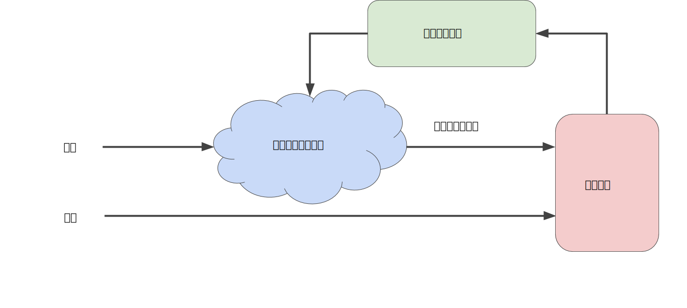

# 机器学习常见概念

- 最简单的模型方程式 

    $$y'=b+w_1x_1$$

    其中：

    - $y'$指的是预测标签（理想输出值）。
    - $b$指的是偏差（y 轴截距）。而在一些机器学习文档中，它称为$w_0$。
    - $w_1$指的是特征 1 的权重。权重与上文中用$m$表示的“斜率”的概念相同。
    - $x_1$指的是特征（已知输入项）。

    根据特征$x_1$**推测**（预测）$y_1$，只需代入$x_1$到这个模型即可。

    例如，具有三个特征的模型可以采用以下方程式：

    $$y'=b+w_1x_1+w_2x_2+w_3x_3$$

- **训练**模型表示通过有标签样本来学习（确定）所有权重和偏差的理想值。
- 在监督式学习中，机器学习算法通过以下方式构建模型：检查多个样本并尝试找出可最大限度地减少损失的模型；这一过程称为**经验风险**最小化。
- **损失**是一个数值，表示对于单个样本而言模型预测的准确程度。
- **平方损失**（又称为 L2 损失）,单个样本的平方损失

    $$=(observation-prediction(x))^2 \\ =(y-y')^2$$

- **均方误差 (MSE)** 指的是每个样本的平均平方损失

    $$MSE = \frac{1}{N}\sum_{(x,y)\in D}{(y-prediction(x)^2)}$$

    其中：

    - $(x,y)$指的是样本，其中
        - $x$指的是模型进行预测时使用的特征集（例如，温度、年龄和交配成功率）。
        - $y$指的是样本的标签（例如，每分钟的鸣叫次数）。
    - $prediction(x)$指的是权重和偏差与特征集$x$结合的函数。
    - $D$指的是包含多个有标签样本（即$(x,y)$ ）的数据集。
    - $N$指的是$D$中的样本数量。

- 通常，可以不断迭代，直到总体损失不再变化或至少变化极其缓慢为止。这时候，我们可以说该模型已**收敛**。

- **梯度**是偏导数的矢量；它可以让您了解哪个方向距离目标“更近”或“更远”。

详情：[偏导数和导数](SubMD/偏导数和梯度.md)

- **梯度矢量**具有方向和大小。梯度下降法算法用梯度乘以一个称为**学习速率**（有时也称为步长）的*标量*，以确定下一个点的位置。
- **超参数**是编程人员在机器学习算法中用于调整的旋钮。
- 在梯度下降法中，**批量**指的是用于在单次迭代中计算梯度的样本总数。
- **随机梯度下降法 (SGD)** 将这种想法运用到极致，它每次迭代只使用一个样本（批量大小为 1）。如果进行足够的迭代，SGD 也可以发挥作用，但过程会非常杂乱。“随机”这一术语表示构成各个批量的一个样本都是随机选择的。
- **小批量随机梯度下降法**（小批量 SGD）是介于全批量迭代与 SGD 之间的折衷方案。小批量通常包含 10-1000 个随机选择的样本。小批量 SGD 可以减少 SGD 中的杂乱样本数量，但仍然比全批量更高效。

- 机器学习常见超参数
    - steps：训练迭代的总次数。一步计算一批样本产生的损失，然后使用该值修改一次模型的权重。
    - batch size：单步的样本数量（随机选择）。例如，SGD 的批次大小为 1。

    $$totalnumber\;of\;trained\;examples = steps * batch\;size $$

    - periods：控制报告的粒度。例如，如果 periods 设为 7 且 steps 设为 70，则练习将每 10 步输出一次损失值（即 7 次）。与超参数不同，我们不希望您修改 periods 的值。请注意，修改 periods 不会更改模型所学习的规律。

    $$number\;of\;training\;examples = \frac{steps * batch\;size}{periods}$$

- 过拟合 (overfitting):创建的模型与训练数据过于匹配，以致于模型无法根据新数据做出正确的预测
- 训练集 - 用于训练模型的子集。
- 测试集 - 用于测试训练后模型的子集。
