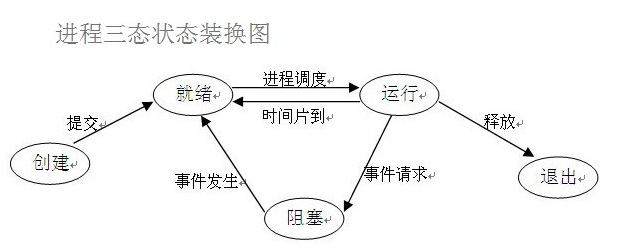
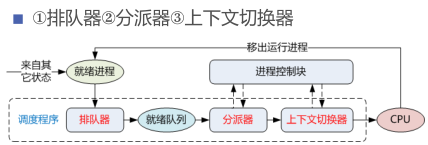
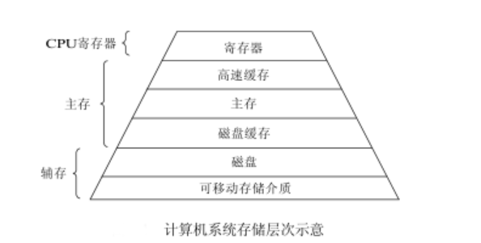
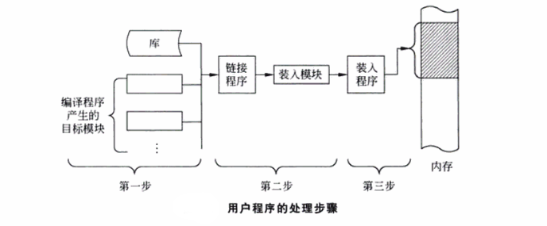
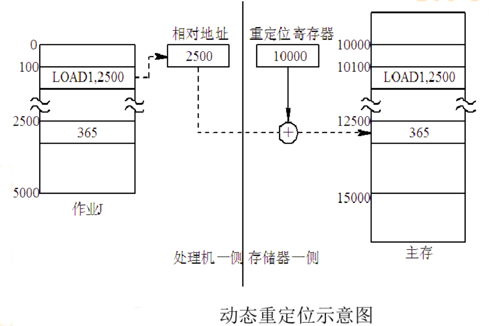

# 操作系统

<!-- @import "[TOC]" {cmd="toc" depthFrom=1 depthTo=6 orderedList=ture} -->

<!-- code_chunk_output -->

1. [操作系统](#操作系统)
    1. [第一章 操作系统引论](#第一章-操作系统引论)
        1. [操作系统的目标和作用](#操作系统的目标和作用)
        2. [操作系统的发展过程：](#操作系统的发展过程)
        3. [操作系统的基本特性：](#操作系统的基本特性)
        4. [操作系统的主要功能：](#操作系统的主要功能)
        5. [OS结构设计](#os结构设计)
    2. [第二章 进程的描述和控制](#第二章-进程的描述和控制)
        1. [前趋图和程序执行](#前趋图和程序执行)
        2. [进程的描述](#进程的描述)
        3. [进程控制](#进程控制)
            1. [操作系统内核](#操作系统内核)
            2. [进程](#进程)
        4. [进程同步](#进程同步)
            1. [硬件同步机制](#硬件同步机制)
            2. [信号量机制](#信号量机制)
            3. [管程机制](#管程机制)
        5. [进程通信](#进程通信)
            1. [共享存储器系统 Shared-Memory System](#共享存储器系统-shared-memory-system)
            2. [管道通信系统](#管道通信系统)
            3. [消息传递系统](#消息传递系统)
            4. [客户机-服务器系统](#客户机-服务器系统)
            5. [消息传递通信的实现方式](#消息传递通信的实现方式)
            6. [直接消息传递系统实例](#直接消息传递系统实例)
        6. [线程](#线程)
            1. [线程的引入](#线程的引入)
            2. [线程和进程的比较](#线程和进程的比较)
            3. [线程的状态和线程控制块](#线程的状态和线程控制块)
        7. [线程的实现](#线程的实现)
            1. [实现方式](#实现方式)
            2. [线程的实现实现](#线程的实现实现)
            3. [线程的创建和终止](#线程的创建和终止)
    3. [第三章 处理调度与死锁](#第三章-处理调度与死锁)
        1. [处理机调度的层次和调度算法的目标](#处理机调度的层次和调度算法的目标)
            1. [处理机调度的层次](#处理机调度的层次)
            2. [处理机调度算法的目标](#处理机调度算法的目标)
        2. [作业和作业调度](#作业和作业调度)
            1. [批处理系统中的作业](#批处理系统中的作业)
            2. [作业调度的主要任务](#作业调度的主要任务)
            3. [先来先服务和短作业优先调度算法](#先来先服务和短作业优先调度算法)
            4. [优先级调度算法和高响应比优先调度算法](#优先级调度算法和高响应比优先调度算法)
        3. [进程调度](#进程调度)
            1. [进程调度的任务、机制和方式](#进程调度的任务-机制和方式)
            2. [轮转调度算法](#轮转调度算法)
            3. [优先级调度](#优先级调度)
            4. [多队列调度算法](#多队列调度算法)
            5. [多级反馈（multileved feedback queue）调度算法](#多级反馈multileved-feedback-queue调度算法)
            6. [基于公平原则的调度算法](#基于公平原则的调度算法)
        4. [实时调度](#实时调度)
            1. [实现实时调度的基本条件](#实现实时调度的基本条件)
            2. [实时调度算法的分类](#实时调度算法的分类)
            3. [最早截止时间优先EDF(Earliest Deadline First)](#最早截止时间优先edfearliest-deadline-first)
            4. [最低松弛度优先LLF(Least Laxity First)算法](#最低松弛度优先llfleast-laxity-first算法)
            5. [优先级倒置](#优先级倒置)
        5. [死锁概述](#死锁概述)
            1. [死锁的原因](#死锁的原因)
            2. [死锁](#死锁)
        6. [预防死锁](#预防死锁)
        7. [避免死锁](#避免死锁)
            1. [利用银行家算法避免死锁](#利用银行家算法避免死锁)
        8. [死锁的检测和解除](#死锁的检测和解除)
            1. [死锁的检测](#死锁的检测)
            2. [死锁的解除](#死锁的解除)
    4. [第四章 存储器管理](#第四章-存储器管理)
        1. [存储器的层次结构](#存储器的层次结构)
        2. [程序的装入和链接](#程序的装入和链接)
        3. [连续分配存储管理方式](#连续分配存储管理方式)
        4. [对换（Swapping）](#对换swapping)
        5. [分页存储管理方式](#分页存储管理方式)
        6. [分段存储管理方式](#分段存储管理方式)
    5. [第五章 虚拟存储器](#第五章-虚拟存储器)
    6. [第六章 输入输出系统](#第六章-输入输出系统)
    7. [第七章 文件管理](#第七章-文件管理)
    8. [第八章 磁盘存储器的管理](#第八章-磁盘存储器的管理)
    9. [第九章 操作系统接口](#第九章-操作系统接口)
    10. [第十章 多处理机系统](#第十章-多处理机系统)
    11. [第十一章 多媒体操作系统](#第十一章-多媒体操作系统)
    12. [保护和安全](#保护和安全)

<!-- /code_chunk_output -->

## 第一章 操作系统引论

### 操作系统的目标和作用

在计算机系统上配置操作系统，其主要目标：方便性、有效性、可扩充性和开放性。

操作系统的作用：

1. 作为用户与计算机硬件系统之间的接口
2. 作为计算机系统资源的管理者
3. 实现了对计算机资源的抽象

### 操作系统的发展过程：

1. 未配置操作系统的计算机系统

   - 人工操作方式。缺点：用户独占全机；CPU等待人工操作
   - 脱机输入/输出（Off-Line I/O）方式。优点：减少了CPU的空闲时间；提高了I/O速度

     > 脱机I/O技术：事先将装有用户程序和数据的纸带装入纸带输入机，在外围机的控制下，把纸带上的数据输入到磁带上。

2. 单道批处理系统

   缺点：系统资源得不到充分利用。

3. 多道批处理系统（为了提高资源利用率和系统吞吐量）

   1. 基本概念

      在系统中，用户提交的作业先存放在外存上，并排成一个队列，成为“后备队列”。然后由作业调度按照一定的算法，从后备队列中选择若干个作业调入内存，使它们共享CPU和系统的各种资源。

   2. 优缺点

      1. 资源利用率高
      2. 系统吞吐量大
      3. 平均周转时间长
      4. 无交互能力

4. 分时系统(为了满足人机交互的需求)

   1. 用户需求主要体现在：人机交互；共享主机

   2. 关键问题：及时接受；及时处理

   3. 分时系统的特征：

      - 多路性

      - 独立性

      - 及时性

      - 交互性

5. 实时系统

   > 实时：表示”及时“
   > 实时计算：系统的正确性，不仅由计算机的逻辑结果来确定，而且还取决于产生结果的实践。

   实时系统的类型：

   1. 工业（武器）控制系统。
   2. 信息查询系统
   3. 多媒体系统
   4. 嵌入式系统

   实时任务的类型：

   1. 周期性任务和非周期性任务
   2. 硬实时任务和软实时任务

   实时系统和分时系统特征的比较：
   - 多路性
   - 独立性
   - 及时性
   - 交互性
   - 可靠性

6. 微机操作系统

   > 配置在微型机上的操作系统被称为微机操作系统

   1. 单用户单任务操作系统
        1. CP/M
        2. MS-DOS

   2. 单用户多任务操作系统
        1. Windows

   3. 多用户多任务操作系统
        UnixOS: Solaris OS;Linux OS

### 操作系统的基本特性：

- 并发 Concurrence
- 共享 Sharing
- 虚拟 Virtual
- 异步 Asynchronism

### 操作系统的主要功能：

1. 处理机管理功能

    - 进程控制
    - 进程同步
    - 进程通信
    - 调度：作业调度和进程调度

2. 存储器管理功能

    - 内存分配
    - 内存保护
    - 地址映射
    - 内存扩充
  
3. 设备管理功能

    - 缓冲管理
    - 设备分配
    - 设备处理
    > 设备管理的主要任务为完成用户进程提出的I/O请求，完成I/O操作；提高CPU和I/O设备的利用率，提高I/O速度，方便用户使用I/O设备

4. 文件管理功能

    - 文件存储的空间的管理
    - 目录管理
    - 文件读写管理和保护

5. 操作系统和用户之间的接口
    1. 用户接口
    2. 程序接口

6. 现代操作系统的新功能
    1. 系统安全
        - 认证技术
        - 密码技术
        - 访问控制技术
        - 反病毒技术

    2. 网络的功能和服务
        - 网络通信
        - 资源管理
        - 应用互操作

    3. 支持多媒体

### OS结构设计

1. 传统操作系统
    1. 无结构操作系统
    2. 模块化结构OS
        - 衡量模块独立性的两个标准：内聚性和耦合度
    3. 分层式结构OS

        优点：
        - 易保证系统的正确性
        - 易扩充性和易维护性

2. 客户/服务器模式
    > 三部分组成： 客户机、服务器和网络系统

3. 面向对象程序设计技术简介
4. 微内核OS结构

## 第二章 进程的描述和控制

### 前趋图和程序执行

> 前趋图：描述程序执行先后顺序。是一个有向无循环图（DAG(Direct Acyclic Graph)）

1. 程序的顺序执行
   > 通常一个程序由若干个个程序段组成，每个程序段完成特定的功能，它们在执行时，都需要按照某种先后次序顺序执行，当前一段程序执行完后，才运行后一程序段。

   程序顺序执行的特征：
    - 顺序性：指处理机严格按照程序规定的顺序执行，即每一操作必须在下一操作开始之前结束。
    - 封闭性：指程序在封闭的环境下运行，即程序运行时独占资源，资源的状态（除初始状态）只有本程序才能改变它，程序一旦执行，其执行结果不受外界因素影响。
    - 可再现性：指只要程序执行时的环境和初始条件相同，当程序重复执行时，不论它是从头到尾不停顿的执行，还是“停停走走”地执行，都可获得相同的结果

2. 程序的并发执行
   程序并发执行的特征：
    - 间断性：程序在并发执行时，由于它们共享资源，以及为完成同一项任务而相互合作，致使这些并发执行的程序之间形成了相互制约的关系。
    - 失去封闭性：某一程序运行时，其环境都必然会收到其他程序的影响。
    - 不可再现性：程序在并发执行时，由于失去了封闭性，也将导致其又失去了可再现性。

### 进程的描述

> PCB: Process Control Block 进程控制块，系统利用进程控制块来描述进程的基本情况和活动进程，从而控制和管理进程。
> 程序段、相关的数据段和PCB三部分构成了进程实体（进程映像）。

进程的定义：

1. 进程是程序的一次执行。
2. 进程是一个程序及其数据在处理机上顺序执行时所发生的活动。
3. 进程具有独立功能的程序在一个数据结合上运行的过程，它是系统进行资源分配和调度的一个独立的单位。

进程的特征：

1. 动态性：进程是实质是进程实体的执行过程，因此，动态性就是进程的最基本的特征。
2. 并发性：是指多个进程实体同存于内存中，且能在一段时间内同时运行。
3. 独立性：在传统的OS中，独立性是指进程实体是一个能独立运行、独立获得资源和独立接受调度的基本单位。
4. 异步性：是指进程是按异步方式运行的，即按各自独立、不可预知的速度向前推进。

进程的基本状态：就绪状态、执行状态以及阻塞状态。

三种状态(以及两种常见状态)的转换：

挂起操作和进程状态的转换

挂起操作：当该操作作用于某个进程时，该进程被挂起，意味着此时该进程处于静止状态。如果进程正在执行，它将暂停执行，若原本处于就绪状态，则该进程此时暂不接受调度。和挂起操作对应的操作是激活操作。

引入挂起操作的原因：

1. 终端用户的需要
2. 父进程请求
3. 负荷调节的需要
4. 操作系统的需要

在引入挂起原语Suspend和激活原语Active后，进程将可能发生一下几种状态的转化：

- 活动就绪->静止状态
- 活动阻塞->静止阻塞
- 静止就绪->活动就绪
- 静止阻塞->活动阻塞

在计算机系统中，对于每个资源和每个进程都设置了一个数据结构，用于表征其实体，称之为资源信息表或进程信息表，其中包含了资源或进程的标识、描述、状态等信息以及一批指针。

OS管理的这些数据结构一般分为四类：内存表、设备表、文件表和进程表，进程表又被称为进程控制块PCB。

PCB的作用：

- 作为独立运行基本单位的标志
- 能实现间断性运行方式
- 提供进程管理所需要的信息
- 提供进程调度所需要的信息
- 实现与其他进程的同步与通信

进程控制块中的信息主要包括四个方面

1. 进程标识符
    > 用于唯一的标志一个进程。通常有两种标识符
    - 外部标识符：为了方便用户（进程）对进程的访问。
    - 内部标识符：为了方便系统对进程的使用。
2. 处理机状态
    > 也称为处理机的上下文，主要是由处理机的各种寄存器的内容组成。
    - 通用寄存器:用于暂存信息。
    - 指令寄存器：存放了要访问下一条指令的地址
    - 程序状态字PSW：包含状态信息、如条件码、执行方式、中断屏蔽标志。
    - 用户栈指针：用于存放过程和系统调用参数及调用地址。
3. 进程调度信息
    - 进程状态
    - 进程优先级
    - 进程调度需要的其他信息
    - 事件：指进程由执行状态转变为阻塞状态所等待发生的事件，即阻塞原因。
4. 进程控制信息：指用于进程控制必须的信息
    - 程序和数据的地址
    - 进程同步和通信机制
    - 资源清单：列出了进程在运行期间所需要的全部资源
    - 链接指针，给出了本进程所在队列中下一个进程的PCB的首地址。

进程控制块的组织方式：
> 在系统中会有多个PCB,为了有效的管理，应该用适当的方式组织这些PCB
- 线性方式，将所有PCB放入一张线性表，将表的首地址存在内存的一个专用区域中。
- 链接方式：将相同状态进程的PCB分别通过PCB的链接字链接成一个队列。
- 索引方式：系统根据所有进程状态的不同，建立几张索引表，将各索引表的首地址记录在内存的一些专用单元中。

### 进程控制

> 进程控制是进程管理的基本功能，主要包括创建新进程、终止已完成的进程、将因发生异常情况而无法继续运行的进程置于阻塞状态，负责进程运行中的状态转换等功能。
> 进程控制一般由OS的内核中的原语来实现。

#### 操作系统内核

OS内核：通常将一些与硬件紧密关联的模块（如中断控制程序）、各种常用设备的驱动程序以及运行频率较高的模块（如时钟管理、进程调度和许多模块所公用的一些基本操作），都安排在紧靠硬件的软件层次，将它们常驻内存，即通常被成为的OS内核。这样安排的目的在于：

- 便于对这些软件进行保护，防治遭受其他应用程序的破坏
- 提高OS的运行效率

同时为了防止OS本身及关键数据遭受应用程序有意无意的破坏，通常也将处理机的执行状态分为系统态和用户态两种：

- 系统态：又称管态，也称内核态。具有较高的特权，能够执行一切指令，访问所有的寄存器和存储区。传统的OS都在系统态运行。
- 用户态：又称目态。它具有较低特权的执行状态，仅能执行规定的指令，访问制定的寄存器和存储区。

一般情况下，应用程序只能在用户态下运行，不能执行OS指令及访问OS区域。

OS内核的功能：

- 支撑功能
  > 该功能是为了提供给OS其他众多模块所需要的一些基本功能，以便支撑这些模块工作。其中三种最基本的支撑功能是：中断处理、时钟管理和原语操作。
    - 中断处理：中断是内核最基本的功能。
    - 时钟管理：
    - 原语操作：所谓原语，就是由若干个指令组成，用于完成一定功能的一个过程。它和一般过程的区别是：它们是“原子操作”。原语在执行过程中不允许中断。原子操作在系统态下执行，常驻内存。
- 资源管理功能
    - 进程管理
    - 存储器管理
    - 设备管理

#### 进程

进程的层次结构：在OS中，允许一个进程创建另一个进程，通常把创建进程的进程称为父进程。

引起创建进程的典型事件：

- 用户登录
- 作业调度
- 提供服务
- 应用请求：上述三种情况下，都是系统内核为用户创建新进程；而这类事件则是由用户进程自己创建新进程。

进程创建的过程：

1. 申请空白的PCB，为新进程申请获取唯一的数据标识符，并从PCB集合中索取一个PCD。
2. 为新进程分配其运行所需的资源，包括各种物理和逻辑资源，如内存、文件、IO设备和CPU时间等。
3. 初始化进程控制块：
    1. 初始化标志信息，将系统分配的标识符和父进程标识符填入新PCB中；
    2. 初始化处理机状态信息，使程序计数器指向程序的入口地址，使栈指针指向栈顶；
    3. 初始化处理机控制信息，将进程的状态设置为就绪状态或静止就绪状态。
4. 如果进程就绪队列能够接纳新进程，就将新进程插入就绪队列。

引起进程终止的事件：

- 正常结束
- 异常结束：发生某种异常事件，程序无法继续运行
    常见的异常事件：越界错；保护错；非法指令；特权指令错；运行超时；等待超时；算术运算错；I/O故障
- 外界干预，是进程应外界的请求而终止运行
    - 操作员或操作系统干预
    - 父进程请求
    - 因父进程终止，指当父进程终止时，它的所有子进程都应当结束。

进程的终止过程：
> 系统中发生了要求终止进程的事件，OS调用进程终止原语
1. 根据被终止进程的标识符，从PCB集合中检索出该进程的PCB，从中读取进程的状态。
2. 若被终止进程正处于执行状态，应立即终止该进程的执行，并置调度标志为真，用于指示该进程被终止后应重新进行调度；
3. 若该进程有子孙进程，还应当将其所有子孙进程都予以终止，防止它们成为不可控进程；
4. 将被终止进程所拥有的全部资源或者还给其父进程，或者还给系统；
5. 将被终止进程PCB从所在队列或链表中移出，等待其他程序来搜集信息。

引起进程阻塞和唤醒的事件：

- 向系统请求共享资源失败
- 等待某种操作的完成
- 新数据尚未到达。对于相互合作的进程，没有获得其他进程提供的数据，只有阻塞。
- 等待新任务的到达

进程阻塞过程：发生了上述的事件后，进程通过调用阻塞原语block将自己阻塞。阻塞是进程自身的一种主动行为。如果进程还处于执行状态，应先立即停止执行，把进程控制块中的现行状态由执行改为阻塞，并将PCB插入到阻塞队伍。

进程唤醒过程：当阻塞进程所期待的事件发生，则由有关进程调用唤醒原语wakeup，将等待该事件的进程唤醒。

进程的挂起：当系统中出现了引起进程挂起的事件时，OS利用挂起原语suspend将制定进程或处于阻塞状态的进程挂起。

进程的激活：当系统中发生激活进程的事件时，OS将利用激活原语active，将指定进程激活。

### 进程同步

单处理机系统中的进程同步机制：硬件同步机制、信号量机制、管程机制等。

进程同步机制的主要任务：是对多个相关进程在执行次序上进行协调，使得并发执行的主进程之间能按照一定的规则共享系统资源，并能很好地相互合作，从而使程序的执行具有可再现性。

在多道程序环境下，处于同一个系统中的多个进程，由于它们共享系统中的资源或为完成某一任务而相互合作，它们之间可能存在着以下两种形式的制约关系：

1. 间接相互制约关系
    > 多个程序并发执行，由于共享系统资源，如CPU、I/O设备等，致使在这些并发执行的程序之间形成相互制约的关系。
2. 直接相互制约关系
    > 某些应用程序，为了完成某个任务而建立了两个或多个进程。

临界资源：许多硬件资源如打印机、磁带机等都属于临界资源，诸进程间应采取互斥方式，实现对这种资源的共享。

临界区：人们把在每个进程中访问临界资源的那段代码称为临界区。

一个访问临界资源的循环进程描述如下：

    while(True)
    {
        进入区//检查是否能够访问临界资源
        临界区
        退出区//将临界区正被访问的标志恢复为为被访问的标志
        剩余区
    }

同步机制应该遵循的规则：

- 空闲让进
- 忙则等待
- 有限等待
- 让权等待

#### 硬件同步机制

1. 关中断
    > 关中断是实现互斥的最简单的方法之一。在进入锁测试之前关闭中断，指导完成锁测试并上锁之后才能打开中断。这样，进程在临界区执行期间，计算机系统不响应中断，从而不会引发调度，也就不会发生进程或线程切换。

    缺点：

    - 滥用关中断权利可能导致严重后果
    - 关中断时间过长，会影响系统效率
    - 关中断方法不适用与多CPU系统
2. 利用Test-and-Set指令实现互斥
    > 借助一条硬件指令--“测试并建立”指令TS以实现互斥的方法。

    TS的一般描述如下

        boolean TS(boolean *lock)
        {
            boolean old;
            old = *lock;
            *lock = TRUE;
            return old;
        }

    这条指令可以当作一个函数过程，其执行过程是不可分割的，即是一条原语。当*lock=FALSE，表示该资源空闲；当\*locak=TRUE，表示资源正在被使用。

3. 利用Swap指令实现互斥
    > 该指令成为对换指令，在Intel 80x86 中又称XCHG指令，用于交换两个字的内容。

    处理过程如下：

        void swap(boolean *a,boolean *b)
        {
            boolean temp;
            temp = *a;
            *b = *a;
            *b = temp;
        }

    用对换指令可以简单有效的实现互斥，方法是为每个临界资源设置一个全局的布尔变量lock，其初值为false，在每个进程中再利用一个局部布尔变量key。利用swap指令实现进程互斥的循环过程如下：

        do{
            key = TRUE;
            do{
                swap(&lock,&key)
            }while(key!=FALSE);
            临界区操作；
            lock = FALSE;
            ...
        }while(TRUE);

#### 信号量机制

> 1965 年，荷兰学着Dijkstra提出的信号量机制是一种卓有成效的进程同步工具。现在信号量机制被广泛地应用于单处理机和多处理机系统以及计算机网络中。

1. 整型信号量
    > Dijkstra把整型信号量定义为一个用于表示资源数目的整型量S,它和一般整型量不同，除初始化操作外，仅能通过两个标准的原子才做wait(S)和signal(S)来访问。很长时间，这两个操作被分别成为P、V操作。

    wait和signal操作可描述如下：

        wait(S){
            while(S<=0);
            S--;
        }
        signal(S){
            S++;
        }
2. 记录型信号量

    在整型信号量机制中的wait操作，只要信号量S<=0，就会不断的测试。没有遵循“让权等待”的准则，而是使进程处于“忙等”的状态，而记录型信号量机制不存在“忙等”现象的进程同步机制。

    除了一个代表资源数目的整型变量value，还增加一个进程链表指针list，用于链接访问同一临界资源所有等待进程。

    上述两个数据项可描述如下：

        typedef struct{
            int value;
            struct process_control_block *list;
        }semaphore;

    相应的wait(S)和signal(S)可描述如下：

        wait(semaphore *s){
            S->value--;
            if(S->value < 0) block(S->list);
        }
        signal(semaphore *s){
            S->value++;
            if(S->value <=0) wakeup(S->list)
        }

3. AND型信号量

    上面的所述的进程问题针对的是多个并发进程共享一个临界资源的情况。但有些场合，是一个进程往往需要获得两个或更多的共享资源后才能执行其任务。

    AND同步机制的思想：将进程在整个运行过程中需要的所有资源，一次性全部地分配给进程，待进程使用完后再一次释放。只要尚有一个资源未能分配给进程，其他所有有可能为之分配的资源也不分配给它。亦即，多若干个临界资源的分配采用原子操作方式：要么把它所请求的资源全部分配到进程，要么一个不分配。

        Swait(S1,S2,...,Sn)
        {
            while(TRUE)
            {
                if(S1>=1 && ... && Sn>=1){
                    for(i=1;i<=n;i++) Si--;
                    break;
                }
                else
                {
                    place the process in the waiting queue associated with the
                    first Si found with Si<1,and set the program count of this
                    process to the beginning of Swait operation

                }
            }
        }

        Ssignal(S1,S2,...,Sn)
        {
            while(TRUE)
            {
                for(i=1;i<=n;i++){
                    Si++;
                    Remove all the process waiting in the queue associated with
                    Si into the ready queue.
                }
            }
        }

4. 信号量集

    前面的wait(S)和signal(S)操作仅能对信号量施以加1减1操作，意味着每次只能对某类临界资源进行一个单位的申请和释放。此外，在有些情况下，为确保系统的安全性，当所申请的资源数量低于某一下限值时，还必须进行管制，不予以分配。

    基于上述两点，可以对AND信号量机制加以扩充，对进程所申请的所有资源以及每类资源不同的资源需求量，在一次PV原语操作中完成申请和释放。进程对信号量S
    i的测试值不再是1，而是资源分配的下限值ti,即要求Si>=ti,否者不予分配。一旦允许分配，进程对该资源的需求之为di,即表示资源占用量，进行Si=Si-di操作，而不是简单的Si=Si-1。由此形成一般化的“信号量集”机制。

#### 管程机制

> 虽然信号量机制是一种既方便、又有效的进程同步机制，但要每个访问临界资源的进程都必须自备同步操作wait(S)和signal(S)。这就使大量的同步操作分散在各个进程中。这样不仅给系统带来了麻烦，还会因同步操作的使用不当而导致系统死锁。这样就产生了新的进程同步工具--管程（Monitors）

管程：代表共享资源的数据结构以及由对该共享数据结构实施操作的一组过程所组成的资源管理程序共同构成了一个操作系统的资源管理模块，我们称之为管程。

管程被请求和释放资源的进程所调用。

Hansan为管程所下的定义是：“一个管程定义了一个数据结构和能为并发进程所执行的一组操作，这组操作能同步进程和改变管程中的数据”

管程由四部分组成：

- 管程的名称
- 局部于管程的共享数据结构说明
- 对该数据结构进行操作的一组过程
- 对于局部于管程的共享数据设置初始值的语句

管程的语法描述如下：

    Monitor monitor_name{ /*管程名*/
        share variable declarations;/*共享变量说明*/
        cond declarations;          /*条件变量说明*/
        public:                     /*能够被进程调用的过程*/
            void P1(...)            /*对数据结构操作的过程*/
            {...}
            void P2(...)
            {...}
            ...
            void (...)
            {...}
            ...
            {                       /*管程主体*/
                initialization code;/*初始化代码*/
                ...
            }
    }

管程是一种程序设计语言的结构成分，从语言的角度看，管程具有一下特性：

- 模块化，即管程是一个基本程序单位，可以单独编译
- 抽象数据类型，指管程中不仅有数据，而且有对数据的操作
- 信息隐蔽，指管程中的数据只能被管程中的过程访问，这些过程也是在管程内部定义的，共管程外的进程调用，而管程中的数据结构以及过程（函数）的具体实现外部不可见。

管程和进程的不同：

- 虽然二者都定义了数据结构，但进程定义的是私有数据结构PCB,管程定义的是公共数据结构，如消息队列等
- 二者都存在对各自数据结构的操作，但进程是由顺序程序执行有关操作，而管程主要是进行同步操作和初始化操作
- 设置进程的目的在于实现系统的并发性，而管程的设置则是解决共享资源的互斥使用问题
- 进程通过调用管程中的过程对共享数据结构实行操作，该过程如通常的子程序一样被调用，因而管程是被动工作方式，进程则为主动工作方式
- 进程之间能够并发执行，而管程则不能与其调用者并发
- 进程具有动态性，由“创建”而诞生，由“撤销”而消亡，而管程则是操作系统中的一个资源管理模块，供进程调用。

在利用管程实现进程同步时，需要设置同步工具，如两个同步操作原语wait和signal。当某进程通过管程获取临界资源而未能满足时，管程便调用wait原语使该进程等待，并将其排在等待队列上，仅当另一进程访问完成并释放该资源之后，管程才又调用signal原语。唤醒等待队列中的队首进程。

除了同步工具是不够的，考虑一种情况，当一个进程调用了管程，在官陈中被挂起或被阻塞，直到阻塞或挂起的原因解除，而在此期间，如果该进程不释放管程，则其他进程就无法进入管程，被迫长时间等待。为了解决这个问题，引入条件变量condition。

### 进程通信

进程通信是指进程之间的信息交换。

进程通信的类型，高级通信机制可归结为四大类：共享存储器系统、管道通信系统、消息传递系统以及客户机-服务器系统。

#### 共享存储器系统 Shared-Memory System

在共享存储器系统中，相互通信的进程共享某些数据结构或共享存储区，进程之间能够通过这些空间进行通信。分为一下两个类型：

- 基于共享数据结构的通信方式：要求诸进程公用某些数据结构，借以实现诸进程间的信息交换。这种方式仅适用于传递相对少量的数据，通信效率低下，属于低级通信。
- 基于共享存储区的通信方式：为了传输大量的数据，在内存中划出了一块共享存储区域，诸进程可通过对该共享区的读写交换信息，实现通信，数据的形式和位置甚至访问控制都是由进程负责，而不是OS,这种通信属于高级通信。

#### 管道通信系统

> 所谓“管道”，是指用于连接一个读进程和一个写进程以实现它们之间通信的一个共享文件，又名pipe文件。向管道（共享文件）提供输入的发送进程（即写进程）以字符流形式将大量的数据送入管道；而接受管道输出的接受进程（即读进程）则从管道中接受数据。由于发送进程和接受进程是利用管道进行通信的，故又称为管道通信。

为了协调双方的通信，管道机制必须提供三方面协调能力：

- 互斥：即当一个进程正在对pipe进行读/写操作时，另一进程必须等待
- 同步：指当写进程把一定数量的数据写入pipe，便去睡眠等待，指导读进程取走数据后再把它唤醒。当读进程读取一空pipe时，也应睡眠等待，直至写进程将数据写入管道后才将之唤醒。
- 确定对方是否存在：只有确定了对方已存在时才能进行通信

#### 消息传递系统

在该机制中，进程不必借助任何共享存储区或数据结构，而是以格式化的消息（message）为单位，将通信的数据封装在消息中，并利用操作系统提供的一组通信命令（原语），在进程间进行消息传递，完成进程间的数据交换。当前应用最广泛的一类进程间通信机制。例如：在计算机网络中，消息又称报文；在微内核操作系统中，微内核和服务器之间的通信无一例外是采用了消息传递机制；由于该机制能很好的支持多处理机系统、分布式系统和计算机网络，因而成为这些领域最主要的通信工具。

基于消息传递系统的通信方式属于高级通信方式，因其实现方式不同，可进一步分为两类：

- 直接通信方式，是指发送进程利用OS提供的发送原语，直接把消息发送给目标进程
- 间接通信方式：是指发送和接受进程，都通过共享中间实体（称为邮箱）的方式进行消息的发送和接受，完成进程的通信。

#### 客户机-服务器系统

前面的技术，虽然也应用于不同计算机间进程的双向通信，但客户机-服务器系统的通信机制，在网络环境的各种应用领域已经成为当前主流的通信实现机制，其主要的实现方法范围三类：套接字、远程过程调用（RPC）和远程方法调用。

1. 套接字 Socket
    > 套接字起源于20世纪70年代加州大学伯克利分校版本的UNIX(即BSD Unix)，是UNIX操作系统下的网络通信接口。

    一个套接字就是一个通信标识类型的数据结构，包括：
    1. 通信目的的地址
    2. 通信使用的端口号
    3. 通信网络的传输协议
    4. 进程所在的网络地址
    5. 针对客户或服务器程序提供的不同系统调用（或API函数）

    套接字是为客户/服务器模型而设计的，通常，套接字包括两类：

    - 基于文件型
        > 通信进程都运行在同一台机器的环境中，套接字是基于本地文件系统支持的，一个套接字关联到一个特殊的文件，通信双方通过这个文件的读写实现通信。
    - 基于网络型
        > 该类型通常采用非对称方式的通信，即发送者需要提供接受者的命名。

2. 远程过程调用和远程方法调用

    远程过程（函数）调用（Remote Procedure Call）是一个通信协议，用于通过网络连接的系统。该协议允许运行于一台主机（本地）系统上的进程调用另一台主义（远程）系统上的进程。如果设计面向对象编程，那么远程过程调用亦可称为远程方法调用。

    负责处理远程过程调用的进程有两个：一是本地客户进程，另一个是远程服务器进程，者两个进程通常也被称为网络守护进程，主要负责在网络间的消息传递，一般情况下，这两个进程都是处于阻塞状态，等待消息。

    为了使远程过程调用看上去和本地过程调用一样，即希望实现RPC的透明性，使得调用者感觉不到此次调用的过程是在其他主机（远程）上执行的，RPC引入一个存根（stub）的概念：
    在本地客户端，每个能够独立运行的远程过程都拥有一个客户存根（client stubborｄ），本地进程调用远程过程实际是调用该过程相关联的存根；与此类似，在每个远程进程所在的服务器端，其所对应的实际可执行进程也存在一个服务器存根（stub）与其关联。本地客户存根和对应的远程服务器存根一般也是处于阻塞状态，等待消息。

    远程过程调用的主要步骤：

    1. 本地过程调用者以一般方式调用远程过程在本地关联的客户存根，传递相应的参数，然后将控制权转移给客户存根；
    2. 客户存根执行，完成包括过程名和调用参数等信息的消息建立，将控制权转移给本地客户进程；
    3. 本地客户进程完成与服务器的消息传递，将消息发送到远程服务器进程；
    4. 远程服务器进程接受消息后转入执行，并根据其中的远程过程名找到对应的服务器存根，将消息转给该存根；
    5. 该服务器存根接到消息后，由阻塞状态转入执行状态，拆开消息从中取出过程调用的参数，然后以一般方式调用服务器上关联的进程；
    6. 在服务器端远程过程运行完毕后，将结果返回与之关联的服务器存根；
    7. 该服务器存根获得控制权运行，将结果打包为消息，并将控制权转移给远程服务器进程；
    8. 远程服务器进程将消息发送回客户端；
    9. 本地客户进程接受到消息后，根据其中的过程名将消息存入关联的客户存根，在将控制权转移给客户存根；
    10. 客户存根从消息中取出结果，返回给本地调用进程，完成控制权的转移。

    上述过程的主要作用在于：将客户过程的本地调用转化为客户存根，再转化为服务器过程的本地调用，对于客户与服务器来说，它们的中间步骤是不可见的。

#### 消息传递通信的实现方式

1. 直接消息传递系统
    > 采用直接通信方式，即发送进程利用OS所提供的发送指令（原语）直接把消息发送给目标进程

    - 直接通信原语
        1. 对称寻址方式。该方式要求发送进程和接受进程必须以显式方式提供对方的标识符。

                send(receiver,messsage)；发送一个消息给接受进程
                receiver(sender,message)；接受Sender发来的消息

        2. 非对称寻址方式。在某些情况下，接受进程可能需要和多个发送进程进行通信，无法事先指定发送进程。

                send(P,message);发送消息给进程P
                receive(id,message);接受来自任何进程的消息，id变量可设置为进行通信的进程的id或名字
    - 消息的格式
    - 进程的同步方式
    - 通信链路：根据通信方式的不同：单向通信链路，双向通信链路。

2. 信箱通信
    > 信箱通信属于间接通信方式，即进程之间的通信，需要通过某种中间实体来完成。

    1. 信箱的结构

        信箱定义为一种数据结构。在逻辑上，可以分为两个部分
        - 信箱头，用于存放有关信箱的描述信息
        - 信箱体，若干个可以存放消息的信箱格组成，信箱格的数目以及每格的大小是在创建信箱是确定的。
    2. 信箱通信原语
        - 邮箱的创建和撤销
        - 消息的发送和接受
    3. 信箱的类型
        - 私用邮箱
        - 公用邮箱
        - 共享邮箱

    在邮箱通信时，发送进程和接受进程存在以下四种关系：
    - 一对一关系
    - 多对一关系
    - 一对多关系
    - 多对多关系

#### 直接消息传递系统实例

消息缓冲队列通信机制首先由美国的Hansan提出，并在RC4000系统上实现，后来被广泛应用于本地进程之间的通信中。在这种通信机制中，发送进程利用Send原语将消息直接发送给接受进程；接受进程则利用Receive原语接受消息

1. 消息缓冲队列通信机制中的数据结构
    1. 消息缓冲区

            typedef struct message_buffer{
                int sender;发送者进程标识符
                int size;消息长度
                char *text;消息正文
                struct message_buffer *next;指向下一个消息缓冲区的指针
            }

    2. PCB中有关通信的数据项
        > 在进程的PCB中增加消息队列首指针，用于对消息队列操作，以及用于实现同步的互斥信号量mutex和资源信号量sm。

            typedef struct processcontrol_block{
                ...
                struct message_buffer *mq;消息队列指针
                semaphore mutex;消息队列互斥信号量
                semaphote sm;消息队列资源信号量
            }PCB；
2. 发送原语

    发送原语描述如下：

        void send(receiver,a){receiver为接受进程标识符，a为发送区首地址
            getbuf(a.size,i);           根据a.size申请缓冲区
            i.sender = a.sender;
            i.size = a.size;
            copy(i.text,a.text);        将发送区a中的消息复制到消息缓冲区i中；
            i.next = 0;
            getid(PCBset,receiver.j);   获得接受进程内部的标识符
            wait(j.mutex);
            insert(&j.mq,i);            将消息缓冲区插入消息队列
            signal(j.mutex);
            signal(j.sm);
        }
3. 接受原语

    接受原语描述如下：

        void receive(b){
            j = internal name;          j为接受进程内部的标识符；
            wait(j.sm);
            wait(j.mutex);
            remove(j.mq,i)              将消息队列中的第一个消息移出；
            signal(j.mutex);
            b.sender = i.size;
            copy(b.text,i.text);        将消息缓冲区i中的消息复制到接受区b；
            releasebuf(i);              释放消息缓冲区；
        }

### 线程

#### 线程的引入

在OS中引入进程的目的是为了使多个进程并发执行，以提高资源利用率和系统吞吐量。

在操作系统中引入线程，则是为了减少程序在并发执行时所付出的时空开销，使OS具有更好的并发性。

1. 进程的两个基本属性
    1. 进程是一个可拥有资源的独立单位，一个进程要能独立运行，它必须拥有一定的资源，包括存放程序正文、数据的磁盘和地址空间，以及它在运行时所需要的I/O设备、已打开的文件、信号量等。
    2. 进程同时是一个可独立调度和分派的基本单位，一个进程要能独立运行，它还必须是一个可独立调度和分派的基本单位。
2. 进程并发执行所需要付出的时空开销

    为了使程序能够并发执行，系统必须进行以下一系列操作：
    1. 创建进程，系统创建一个进程时，必须为它分配其所需的，除处理机以外的所有资源。
    2. 撤销进程，系统在撤销进程时，又必须先对其所占的资源执行进行回收操作，再撤销PCB。
    3. 进程切换，对进程进行上下文切换，需要保留当前CPU环境，设置新选中进程的CPU环境，因而须花费不少处理机时间。

3. 线程--作为调度和分派的基本单位
    > 为了分开进程的两个属性分开，由OS分开处理，亦即不把作为调度和分派的基本单位也同时作为拥有资源的单位，以做到轻装上阵；而对于拥有资源的基本单位，又不对之施以频繁的切换，正是这种思想的指导下，形成了线程的概念。

    在OS中引入线程，以线程作为调度和分派的基本单位，则可以有效地改善多处理机系统的性能。

#### 线程和进程的比较

由于进程具有许多传统进程所具有的特征，所以又称之为轻型进程（Light-Weight-Process）或进程元，相应的，传统进程称为重型进程（Heavy-Weight-Process）。

1. 调度的基本单位

    - 在传统的OS中，进程是作为独立调度和分派的单位，因而进程是能独立运行的基本单位。在每次调度时，都需要进行**上下文切换，开销较大**。
    - 引入线程的OS中，把线程作为调度和分派的基本单位，因而线程是能独立运行的基本单位。当线程切换时，仅需保存和设置少量寄存器内容，切换代价远低于进程。
    - 在同一进程中，线程的切换不会引起进程的切换，但从一个进程的线程切换到另一个进程的线程，必须就引起线程的切换。

2. 并发性

    在引入线程的OS中，不仅进程之间可以并发执行，而且在一个进程中的多个线程之间亦可并发执行，甚至还允许在一个进程中所有的线程都能并发执行。同样，不同进程的线程也能并发执行。这使得OS具有更好的并发性，从而能更加有效地提高系统资源的利用率和系统吞吐量。

    例如：在网页浏览器中，可以设置一个线程来显示图像或文本，再设置一个线程用于从网络中接受数据。

    此外，有的应用程序需要执行多个相似的任务，例如，一个网页服务器经常会接受到许多客户的请求，如果采用传统的单线程的进程来执行任务，则每次只能为一个客户服务。但如果在一个进程中可以设置多个线程，将其中一个专用于监听客户的请求，则每当有一个客户请求，便立即创建一个线程来处理该客户的请求。

3. 拥有资源
4. 独立性
5. 系统开销
6. 支持多处理机系统

#### 线程的状态和线程控制块

线程和传统的进程一样，在各个线程之间存在着共享资源和相互合作的制约关系，致使线程在运行的时也具有间断性。

相应的，线程在运行时也由三种基本状态：

- 执行状态：表示线程已获得处理机而正在运行
- 就绪状态：线程已具备了各种执行条件，只需再获得CPU便可以立即运行
- 阻塞状态：指线程在执行中因某事件受阻而处于暂停状态

线程状态的转换和进程状态的转换是一样的。

线程控制块TCB：记录所有用于控制和管理线程的信息

组成部分：

- 线程标识符
- 一组寄存器：包括程序计数器PC、状态寄存器和通用寄存器的内容。
- 线程运行状态
- 优先级：描述线程的优先级
- 线程专有存储区：用于线程切换时存放线程保护信息，和该线程相关的统计信息
- 信号屏蔽：对某些信号加以屏蔽
- 堆栈指针：用来保存局部变量和返回地址，需要设置两个指向堆栈的指针
    - 指向用户自己的堆栈的指针：线程在用户态时，使用用户自己的用户栈来保存局部变量和返回地址
    - 指向核心栈的指针：线程在和和心态时使用系统的核心栈

多线程OS中的进程属性

> 通常在多线程OS中的进程都包含了多个线程，并为它们提供资源。
> OS支持在一个进程中的多个进程并发执行，但此时的进程不再作为一个执行的实体。

- 进程是一个可拥有资源的独立单位。
- 多个线程可以并发执行
- 进程已不是可执行的实体。在多线程OS中，是把线程作为独立运行或称调度的基本单位

### 线程的实现

#### 实现方式

- 内核支持线程KST(Kernel Supported Threads)
    - 优点：
        - 内核能够同时调用同一进程的多个线程并行执行
        - 如果进程中的一个线程被阻塞了，内核可以调用该进程的其他线程占用处理机运行，也可以运行其他进程的线程
        - 内核支持线程具有很小的数据结构和堆栈，线程的切换比较快，切换开销小
        - 内核本身也可以采用多线程基础，提高系统的执行效率和速度
    - 缺点：对于用户的线程来说，其模式切换的开销较大，线程的切换，需要从用户态转到核心态运行。
- 用户级线程ULT(User Level Threads)
    > 用户级线程在用户空间中实现的。对线程的创建、撤销、同步和通信等功能，都无序内核的支持，即用户级线程和内核无光。

    对于设置用户级线程的系统，其调度仍是以进程为单位进行的。
    对于内核支持线程，则调度是以线程为单位的。

    - 优点
        - 线程切换不需要转换到内核空间
        - 调度算法可以是进程专用的。
        - 用户级线程的实现和OS平台无光
    - 缺点
        - 系统调用的阻塞问题
        - 在单纯的用户级线程实现方式中，多线程应用不能利用多处理机进行多重处理的优点，内核每次分配给一个进程的仅有一个CPU，因此，进程中仅有一个线程能执行，在该线程放弃CPU之前，其他线程只能等待。
- 组合方式
    > 将用户级线程和内核支持线程两种线程方式进行组合。

    由于用户级线程和内核支持线程的连接方式的不同，从而形成了三种模型
    - 多对一模型，即将用户线程映射到一个内核控制线程。
    - 一对一模型，即将每一个用户级线程映射到一个内核支持线程。
    - 多对多模型，即将许多用户线程映射到同样数量或更少数量的内核现场上。

    

#### 线程的实现实现

1. 内核支持线程
    > 在仅设置了内核支持线程的OS中，一种可能的线程控制方法是，系统在创建一个新的进程时，便为它分配一个任务数据块PTDA(Per Task Data Area),其中包括若干个线程控制块TCB空间。

    内核支持线程的调度和切换与进程的调度和切换十分相似，也分抢占式方式和非抢占式方式两种。
    在线程的调度算法上，也可采用时间片轮转法、优先权算法等。
    当线程调度选中一个线程后，便将处理机分配给它。
2. 用户级线程
    > 用户级线程是在用户空间实现的。所有的用户级线程都具有相同的结构，它们都运行在一个中间系统上。当前有两种方式实现中间系统，即运行时系统和内核控制系统。
    1. 运行时系统
        > 运行时系统：实质上是用于管理和控制线程的函数（过程） 的集合，其中包括用于创建和撤销线程的函数、线程同步和线程通信的函数，以及实现线程调度的函数等。

        正因为上述的函数，才能使用户级线程与内核无关。运行时系统中的所有函数都驻留在用户空间，并作为用户级线程与内核的接口。

        在传统的OS中，进程的切换时必须先由用户态转为核心态，再由核心态执行切换任务；而用户级线程在切换的时候不需要转入核心态，而由运行时系统中的线程切换过程，来执行切换任务，该过程将线程的CPU状态保存在该线程的堆栈中，然后按照一定的算法，选择一个处于就绪状态的新线程运行，将新线程堆栈中的CPU状态装入到CPU相应的寄存器中，一旦将栈指针和程序计数器切换后，便开始了新线程的运行。

        不论在传统OS还是多线程OS，系统资源都是由内核管理的。

        - 在传统的OS中，进程是利用OS提供的系统调用来请求系统资源，系统调用通过软中断机制进入OS内核，由内核完成相应资源的分配
        - 用户级线程是不能利用系统调用的，当线程需要系统资源时，是将该要求传递给运行时系统，由后者通过相应的系统调用来获取系统资源。
    2. 内核控制线程
        > 又叫轻型进程LWP(Light Weight Process)。每个进程可拥有多个LWP，同用户级线程一样，每个LWP都有自己的数据结构。

        LWP可通过系统调用来获得内核提供的服务，这样，当一个用户级线程运行时，只须将它连接到有个LWP上，此时它便具有了内核支持线程的所有属性，。这种线程的实现方式是**组合方式**。

        在一个系统的用户级线程可能很大，为了节省系统开销，不可能设置太多的LWP，而是把这些LWP做成一个缓冲池。称为“线程池”。

        用户进程中的任意用户线程可以链接到LWP池中的任一LWP上，为了使每个用户线程都能利用LWP与内核通信，可以使多个用户线程多路复一个LWP,但是只有当前连接到LWP的线程能够和内核通信，其余进程或者阻塞，或者等待LWP.

        由LWP实现了内核与用户级线程之间的隔离，从而使用户级线程与内核无关。

#### 线程的创建和终止

1. 线程的创建

    应用程序启动时，通常仅有一个线程在执行，称为“初始化线程”，它的主要功能是用于创建新线程。

    在创建新线程时，需要利用一个线程创建函数（或系统调用），并提供相应的参数，如指向线程主程序的入口指针、堆栈的大小，以及用于调度的优先级等。创建完成后，返回一个线程标识符供使用。
2. 线程的终止

    当一个线程完成任务后，或者在线程运行中出现异常情况而须强行终止时，由终止线程通过调用相应的函数对它执行终止操作。但有些线程（主要是系统线程），它们一旦被建立起来之后，便会一直运行而不被终止。

    在大多是的OS中，线程被终止后并不立即释放它占有的资源，只有当进程中的其他线程执行了分离函数，被终止的线程才能和资源分离，此时的资源才能被其他线程利用。在大多是的OS中，线程被终止后并不立即释放它占有的资源，只有当进程中的其他线程执行了分离函数，被终止的线程才能和资源分离，此时的资源才能被其他线程利用。

## 第三章 处理调度与死锁

### 处理机调度的层次和调度算法的目标

> 在多道程序系统中，调度的实质就是资源的分配，处理机调度是对处理机资源进行分配。

处理机调度算法：指根据处理机分配策略所规定的处理机分配算法。

#### 处理机调度的层次

- 高级调度（High Level Scheduling）
    - 长程调度或作业调度
    - 调度对象：作业
    - 主要功能：根据某种算法，决定将外存上处于后备队列中的几个作业调入内存，为它们创建进程，分配必要的资源，并放入就绪队列。
    - 高级调度主要用于多道批处理系统中，而在分时和实时系统中不设置高级调度
- 低级调度。（Low Level Scheduling）
    - 进程调度或短程调度
    - 调度对象：进程或内核级线程
    - 主要功能：根据某种算法，决定就绪队列中的哪个进程获取处理机，并分派程序将处理机分配给被选中的进程。
    - 进程调度是一种基本调度，在多道批处理、分时和实时三个类型的OS中，都必须配置这级调度。
- 中级调度（Intermediate Scheduling）
    - 内存调度
    - 主要目的：提高内存的利用率和系统的吞吐量。
    - 将那些暂时不能运行的进程，调至外存等待，此时进程的状态是就绪驻外存状态（或挂起状态）。当它们具备运行条件且内存空闲时，由内存调度决定，把外存的那些已具备条件的就绪内存调入内存，修改状态为就绪状态，挂载就绪队列等待。中级调度实际上就是存储器管理中的对换功能。

进程调度的运行频率最高。作业调度往往发生在一批作业已运行完毕并退出系统，有需要重新调入一批作业进入内存时，作业调度周期较长，大约几分钟一次，所以又叫长程调度。

#### 处理机调度算法的目标

1. 处理机调度算法的共同目标
    - 资源利用率。使系统尽可能忙碌

        CPU利用率：R
        CPU有效工作时间:E
        CPU空闲等待时间:F
        $R=\frac{E}{E+F}$

    - 公平性：指使诸进程都获得合理的CPU时间
    - 平衡性
        > 系统中可能具有多种类型的进程，有的属于计算型作业，有的属于I/O型作业。为了使系统的CPU和外部设备经常处于忙碌状态，调度算法应尽可能保持系统资源的平衡性。
    - 策略强制执行:对所制定的策略其中包括安全策略，只要需要，就必须予以准确的执行，即使或造成某些工作的延迟也要执行。
2. 批处理系统的目标
    - 平均周转时间短
        > 指作业被提高系统开始，到作业完成为止的这段时间间隔（称为作业周转实践）

        包括四部分时间：作业在外存后备队列上等待调度的时间，进程在就绪队列等待进程调度的时间，进程在CPU执行的时间以及进程等待I/O操作完成的时间。后三项在一个作业的处理过程，可能发生多次。

        平均周转时间：$T=\frac{1}{n}\sum_{i=1}^n{Ti}$

        帯权周转时间，即作业的周转时间Ti和系统为它提供的服务的时间Ts之比：$W=\frac{Ti}{Ts}$

        平均带权周转时间：$W=\frac{1}{n}\sum_{i=1}^n{\frac{Ti}{Ts}}$

    - 系统吞吐量高
        > 吞吐量：单位时间内系统所完成的作业数，因而与处理机作业的平均长度有关。
    - 处理机利用率高
3. 分时系统的目标
    - 响应时间快
    - 均衡性
4. 实时系统的目标
    - 截止时间的保证
        > 截止时间：某任务必须开始执行的最迟时间，或必须完成的最迟时间
    - 可预测性

### 作业和作业调度

操作员把用户提交的作业通过相应的输入设备输入到磁盘存储器，并保存在一个后备作业队列中。再由作业调度程序将其从外存调入内存。

#### 批处理系统中的作业

1. 作业和作业步
    1. 作业 Job
        > 作业是一个比程序更加广泛的概念，它不仅包含了通常的程序和数据，而且还应配有一份作业说明书，系统根据该说明书来对程序的运行进行控制。在批处理系统中，是以作业为基本单位从外存调入内存的。
    2. 作业步 Job Step
        > 作业运行期间，每个作业都必须经过若干个相对独立又相互关联的顺序加工步骤才能得到结果。我们把每一个加工步骤称为一个作业步，各作业步之间存在着相互联系，往往是上一个作业步的输出作为下一个作业步的输入。

        如：一个典型的作业可分为：“编译”作业步，“链接装配”作业步和“运行”作业步
2. 作业控制块 JCB (Job Control Block)
    > 作业控制块是作业在系统存在的标志，JCB的内容有：作业标识、用户名称、用户帐号、作业类型（CPU繁忙型、I/O繁忙型，批量型、终端型）、作业状态、调度信息（优先级、作业运行实践）、资源需求（预计运行实践、要求内存大小等）、资源使用情况等。

3. 作业运行的三个阶段和三种状态
    1. 收容阶段。操作员提交作业通过某种输入方式或SPOOLing系统输入到硬盘，为作业建立JCB,并放置到后备作业中，此时作业的状态为“后备状态”。
    2. 运行阶段。作业被作业调度选中后，便为它分配必要的资源和建立进程，并放入就绪队列。一个作业从第一次进入就绪状态开始，直到结束，这个期间为“运行状态”。
    3. 完成阶段。作业运行完成或发生异常情况退出，作业进入完成阶段，相应的状态为“完成状态”。

#### 作业调度的主要任务

作业调度的主要任务是：根据JCB的信息，检查系统的资源能否满足作业对资源的需求，以及按照一定的调度算法，从外存的后备队列中选取某些队列调入内存，并为它们创建进程、分配必要的资源。
然后将新创建的进程排在就绪队列等待调度。因此作业调度也称为接纳调度（Admission Scheduling）

每次执行作业调度，都需要做出以下两个决定

- 接纳多少个作业
- 接纳那些作业

#### 先来先服务和短作业优先调度算法

1. 先来先服务（first-come first-served,FCFS）调度算法
    最简单的算法，该算法既可用于作业调度，也可以用于进程调度。

    FCFS算法已经很少作为主调度算法，经常和其他调度算法组合使用，形成一个更有效的调度算法。
2. 短作业优先（short job first,SJF）的调度算法
    1. 短作业优先算法
        按照作业的长短来计算优先级，作业越短，优先级越高。作业的长短是以作业所要求的运行时间来衡量的。

        SJF算法可分别用于作业调度和进程调度。

    2. 短作业优先算法的缺点
        - 必须预知作业的运行时间。
        - 对长作业非常不利。
        - 在采用SJF算法，人机无法实现交互。
        - 未考虑作业的紧迫程度，不能保证紧迫性作业能得到及时处理。

#### 优先级调度算法和高响应比优先调度算法

1. 优先级调度算法（priority-Scheduling algorithm，PSA）
    - 对于先来先服务调度算法，作业等待的时间就是优先级
    - 对于短作业优先调度算法，作业的长短就是优先级
    - 优先级调度算法，则是基于作业的紧迫程度，由外部赋予作业的对的优先级。
2. 高响应比优先调度算法（Highest Response Ratio Next,HRRN）

    高响应比优先调度算法既考虑了作业的等待时间，有考虑了作业的运行时间，因此既照顾了短作业，又不致使长作业等待时间过长。

    优先权：P
    等待时间：W
    要求服务时间：Q

    $P=\frac{W+Q}{Q}$

    由于等待时间(W)和服务时间(Q之和就是系统对该作业的响应时间，故优先级有相当于响应比$R_p$,优先级又可以表示为：

    $R_p=\frac{W+Q}{Q}$

### 进程调度

进程调度是必不可少的一种调度。在三种OS中都配置了进程调度。它还是对系统性能影响最大的一种处理机调度

#### 进程调度的任务、机制和方式

1. 进程调度的任务
    1. 保存处理机的现场信息。在进程调度时首先需要保存当前进程的处理机的现场信息，如程序计数器、多个通用寄存器的内容等。
    2. 按某种算法选取课程。调度程序按照某种算法从就绪队列中选取一个进程，将其改为运行状态，并准备把处理机分配给它。
    3. 把处理机分配给进程。
2. 进程调度机制

    

    进程调度机制分为三个部分：

    - 排队器:将就绪进程按照一定的策略排成一个或多个队列。
    - 分派器：依据进程调度程序所选定的进程，将其从就绪队列中取出，然后进行从分派器到新选出进程间的上下文切换，将处理机分给新的进程。
    - 上下文切换器

        对处理机进行切换时，会发生两对上下文的切换操作：
        - 第一对上下文切换时，OS将保存当前进程的上下文，即把当前进程的处理机寄存器内容保存到该进程的进程控制块的相应单元，再装入分派程序的上下文，以便分派程序运行；
        - 第二对上下文切换是移出分派程序的上下文，而把新选进程的CPU现场信息装入处理机的各个相应的寄存器中，以便选取进程运行。

        在进程上下文切换时，需要执行大量的load和store等操作指令命令，以保存寄存器的内容。
        即使现代计算机，每次上下文切换所花费的时间大约可执行上千条指令。
        为次，现在已有靠硬件实现的方法来减少上下文切换时间。
        一般采用两组或多组寄存器，一组寄存器供处理机在系统态时使用，而另一组寄存器供应用程序使用。
3. 进程调度方式
    1. 非抢占方式
    2. 抢占方式

#### 轮转调度算法

在分时系统中，最简单也是最常用的是基于时间片的轮转（round robin）调度算法

1. 基本原理

    系统根据FCFS策略，将所有的就绪进程排成一个就绪队列，并可设置每隔一定时间间隔即产生一次中断，激活系统中的进程调度程序，完成一次调度，将CPU分给队首进程，令其执行。当该进程的时间片耗尽或运行完毕，系统再次将CPU分配给新的队首进程（或新到达的紧迫进程）。

2. 进程切换时机
    - 若一个时间片尚未用完，正在运行的进程便已经完成，就理科激活调度程序，将它从就绪队列删除，再调度就绪队列队首的进程运行，并启动一个新的时间片。
    - 在一个时间片用完，计时器中断处理程序被激活。如果进程尚未运行完毕，调度程序把它送到就绪队列的末尾。
3. 时间片大小的确定

    时间片的大小对系统的性有很大的影响。

    选择很小的时间片，有利于短作业，但时间片小，意味着会频繁地执行进程调度和进程上下文的切换，增加系统的开销。反之，时间片较长，RP算法退化为FCFS算法，无法满足短作业和交互式用户的需求。

    一个较为可取的时间片大小是略大于一次典型的交互所需要的时间，使大多数交互式进程能在一个时间片内完成，从而获得很小的响应时间。

#### 优先级调度

在时间片轮转算法中，做了一个隐含的假设，即系统中的所有进程的紧迫性都是相同的。但实际情况并非如此。为了满足实际情况的需要，在进程调度算法中引入了优先级，形成了优先级调度算法。

1. 优先级调度算法的类型
    - 非抢占式优先级算法
        > 一旦把处理机分配给就绪队列中优先级最高的进程后，该进程一直执行下去直至完成，或者因该进程发生某事件而放弃处理机时，系统方可将处理机重新分配给另一优先级最高的进程。
    - 抢占式优先级算法
        > 把处理机分配给优先级最高的进程，使之执行。但在其执行期间，只要出现了另一优先级更高的进程，调度程序就将处理机分配给新到的优先级最高的进程。

        抢占式优先级算法常用于对实时性要求较高的系统中。
2. 优先级的类型
    1. 静态优先级
        > 静态优先级是在创建进程时确定的，在进程的整个运行期间保持不变。优先级是利用某一个范围内的一个整数来表示的，例如0-255中的某个整数，又把该整数成为优先数。

        确定优先级的大小的依据有如下三个：
        - 进程类型。通常系统进程的优先级高于一般用户进程的优先级。
        - 进程对资源的需求。对资源要求少的进程应赋予较高的优先级。
        - 用户要求。根据进程的紧迫程度及用户所付费用的多少确定优先级。
    2. 动态优先级
        > 动态优先级是在创建进程之初，先赋予其一个优先级，然后其随着进程的推进或等待时间的增加而改变，以便获得更好的调度性能。

#### 多队列调度算法

将系统中的进程就绪队列从一个拆分为若干个，将不同类型和性质的进程固定分在不同的就绪队列，不同的就绪队列采用不用的调度算法，一个就绪队列中的进程可以设置不同的优先级，不同的就绪队列本省也可以设置不同的优先级。

多队列调度算法由于设置多个就绪队列，因此对每个就绪队列就可以实施不同的调度算法，因此，系统针对不同用户进程的需求，很容易提供多种调度策略。

#### 多级反馈（multileved feedback queue）调度算法

前面的各种用于进程调度的算法都有一定的局限性。如果未指明进程长度，则短进程优先和基于进程长度的抢占式调度算法都将无法使用。

多级反馈队列调度算法则不必事先知道各种进程所需的执行时间，还可以较好地满足各种类型进程的需要，因而它是目前公认的一种较好的进程调度算法

1. 调度机制
    1. 设置多个就绪队列。
        - 为每个队列赋予不同的优先级。第一个队列的优先级最高，其余队列优先级逐个降低。
        - 为每个队列的进程所赋予的执行时间片大小也各不相同，在优先级越高的队列中，其时间片越小。
    2. 每个队列都采用FCFS算法。
        - 当新进程进入内存后，首先将它放入第一队列的末尾，按FCFS原则等待调度。
        - 当轮到该进程执行时，如果它能在该时间片内完成，便可撤离系统。否则，即它在一个时间片结束时尚未完成，调度程序将其转入第二队列的末尾等待调度，以此类推。当进程最后被降到第n队列后，在第n队列中便采取按RR方式运行。
    3. 按队列优先级调度。
        - 调度程序首先调度最高优先级队列中的诸进程运行，仅当第一队列空闲时才调度第二队列中进程运行；换言之，仅当第1～（i-1）所有队列均空闲时，才会调度第i队列中的进程运行。
        - 如果处理机正在第i队列为某个进程服务时，又有新进程进入任一优先级较高的队列，此时须立即把正在运行的进程放回第i队列的末尾，而把处理机分配给新到的高优先级进程。
2. 调度算法的性能

    在多级反馈调度算法中，如果规定第一个队列的时间片略大于多数人机交互所需之处理时间时，便能较好地，满各种类型用户的需要。

    - 终端型用户
    - 短批处理作业用户
    - 长批处理作业用户

#### 基于公平原则的调度算法

以上算法所保证的只是优先运行，如优先级算法是优先级最高的作业先运行，但不保证作业占用了多少处理机时间。另外也为未考虑调度的公平性。

1. 保证调度算法
    > 保证调度算发，向用户做出的保证不是优先运行，而是明确的性能保证，该算法可以做到调度的公平性。

    一种比较容易实现的性能保证是处理机分配的公平性。

    如果在系统中有n个相同类型的进程同时运行，为公平起见，须保证每个进程都获得相同的处理机时间1/n。在实施公平调度算法系统中必须具有这样一些功能：

    - 跟踪计算每个进程自创建以来以及执行的处理时间。
    - 计算每个进程应获得的处理机时间，即自创建以来的时间处理n。
    - 计算进程获得处理机时间的比率，即进程实际执行的处理时间和应获得的处理机时间之比。
    - 比较各进程获得处理机时间的比率。
    - 调度程序应选择比率较小的进程将处理机分配给它，并让该进程一直运行，直到超过最接近它的进程比率位置。
2. 公平分享调度算法

    在该调度算法中，调度的公平性主要是针对用户而言，使所有用户能获得相同的处理机时间，或要求的时间比例。然而调度又是以进程为基本单位，为此，必须考虑到每一个用户所拥有的进程数目。

### 实时调度

#### 实现实时调度的基本条件

1. 提供必要的信息

    系统应向调度程序提供有关任务的信息：

    - 就绪时间
    - 开始截止时间和完成截止时间
    - 处理时间
    - 资源要求
    - 优先级
2. 系统处理能力强

    在实时系统中，若处理机的处理能力不够强，则有可能因处理机忙不过，而致使某些实时任务不能得到及时处理，从而导致无法预料的后果。

    假定系统中有m个周期性的硬实时任务HRT，它们的处理时间可表示为$C_i$,周期时间表示为$P_i$，则在单处理机情况下，必须满足下面的限制条件系统才是可调度的：$\sum_{i=1}^{m}\frac{C_i}{P_i}<1$

    上述的限制条件下未考虑任务切换花费的时间，因此，当利用上述限制条件时，还应适当地留有余地。

    提高系统处理能力的途径：

    - 采用单处理系统，但须增强其处理能力，以显地减少对每个任务的处理时间
    - 采用多处理机系统

    假定处理机数为N，则上述限制条件改为：$\sum_{i=1}^{m}\frac{C_i}{P_i}<N$
3. 采用抢占式调度机制采用抢占式调度机制
4. 具有快速切换机制

    该机制应该具备如下两方面能力：

    - 对中断的快速响应能力
    - 快速的任务分派能力

#### 实时调度算法的分类

1. 非抢占式调度算法
    - 非抢占式轮转调度算法
    - 非抢占式优先调度算法
2. 抢占式调度算法
    - 基于时钟中断的抢占式优先级调度算法
    - 立即抢占的优先级调度算法

#### 最早截止时间优先EDF(Earliest Deadline First)

> 根据任务的截止时间确定任务的优先级，任务的截止时间越早，其优先级越高，具有最早截止时间的任务排在队列的队首。

1. 非抢占式调度方式用于非周期实时任务
2. 抢占式调度方式用于周期任务

#### 最低松弛度优先LLF(Least Laxity First)算法

> 根据任务的紧急或松弛程度确定任务的优先级，任务紧急程度越高，赋予该任务的优先级越高，以使之优先执行。

例如，一个任务在200ms时必须完成，而它本身需要的运行时间是100ms，因此调度程序必须在100ms之前执行，该任务的紧急程度（松弛程度）为100ms。

该算法要求系统中有一个按松弛度排序的实时任务就绪队列，松弛度最低的任务排在最前面，调度程序选择队列中的队首任务执行。

该算法主要用于可抢占式调度算法中。

#### 优先级倒置

1. 优先级倒置的形成

    优先级倒置现象：即高优先级的进程（或线程）被低优先级的进程延迟或阻塞。

    原因：当前的OS中广泛采用优先级调度算法和抢占方式，然而在系统中存在着影响进程运行的资源而可能产生”优先级倒置“的现象。

2. 优先级倒置的解决办法

### 死锁概述

资源问题：

1. 可重用性资源和消耗性资源
    - 可重用性资源
        具有的性质：
        - 每个可重用性资源中的单元只能分配给一个进程使用，不允许共享。
        - 进程在使用可重用性资源时，必须按照这样的顺序
            1. 请求资源。请求失败，请求进程将会被阻塞或循环等待。
            2. 使用资源。对资源进行操作。
            3. 释放资源。
        - 系统中每一类可重用性资源的单元数目是相对固定的，进程在运行期间既不能创建也不能删除它。

        对资源的请求和释放通常利用系统调用实现的。

    - 可消耗性资源
        > 可消耗性资源又称临时资源，它在进程运行期间，由进程动态地创建和消耗的。

        性质：
        - 每一类可消耗资源的单元数目在进程运行期间是可以不断变化的
        - 进程在运行过程中，可以不断地创造可消耗性资源的单元，将它们放入该资源类的缓冲区中，以增加该资源类的单元数目。
        - 进程在运行过程中，可以请求若干个可消耗性资源单元，用于进程的消耗，不再将它们返回给该资源类中。

        最典型的可消耗性资源就是用于进程间通信的消息等。

2. 可抢占式性资源和不可抢占式资源
    - 可抢占式资源
        > 某进程在获得这类资源后，该资源可以再被其他进程或系统抢占。

        CPU和主存都属于可抢占性资源。对于这类资源是不会引起死锁的。
    - 不可抢占式资源
        > 即一旦系统把某个资源分配给该进程后，就不能将它强行收回，只能在进程使用完后自行释放。

        刻录机、磁盘带、打印机等都属于不可抢占性资源。

#### 死锁的原因

1. 竞争不可抢占性资源引起死锁
2. 竞争可消耗资源引起死锁
3. 进程推进顺序不当引起死锁

#### 死锁

1. 定义
    > 如果一组进程中的每一个进程都在等待仅由该组进程中的其他进程才能引发的事件，那么该组进程是死锁的（Deadlock）

2. 死锁产生的必要条件

    产生死锁的四个必要条件：

    - 互斥条件
    - 请求和保持条件
    - 不可抢夺条件
    - 循环等待条件

3. 死锁的处理方法

    - 预防死锁
    - 避免死锁
    - 检测死锁
    - 解除死锁

### 预防死锁

1. 破坏”请求与保持“条件

    系统必须保证：当一个进程在请求资源时，它不能持有不可抢占资源。
    该保证可通过如下两个不同的协议实现：
    - 第一种协议
        > 规定，所有进程在开始运行之前，必须一次性地申请其在整个运行过程中所需的所有资源。（破坏”请求“条件）,分配资源的时候，只要一种资源不能满足该进程的要求，即使其他资源空闲也不分配给该进程，让该进程等待。（破坏”保持“条件）

        该协议的优点是简单、易行且安全，但缺点也及其明显：

        - 资源被严重浪费，严重恶化了资源的利用率。
        - 使个别进程经常会发生饥饿现象。
    - 第二种协议
        > 对第一种协议进程改进，它允许一个进程只获得允许初期所需的资源后，便开始允许。

2. 破坏”不可抢占“条件
3. 破坏”循环等待“条件

### 避免死锁

系统安全状态
> 在死锁避免方法中，把系统的状态分为安全状态和不安全状态。当系统处于安全状态时，可避免发生死锁。反之，当系统处于不安全状态，则可能进入到死锁状态。

#### 利用银行家算法避免死锁

实现银行家算法，每一个新进程在进入系统时，它必须申明在运行过程中，可能需要每种资源类型的最大数目，其数目不能超过系统所拥有的资源总量。当进程请求一组资源时，系统必须首先确定是否有足够的资源分配给该进程。若有，再进一步计算在将这些资源分配给进程后，是否会使系统处于不安全状态。如果不会，才将资源分配给它，否则让进程等待。

1. 银行家算法中的数据结构

    - 可利用资源向量$\vec{Available}$。这是一个含有m个元素的数组，其中的每一个元素代表一类可利用的资源数目，其初始值是系统中所配置的该类全部可用资源的数目，其数值随着该类资源的分配和回收而动态的地改变。
    - 最大需求矩阵Max。这是个$n*m$的矩阵，它定义了系统中n个进程中的每一个进程对m类资源的最大需求。
    - 分配矩阵Allocation。这也是个$n*m$的矩阵，它定义了系统中每一类资源当前已分配给每一个进程的资源数。
    - 需求矩阵Need。这也是个$n*m$的矩阵，用以表示每一个进程尚需的各类资源数。

    上述三个矩阵间存在下属关系：
    $$Need[i,j]=Max[i,j]-Allocation[i,j]$$

2. 银行家算法

    设$\vec{Request_i}$是进程$P_i$的请求向量，如果$\vec{Request_i}[j]=K$,表示进程$P_i$需要$K$个$R_j$类型的资源。当$P_i$发出资源请求后，系统按下述步骤进程检查：

    1. 如果$Request_i \leq Need[i,j]$,便转向步骤2；否则任务出错，因为它所需要的资源数已超过它所宣布的最大值。
    2. 如果$\vec{Request_i} \leq Available[j]$，便转向步骤3；否则，表示尚无足够资源，$P_i$须等待。
    3. 系统试探着把资源分配给进程$P_i$，并修改下面数据结构中的数值：
        $\vec{Available}[j]=\vec{Available}[j]-\vec{Request_i}[j];$
        $Allocation[i,j]=Allocation[i,j]+\vec{Request_i}[j];$
        $Need[i,j]=Need[i,j]-\vec{Request_i}[j];$
    4. 系统执行安全性算法，检查此次资源分配后系统是否处于安全状态。若安全，才正式将资源分配给进程$P_i$,以完成此次分配；否则，将本次的试探分配作废，恢复原来的资源分配状态，让进程$P_i$等待。
3. 安全性算法

    系统所执行的安全性算法可描述如下：

    1. 设置两个向量：
        - 工作向量$\vec{Work}$，它表示系统可提供给进程继续运行所需的各类资源数目，它含有$m$个元素,在执行安全算法开始时，$\vec{Work}=\vec{Available}$
        - $Finish$:它表示系统是否有足够的资源分配给进程，使之运行完成。开始先做$Finish[i]=false$;当有足够资源分配给进程时，再令$Finish[i]=true$。
    2. 从进程集合中找到一个能满足下述条件的进程
        - $Finish[i]=false$
        - $Need[i,j] \leq \vec{Work}[j]$
        若找到，执行步骤3，否则，执行步骤4。
    3. 当进程$P_i$获得资源后，可顺序执行，直至完成，并释放出分配给它的资源，故执行
        $\vec{Work}[j] = \vec{Work}[j] + Allocation[i,j];$
        $Finish[i] = true;$
        $go to step 2;$
    4. 如果所有进程的$\quad Finish[i] = true\quad$都满足,则表示系统处于安全状态，否则，系统处于不安全状态。

### 死锁的检测和解除

如果系统中，既不采取死锁预防和死锁避免算法，系统很可能发生死锁，在这种情况下，系统应当提供两个算法：

- 死锁检测算法
- 死锁解除算法

#### 死锁的检测

为了能对系统中是否已发生了死锁进行检测，在系统中必须：

- 保存有关资源的请求和分配信息；
- 提供一种算法，它利用这些信息来检测系统是否进入死锁状态。

1. 资源分配图 Resource Allocation Graph

    由一组结点$N$和一组边$E$所组成一个对偶$G=(N,E)$，它具有下述形式的定义和限制：
    1. 把$N$分为互斥的子集，即一组进程结点$P=\{P_1,P_2,...,P_n\}$
    和一组资源结点$R=\{R_1,R_2,...,R_n\},N=P \cup R$。
    2. 凡属于$E$中的一个边$e \in E$,都连接着$P$中的一个结点和$R$中的一个结点，$e=\{R_1,R_2\}$是资源请求边，由进程$P_i$指向资源$R_j$，它表示进程$P_i$请求一个单元的$R_j$资源。$E=\{R_j,P_i\}$是资源分配边，由资源$R_j$指向进程$P_i$，它表示把一个单位的资源$R_j$分配给进程$P_i$。
2. 死锁定理
3. 死锁检测中的数据结构

#### 死锁的解除

常用的解除死锁的方法

- 抢占资源
- 终止或撤销进程

1. 终止进程的方法
    - 终止所有死锁进程
    - 逐个终止进程：逐个的终止进程，直至有足够的资源，以打破循环等待，把系统从死锁状态解除出来。
2. 付出代价最小的死锁解除算法

## 第四章 存储器管理

> 存储器一直是计算机的重要组成部分。存储器管理的主要对象是内存。

### 存储器的层次结构

1. 多层结构的存储器系统
    1. 存储器的多层结构
        
    2. 可执行存储器

        寄存器和主存储器被成为可执行存储器。对于存放于其中的信息，与存放于辅存中信息相比较而言，计算机所采用的访问机制是不同的，所需耗费的时间也是不同的。

        进程可以在很少的时钟周期内使用一条load和store指令对可执行存储器进程访问，但对辅存的访问则需要通过$I/O$设备实现，因此，在访问中涉及到中断、设备驱动程序以及物理设备的运行，所需要的时间远远高于访问可执行存储器的时间。
2. 主存储器与寄存器

    - 主存储器简称为内存或主存，是计算机系统中的主要部件，用于保存进程运行时的程序和数据，也称为可执行存储器。

        - 通常，处理机都是从主存储器中取得指令和数据，并将所取得的指令放入指令寄存器中，而将其所读取的数据装入数据结存器；或者反之，将寄存器的数据存入到主存储器中。

        - 由于主存储器的速度远远低于CPU的执行指令速度，为了缓和这个矛盾，引入了寄存器和高速缓存。
    - 寄存器，具有和处理机相同的速度，故对寄存器的访问素速度最快，完全能与CPU协调工作，但价格很贵，因此容量不可能做的很大。

        - 主要用于存放处理机运行时的数据，加快存储器的访问速度，如使用寄存器存放操作数，或用作地址寄存器加快地址转换速度等。

3. 高速缓存和磁盘缓冲

    - 高速缓存：介于寄存器和存储器之间的存储器，主要用于备份主存中较常用的数据，以减少处理机对主存储器的访问次数，这样可大幅度地提高程序的执行速度。
        - 高速缓存容量远大于寄存器
        - 访问速速快于主存储器。
        - 为了缓和内存和处理机速度之间的矛盾。

        当CPU访问一组特定信息时，须检查它是否在高速缓存中，如果已存在，便可直接从中取出，避免访问主存，否则，就须从主存中读出信息。

        由于高速缓存的速度越高价格越贵，故在有的计算机系统中设置了两级或多级高速缓存。紧靠内存的一级高速缓存的速度最高，故容量最小，二级高速缓存的容量稍大，速度也稍低。

    - 磁盘缓存：目前磁盘的$I/O$速度远低于对主存的访问速度，为了缓和两者之间在速度上的不匹配，而设置了磁盘缓存。
        - 暂存频繁使用的一部分磁盘数据和信息，以减少磁盘的访问速度。
        - 并不是实际存在的存储器，而是利用主存中的部分存储空间暂时存放从磁盘中读出或写入的信息。
        - 主存可以看作是辅存的高速缓存，
        - 辅存中的数据必须复制到主存才能使用，
        - 数据也必须先存在主存，才能输出到辅存。

### 程序的装入和链接

1. 引入
    
    用户程序要系统中运行，必须将它装入内存，然后将其转变为一个可执行程序，通常需要一下几个步骤
    1. 编译，由编译程序对用户源程序进行编译，形成若干个目标模块；
    2. 链接，由链接程序将编译后的程序形成的一组目标模块以及它们所需要的库函数链接在一起，形成一个完成的装入模块；
    3. 装入，由装入程序将装入模块装入内存。

2. 程序的装入

    1. 绝对装入方式 Absoulte Loading Mode
        当计算机系统很小的时候，且仅能运行单道程序时，完全有可能知道程序将
        驻留在内存的什么位置。此时可采用绝对装入方式。用户程序经编译后，将产生绝对地址（即物理地址）的目标代码。
    2. 可重定位装入方式 Relocation Loading Mode
        对于用户程序编译形成的若干个目标模块，它们的起始位置通常都是从0开始的，程序中的其他地址也都是相对于起始地址计算的。此时不可能再用绝对装入方式，而应采用可重定位装入方式。
    3. 动态运行时的装入方式 Dynamic Run-time Loading
        可重定位装入方式可将装入模块装入到内存中的任何允许的位置，故可用于多道程序环境。但该方式不允许程序在运行时在内存中移动位置。

        例如，在具有对换功能的系统中，一个进程可能被多次换出，又多次被换入，每次换入后的位置通常是不同的。在这种情况下，就应该采用动态运行时的装入方式。
3. 程序的链接

    在对目标模块进行链接时，根据进行链接的时间不同，可把链接分为三种：
    1. 静态链接（Static Linking）方式
        在程序运行之前，先将各目标模块及它们所需的库函数链接成一个完整的装配模块，以后不在拆开。这就是静态链接方式。

        将几个目标模块装配成一个装入模块时，须解决一下两个问题：
        - 对相对地址进程修改
        - 交换外部调用符号
    2. 装入时动态链接（Load-time Dynamic Linking）
        在装入内存时，采用边装入边链接的链接方式。即在装入一个目标模块时，若发生一个外部模块的调用事件，将引入装入程序去找出相应的外部目标模块，并将它装入内存，还要修改目标模块中的相对地址。

        优点：
        - 便于修改和更新
        - 便于实现对目标模块的共享
    3. 运行时动态链接（Run-time Dynamic Linking）
        将对某些模块的链接推迟到程序执行时才进行。即，在执行过程中，当发现一个被调用模块尚未装入内存时，立即由OS去寻找该模块，并将之装入内存，将其链接到调用者模块上。

### 连续分配存储管理方式

1. 单一连续分配
    在单道程序环境下，当时的存储器管理方式是把内存分为系统区和用户区两部分，系统区仅提供给OS使用，它通常是放在内存的低址部分。而在用户区内存中，仅装有一道用户程序，即整个内存的用户空间由该程序独占。这样的存储器分配方式被称为单一连续分配方式。
2. 固定分区分配
    1. 划分分区的方法
        用下述两种方法将内存的用户空间划分为若干个固定大小的分区
        - 分区大小相等：指所有的内存分区大小相等。缺点是缺乏灵活性。
        - 分区大小不等。
    2. 内存分配
        为了便于内存分配，通常将分区按其大小进行排队，并建立一张分区使用表，其中各表项包括每个分区的起始地址、大小及状态。

    固定分区分配是最早出现的，可用于多道程序系统的存储管理方式，现在很少用于通用的$OS$中，但在某些用于控制多个相同对象的控制系统中，由于每个对象的控制程序大小相同，仍可采用固定分区式存储管理方式。
3. 动态分区分配
    动态分区分配又称可变分区分配，根据进程的实际需要，动态地为之分配内存空间。设计三方面问题：数据结构、分区分配算法和分区的分配和回收操作。

    1. 动态分区分配中的数据结构
        常用的数据结构有一下两种形式：
        - 空闲分区表
        - 空闲分区链
    2. 动态分区分配算法
    3. 分区分配操作
        主要的操作是分配内存和回收内存。
4. 基于顺序搜索的动态分区分配算法

    为了实现动态分区分配，通常是将系统中的空闲分区链接成一个链。

    顺序搜索：指依次搜索分区链上的空闲分区，去寻找一个其大小能满足要求的分区。

    基于顺序搜索的动态分区分配算法主要有四种：首次适应算法、循环首次适应算法、最佳适应算法和最坏适应算法。

    1. 首次适应（First fit,FF）算法
        FF算法要求空闲分区链以地址递增的次序链接。在分配内存时，从链首开始顺序查找，直至找到一个大小能满足要求的空闲分区位置。然后在按照作业的大小，从该分区划分一块内存空间，分配给请求者，余下空闲分区仍留在空闲链中。若找不到满足条件的分区，内存分配失败，返回。

        该算法倾向于优先利用内存中低址部分的空闲分区，保留了高址部分的大空闲分区，为以后的大作业分配大的内存空间创造了条件。缺点是低址部分不断被划分，会留下许多难以利用的。很小的空闲分区，成为碎片。
    2. 循环首次适应（next fit，NF）算法
        为了避免低址部分留下很多很小的空闲分区以及减少查找可用空闲分区的开销，NF算法不是每次从链首开始查找，二次在上次找到的空闲分区的下一个空闲分区开始查找。

        为实现该算法，应设置一起始查寻指针，用于指示下一次起始查寻的空闲分区，并采用循环查找方式，如果最后一个不能满足要求，则返回到第一个空闲分区，比较大小是否符合要求。

        该算法使内存中的空闲分区分布的更加均匀，从而减少了查找空闲分区的开销，但缺乏大的空闲分区。

    3. 最佳适应（best fit，BF）算法
        每次作业分配内存时，总是把能满足要求，又是最小的空闲分区分配给作业。为了加速查找，该算法要求将所有的空闲分区按其从小到大的顺序形成一空闲分区链。缺点是会留下很多许多难以利用的碎片。
    4. 最坏适应（worst fit，WF）算法
        与最佳适应算法相反，该算法要求将所有的空闲分区按其从大到小的顺序形成一空闲分区链，查找时，只要看第一个分区是否能满足作业要求即可。
5. 基于索引搜索的动态分区分配算法

    基于顺序搜索的动态分区分配算法适用于不太大的系统。当系统很大时，系统的内存分区可能很多，相应的空闲分区链可能很长，采用顺序搜索分区方法会很慢。在大中型系统中往往会采用基于索引搜索的动态分区分配算法。

    目前常用的有：快速适应算法、伙伴系统和哈希算法。

    1. 快速适应（quick fit）算法
        又称分类搜索算法，将空闲分区根据容量大小进行分类，对于每一类具有相同容量的所有空闲分区，单独设立一个空闲分区链表，这样系统中存在多个空闲分区链表。同时在内存中设立一张管理索引表，其中的每一索引表项对应了一种空闲分区类型，并记录了该类型空闲分区链表表头的指针。

        空闲分区的分类是根据进程常用的空间大小划分的。

        步骤：
        - 根据进程长度，从索引表中去寻找能容纳它的最小空闲区链表；
        - 然后从链表中取下第一块进行分配即可。

        该算法在进行空闲分区分配时，不会对任何分区产生分割，所以能保留大的分区，满足对大空间的需求，也不会产生碎片，优点是查找效率高。

        缺点在于为了有效合并分区，在分区归还主存时的算法复杂，系统开销大。该算法在分配空闲分区时，是以进程为单位，一个分区只属于一个进程，分区存在或多或少的浪费。这是典型的以空间换时间的做法。

    2. 伙伴系统（buddy system）
        规定，无论已分配分区或空闲分区，其大小均是$2^k$（$k$为整数，$1 \leq k \leq m$）。通常$2^m$是整个可分配内存的大小。

        当为进程分配一个长度为$n$的存储空间时，，首先计算一个$i$值，使$2^{i-1} < n \leq 2^i$,然后在空闲分区大小为$2^i$的空闲分区链中查找。若找到就分配给该仅，否则，表示长度为$2^i$的空闲分区已经耗尽，则在分区大小为$2^{i+1}$的空闲分区链表中寻找，若存在$2^{i+1}$，则把该空闲分区分成相等的两个分区，这两个分区称为一对伙伴，其中一个分区用于分配，另一个加入分区大小为$2^i$的空闲分区链中。若$2^{i+1}$不在则查找$2^{i+2}$，再分割，以此类推。

        与一次分配可能要进行多次分割一样，一次回收也可能要进行多次合并。

        在伙伴系统中，对于一个大小为$2^k$，地址为$x$的内存块，其伙伴块的地址则用$buddy_k(x)$表示，其通式为：
        $$buddy_k(x)=\begin{cases}x+2^k(if \; x \;MOD \; 2^{k+1}=0)\\
        x-2^k(if \; x \; MOD \; 2^{k+1}=2k)\end{cases}$$

        伙伴系统中，其分配和回收的时间性能取决与查找空闲分区的位置和分割、合并空闲分区所花费的时间。
    3. 哈希算法
        哈希算法就是利用哈希快速查找的优点，以及空闲分区在可利用空闲区表中的分布规律，建立哈希函数，构造一张以空闲分区大小为关键字的哈希表，该表的每一个表项记录了一个对应的空闲分区链表表头指针。

        当进行空闲分区分配时，根据所需空闲分区大小，通过哈希函数计算，即得到在哈希表中的位置，从而得到相应的空闲分区链表，实现最佳分配策略。

6. 动态可重定位分区分配

    1. 紧凑
        连续分配分配方式的特点，一个系统或用户程序必须被装入一片连续内存空间。产生大量的碎片，造成作业无法装入，若想将大作业装入，可采用的一种方法：将内存中的所有作业进行移动，使它们全都相邻拼接。

        这种通过移动内存中作业的位置，把原来多个分散的小分区拼接成一个大分区的方法，称为拼凑或紧凑。

        带来新的问题，紧凑后的用户程序在内存的位置发生变化，若不对程序和数据的地址加以修改或变换，则程序必将无法执行。为此，在紧凑后，都必须对移动了的程序或数据进行重定位。
    2. 动态重定位

        前面介绍的动态运行时装入的方式中，作业装入内存的地址仍然是相对地址，将相对地址转变为绝对地址的工作被推迟到程序指令真正执行时执行。

        为了使地址的转换不影响到指令的执行速度，必须有硬件地址变换机构的支持。须在系统中增加一个重定位寄存器，用来存放程序（数据）在内存中的起始地址。

        程序执行时，访问的内存地址是相对地址与重定位寄存器相加而形成的。

        地址变换过程是在程序执行期间，随着对每条指令或数据的访问自动进行，故成为动态重定位。

        在系统对内存进行了紧凑后，不需要改变程序，只需在内存的新起始地址置换原来的起始地址。

        

    3. 动态重定位分区分配算法
        

### 对换（Swapping）

> 对换技术又称为交换技术

为了实现外存和内存之间的对换，系统中必须有一台$I/O$速度较高的外存，其容量也要足够大，能够容纳分时运行的所有用户作业，目前最常用的大容量磁盘存储器。

1. 多道程序环境下的对换技术
    1. 对换的引入
        在多道环境下系统通存在如下两种情况：
        - 内存中进程由于某些事件为发生而陷入阻塞状态，但占用了大量的内存，甚至导致无可运行的内存，迫使$CPU$停止下来等待。
        - 有着许多作业，但是内存不足，一直驻留在外存，而不能进入内存运行。
        > **对换**：指把内存中暂时不能运行的进程或者暂时不用的程序和数据换出到外存上，以便腾出足够的内存空间，再把已具备运行条件的进程或进程所需要的数据换入内存。

        **对换**是改善内存利用率的有效措施，可以直接提高处理机的利用率和系统的吞吐量。
    2. 对换的类型
        根据每次对换所对换的数量，可分为两类：
        - 整体对换
        - 页面(分段)对换

        为了实现对换，系统必须实现：
        - 对对换空间的管理
        - 进程的换出
        - 进程的换入

2. 对换空间的管理
    1. 对换空间的目标
        对具有对换功能的$OS$中，通常把磁盘空间分为**文件区**和**对换区**两部分。
        1. 对文件区管理的主要目标
            - 主要目标：提高文件存储空间的利用率，然后才是提高对文件的访问速度。
            - 方式：采用离散分配的方式。
        2. 对对换空间管理的主要目标
            - 主要目标：提高进程换入和换出的速度，其次才是提高文件存储的利用率。
            - 方式：采用连续分配的方式，较少考虑外存的碎片问题。
    2. 对换区空闲盘块管理中的数据结构
        其数据结构的形式与内存在采用动态分区分配方式中所用数据结构相似，采用空闲分区表或空闲分区链。
        在空闲分区表每个条目中，包含：对换空间的首址及其大小，分别用盘块号和盘块数表示。

    3. 对换空间的分配和回收
        对换分区的分配采用连续分配的方式，因而对换空间的分配与回收与动态分区方式时的内存分配和回收方法雷同。
        其分配算法可以是：
        - 首次适应算法
        - 循环首次适应算法
        - 最佳适应算法等。

        对换区的回收操作可分为四种情况：
        - 回收分区与插入点的前一个空闲分区$F_1$相邻接；
        - 回收分区与插入点的后一个空闲分区$F_2$相邻接；
        - 回收分区同时与插入点的前、后分区邻接；
        - 回收分区既不与$F_1$邻接，又不与$F_2$邻接。

3. 进程的换出和换入
    1. 进程的换出
        换出进程分为两步：
        1. 选择被换出的进程
        2. 进程换出过程(注：不能换出共享的程序和数据段，其他的程序可能还需要使用)
    2. 进程的换入

### 分页存储管理方式

### 分段存储管理方式

## 第五章 虚拟存储器

## 第六章 输入输出系统

## 第七章 文件管理

## 第八章 磁盘存储器的管理

## 第九章 操作系统接口

## 第十章 多处理机系统

## 第十一章 多媒体操作系统

## 保护和安全
